# Hit-loss emulation for covflow, explained

*What the scripts `build_kill_maps.py`, `noL1_data_study.py` and `emulate_hit_loss.py` do, why, how to read their output, and what the first 2026 test showed.*

Figure names tell where a figure comes from:

- **`f…`**: drawings, or plots made from real 2026 numbers;
- **`r…`**: pages of the scripts' own PDFs, run on the **real 2026 data and Summer24 MC** (October 2026);
- **`s…`**: pages produced on **synthetic** samples. Only two are left (the route A/B pages in section 7.4), because routes A and B have not been run on real data yet. They show what those pages look like, not CMS results.

**ε, written `eps` in the code, plots and logs, is not an acronym:** it is the Greek letter epsilon and always means **hit efficiency** (section 1).

---

## Contents

0. [The problem in one picture](#0-the-problem-in-one-picture)
1. [Words used everywhere](#1-words-used-everywhere)
2. [The chain and the commands](#2-the-chain-and-the-commands)
3. [Step 1: kill maps (`build_kill_maps.py`)](#3-step-1-kill-maps)
4. [Step 2: emulating the hit loss in one MC event](#4-step-2-emulating-the-hit-loss-in-one-mc-event)
5. [Step 3: did it work? Closure and total variation](#5-step-3-closure)
6. [Step 4: are the data tracks without L1 a single population? (mixture test)](#6-step-4-the-mixture-test)
7. [Step 5: the covariance of a track that lost a hit, routes A and B](#7-step-5-routes-a-and-b)
8. [How to choose between A and B](#8-how-to-choose-between-a-and-b)
9. [Worked example: the 2026 test, number by number](#9-worked-example-the-2026-test)
10. [Approximations, open items, speed](#10-approximations-open-items-speed)
11. [Reference: files, options, outputs](#11-reference)

---

## 0. The problem in one picture

covflow corrects the MC track covariance (5×5) towards data with a normalising flow. That flow is *conditioned* on a **context**: pt, η, φ and the hit pattern (how many pixel hits, which BPix layer and which FPix disk come first). The correction is only meaningful if MC and data tracks with the **same context** are comparable.

In 2026 they are not comparable, because the pixel detector in data has lost many more modules than the MC conditions (Summer24) know about. The figure shows the **hit efficiency** ε, written `eps` in the code and plots (section 1): the fraction of muons crossing a piece of detector that leave a valid hit there.

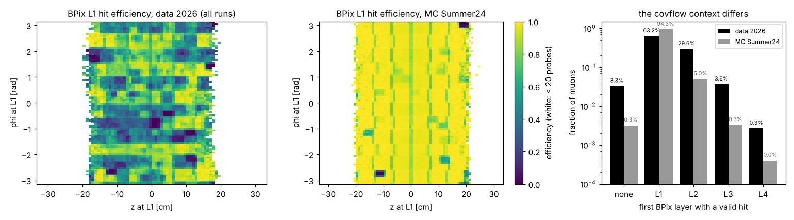

*Left and middle: BPix layer 1 hit efficiency for muons that cross it, as a function of where they cross it (z, φ), for all of 2026 data and for the MC. Data shows dark blocks (dead or partly dead modules) all over; MC is almost uniformly yellow. Right: as a result, 63% of data muons start at L1 against 94% in MC, and the no-L1 data muons pile up at L2 and L3.*

In 2026, **one data track in three has no L1 hit, compared with a few per cent in MC**. covflow trained as it is would be asked to map, say, "MC tracks starting at L2" (5% of MC, mostly geometric gaps) onto "data tracks starting at L2" (30% of data, mostly dead modules). These are different populations.

Reweighting MC in (pt, η, φ, z0) to the data hit pattern does not work: the hit loss is localised in (z, φ) cells that are dead in data and working in MC, so the MC tracks that "should" have lost the hit are a tiny minority and get weights up to ~10³.

**The approach here: make the MC lose the same hits as data, track by track.** In a cell where the hit efficiency is 40% in data and 97% in MC (ε_data = 0.40, ε_MC = 0.97), each MC hit is removed with probability 1 − 0.40/0.97 = 0.59. The MC then has the data hit pattern, with weights ≈ 1. Two questions remain:

1. which hits to remove, and when in the year (steps 1–3);
2. what the covariance of an MC track becomes once its hit is gone (steps 4–5, routes A and B).

---

## 1. Words used everywhere

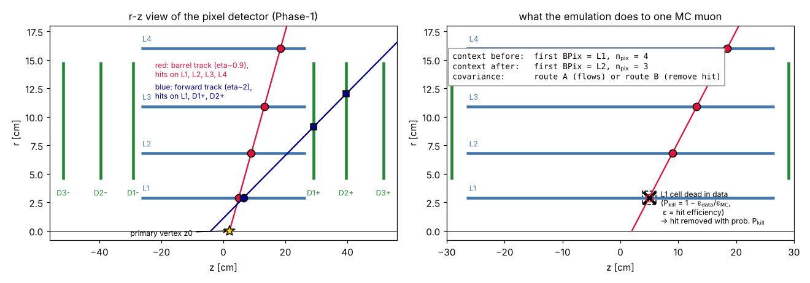

*Left: r-z view of the Phase-1 pixel detector: four barrel layers L1–L4 (r = 2.9, 6.8, 10.9, 16.0 cm, |z| < 26.6 cm) and three disks per side D1–D3 (|z| = 29.1, 39.6, 51.6 cm, 4.5 < r < 14.8 cm). A central track crosses the four layers; a forward track crosses L1 and then the disks. Right: what the emulation does to one MC muon whose L1 crossing falls in a cell that is dead in data.*

> **The one symbol to remember: ε (written `eps` in the code and plots) = hit efficiency**, the fraction of tracks crossing a piece of detector that leave a valid hit there. ε_data and ε_MC are that fraction in data and in MC.

| word | meaning |
|---|---|
| **crossing** | the point (z, φ) where a muon's helix, from its PCA to the PV, crosses a pixel surface (L1, or D1±: r, φ). Computed from pt, η, φ, charge, PV x/y and z0 = pv_z + dz, in a 3.8 T field. Helix formulas: barrel z_L = z0 + s_L·sinh η with s_L = 2R·asin(r_L / 2R); disk s_D = (z_D − z0) / sinh η, r_D = 2R·sin(s_D / 2R); R[m] = pt / (0.2998 · 3.8). |
| **in acceptance** | the crossing is on the sensitive surface: \|z\| < 26.6 cm on L1, 4.5 < r < 14.8 cm on D1. |
| **cell** | a bin of the surface. L1: 48 bins in φ × bins of one ROC pitch (0.83 cm) in z, so 3072 cells in acceptance. D1±: 48 in φ × 20 in r. |
| **probe** | a muon that crosses the surface in acceptance and has at least 2 other valid pixel hits (so that the track is certainly a good track and did not need the surface hit to be reconstructed). |
| **ε = "eps" = hit EFFICIENCY** | ε is the Greek letter epsilon. **Wherever you read ε, or `eps` in the scripts, plots, logs and option names (`eps_data`, `eps_MC`, `eps L1`, `--eps-dead`), it means the HIT EFFICIENCY of a cell:** of the probes that cross the cell, the fraction that has a valid hit there. ε = (probes with a valid hit) / (probes). "Valid L1 hit" = `pix_first_b_layer == 1`; "valid D1 hit" = `pix_first_e_disk == 1`. MC probes are weighted with `pu_weight_<year>`. ε = 1: every track has the hit; ε = 0.6: 40% of the tracks lose it; ε = 0: dead module. |
| **ε_data, ε_MC (`eps_data`, `eps_MC`)** | the hit efficiency of the same cell measured in data and in MC. |
| **P_kill** | probability to remove an existing MC hit in a cell: 1 − ε_data/ε_MC, used where ε_data < ε_MC. |
| **run range** | a block of consecutive runs with roughly constant efficiency, found automatically. Each has its own data maps. |
| **fallback level** | how a cell got its ε_data when it has too few probes (section 3.3): 0 own value, 1 neighbouring run ranges, 2 surface average, 3 nothing. |
| **uncorrectable cell** | ε_data > 3 · ε_MC (`--max-weight`, 1.5 before Oct 2026): the data hit efficiency is so much higher than MC's that MC has too few hits there to reproduce data (section 3.4). |
| **context** | the covflow conditioning variables. Here, the part that changes: `n_pix`, `n_pix_b`, `n_pix_e`, first BPix layer (0 = none, 1–4), first FPix disk (0 = none, 1–3). |
| **TV (total variation)** | distance between two distributions: ½ Σ \|f_data − f_MC\|. 0 = identical, 1 = disjoint. It equals the fraction of MC tracks that would have to change category to match data (section 5). |
| **W1, W0, D0** | data tracks crossing a working L1 cell with a hit (W1) or without a hit (W0), and crossing a dead L1 cell, hence without a hit (D0) (section 6). |
| **route A, route B** | two independent ways to compute the covariance of an MC track after its hit is removed (section 7). |

**Abbreviations and symbols**

| short | spelled out |
|---|---|
| **ε, `eps`** | **hit efficiency** (Greek epsilon; not an acronym). `eps_data`, `eps_MC`: in data, in MC. `--eps-dead`, `--eps-working`: hit-efficiency thresholds for dead and working cells |
| BPix, FPix | barrel pixel detector, forward pixel detector |
| L1–L4 | BPix layers 1–4 (L1 innermost, r = 2.9 cm) |
| D1–D3, D1± | FPix disks 1–3; + / − = the disk at positive / negative z |
| ROC | readout chip: a pixel module is read by 16 ROCs; the L1 cells are one ROC wide in z |
| PV | primary vertex |
| PCA | point of closest approach of the track to the beam line (where its parameters are given) |
| PU | pile-up; `pu_weight_<year>` reweights the MC pile-up to data |
| MC | Monte Carlo simulation (here Summer24 for 2024–2026) |
| P_kill | probability to remove an MC hit in a cell |
| w_hit, w_nohit | weights of MC muons with / without the hit in cells where data has the higher hit efficiency |
| W1, W0, D0 | Working cell with hit, Working cell without hit, Dead cell (without hit) |
| TV | total variation (distance between two distributions) |
| KS | Kolmogorov–Smirnov distance (largest difference of two cumulative distributions) |
| C, C′ | track covariance matrix (5×5) before / after removing a hit |
| H, V | how the hit position depends on the track parameters (2×5); hit position error (2×2) |
| PD | positive definite (a valid covariance matrix) |
| σ(d_xy), σ(d_sz) | uncertainties of the transverse and longitudinal impact parameters |
| IP | impact parameter |
| q/p, λ, φ, d_xy, d_sz | the five track parameters: charge/momentum, dip angle, azimuth, transverse and longitudinal impact parameters |

---

## 2. The chain and the commands

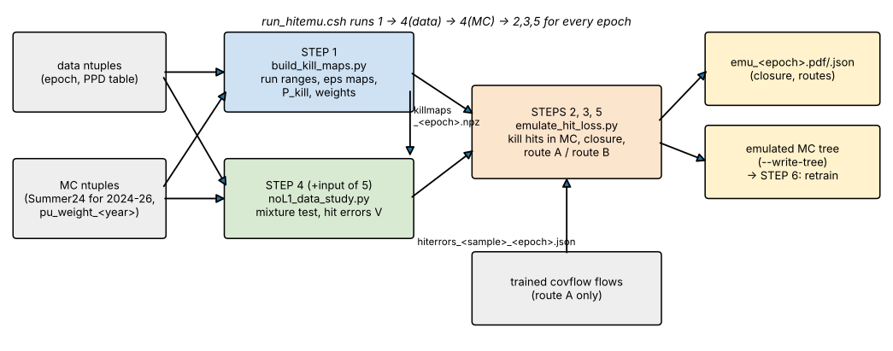

*The scripts and what they pass to each other. Steps are numbered as in the plan: 1 kill maps, 2 hit killing, 3 closure, 4 mixture test and hit errors, 5 routes A/B, 6 retraining covflow on the emulated MC (not automated yet).*

Everything runs from the covflow repository root and reads the same ntuples, selection and epoch table (`configs/run3_epochs.py`) as covflow. The branch defaults (`vx=pv_x`, `vy=pv_y`, z0 from `pv_z + dz`) are the ones of the efficiency-map runs, so no option is needed for them.

```tcsh
cd /work/manzoni/correct_track_covariance/covflow
conda activate covflow

# quick look at one epoch (a few minutes each; --max-events reads the FIRST N events, i.e. the first runs)
python build_kill_maps.py   --epoch 2026 --max-events 300000 --out test_km
python inspect_killmaps.py  test_km/killmaps_2026                      # where the probes sit, what stays missing
python noL1_data_study.py   --epoch 2026 --killmaps test_km/killmaps_2026 --max-events 300000 --split-test --out test_nol1
python emulate_hit_loss.py  --epoch 2026 --killmaps test_km/killmaps_2026 --max-events 300000 --out test_emu
# hit pattern only (no covariance branches, much faster): for iterating on kill maps and context closure
python emulate_hit_loss.py  --epoch 2026 --killmaps test_km/killmaps_2026 --max-events 300000 --closure-only --out test_emu_co

# everything, every epoch, under screen (edit RUNS at the top of the script first: the trained-flow production)
screen -S hitemu
tcsh run_hitemu.csh                 # or: tcsh run_hitemu.csh 2024 2025 2026
```

`run_hitemu.csh` writes `hitemu/<epoch>/{killmaps,noL1_data,noL1_mc,emu}/`, logs in `hitemu/logs/`, and a summary table at the end.

---

## 3. Step 1: kill maps

`build_kill_maps.py` makes three passes over the ntuples:

1. per-run L1 and D1 efficiency in data, to find the run ranges;
2. data maps of the hit efficiency, ε_data(cell), per run range;
3. the MC map of the hit efficiency, ε_MC(cell), one for the whole MC.

(Reminder: ε, `eps` in the outputs, is the hit efficiency of a cell, section 1.) It then turns each pair (ε_data, ε_MC) into an action: remove MC hits, reweight MC tracks, or do nothing.

### 3.1 Run ranges: why, and how they are found

Modules die (and are sometimes recovered) during the year, so one map per epoch would smear a module that died in July over the whole year. The per-run efficiency is split into blocks by **binary segmentation**:

- start from the whole epoch;
- try every split point; keep the one that most improves the binomial likelihood of "one efficiency per block" (L1 and D1 together);
- repeat on the block where the best split gains most.

It stops when one of three things happens:

- there are 8 blocks (`--max-ranges`);
- a further split would leave a block with fewer than 122,880 L1 probes, i.e. 40 per L1 cell on average (`--min-cell-probes` × 3072);
- the gain is below 25 in −2 ln L (`--min-gain`).

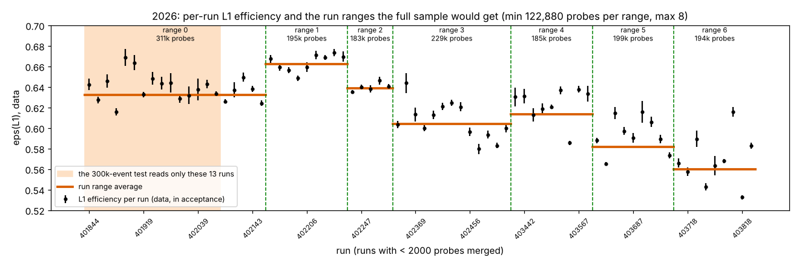

*Black: L1 efficiency per run, full 2026 (from the effmaps run table). Orange: the 7 run ranges the segmentation finds on it, from ε = 0.66 down to 0.56 at the end of the year. Shaded: the 13 runs read by the 300k-event test, which therefore gets a single range. The full-year `build_kill_maps.py` run (section 9.6) found the same 7 ranges; one boundary is 2 runs off, because the real run also uses D1.*

MC has no runs. Each MC event is assigned to a run range at random, with probability equal to the range's share of the luminosity. The proxy is the share of selected data events; brilcalc's recorded luminosity can be passed with `--lumi-csv`. The event is then treated with that range's maps.

The same page in the kill-maps PDF, real full-2026 run (top: L1, bottom: D1; orange: range averages, dashed: boundaries):

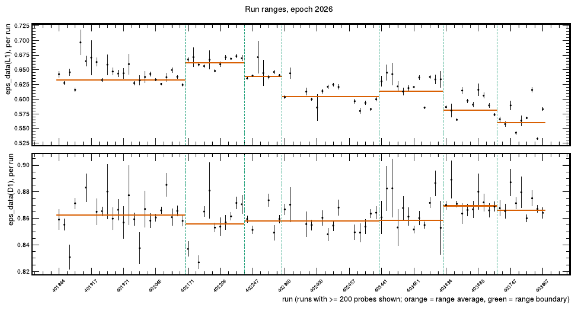

### 3.2 From probes to efficiency maps

For every probe, the cell of its crossing is filled in a "probes" map and, if the hit is valid, in a "hits" map. The hit efficiency is ε = hits / probes per cell, per run range in data and once in MC.

### 3.3 Cells with too few probes: fallback levels

A cell needs at least 30 probes (`--min-cell`) for its own efficiency to be trusted. Otherwise:

| level | the data hit efficiency ε_data of the cell is taken from | when |
|---|---|---|
| 0 | the cell itself, in this run range | ≥ 30 probes |
| 1 | the same cell summed over the neighbouring run ranges (the narrowest window with ≥ 30 probes), scaled by (this range's surface average) / (the window's surface average) | sparse in this range, but not over the year |
| 2 | **ε_MC of the same cell × one data/MC factor per range** (the factor makes the data efficiency summed over all level-2 cells equal to the measured one) | sparse everywhere |
| 3 | nothing: the cell is left unchanged (P_kill = 0) | no data probe at all |

The same rule applies to MC: own cell if ≥ 30 effective probes, else the MC surface average.

Level 2 was the *data surface average* until October 2026. The 2026 test showed that this is biased whenever MC has dead regions (section 9.3): the average already contains data's dead regions, and MC's dead regions then stay dead on top. Level 2 now keeps MC's live/dead pattern and only rescales it. `--fallback average` brings back the old behaviour, for comparison.

How many cells fall back depends almost only on statistics and on z: the luminous region is ±4 cm, so L1 cells at \|z\| > 15 cm are rarely crossed by anybody.

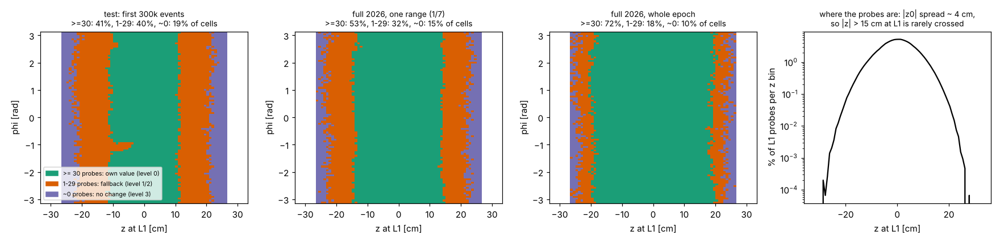

*Expected L1 probes per kill-map cell (estimated from the full-2026 probe map, scaled). Green: own measurement (level 0). Orange: fallback. Violet: practically no probes. The test (left: 41% / 40% / 19%) matches the log line `1156/0/1276/640` (38% / 42% / 21%). With the full sample about half the cells of each run range are measured directly; the rest use level 1, i.e. the same cell over the neighbouring months. In data probes rather than cells, the full-year run puts **95.6% of the L1 probes, 92.5% of D1+ and 87.9% of D1− in level-0 cells, and only 0.0–0.4% in level 2**: the fallback no longer matters. The right panel shows why the outer |z| region is empty in data and MC alike.*

### 3.4 From the two hit efficiencies (ε_data, ε_MC) to an action

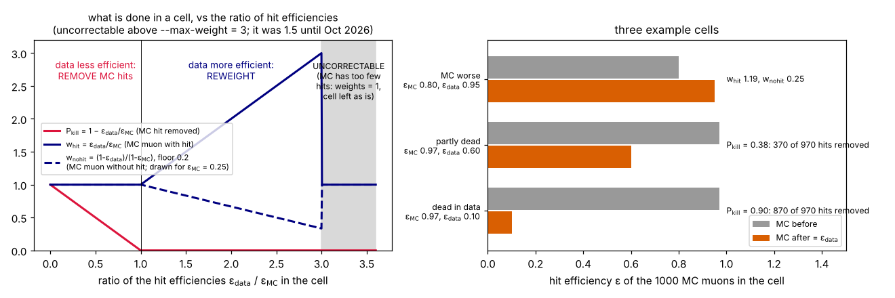

*Left: what is done to a cell as a function of the ratio of hit efficiencies, ε_data/ε_MC (`eps_data/eps_MC` in the figure). Right: three example cells with 1000 MC muons each, before (grey) and after (orange) the emulation; after = ε_data in all three.*

- **ε_data < ε_MC (most cells in 2025–2026):** each existing MC hit is removed with P_kill = 1 − ε_data/ε_MC. The MC efficiency becomes ε_MC · (1 − P_kill) = ε_data. Nothing is weighted.
- **ε_data > ε_MC:** hits cannot be created. Instead, MC muons with a hit get weight w_hit = ε_data/ε_MC and those without get w_nohit = (1 − ε_data)/(1 − ε_MC), floored at 0.2. The weighted MC efficiency is then ε_data. The event weight is the product over the two muons.
- **ε_data > 3 · ε_MC: "uncorrectable"** (`--max-weight`, default 3 since October 2026; it was 1.5). MC is (nearly) dead where data works: the weight would be large and carried by very few tracks. Nothing is done (weights 1). The emulated MC then stays below data in that cell, by ε_data − ε_MC.

How much the uncorrectable cells matter, on the full 2026 sample:

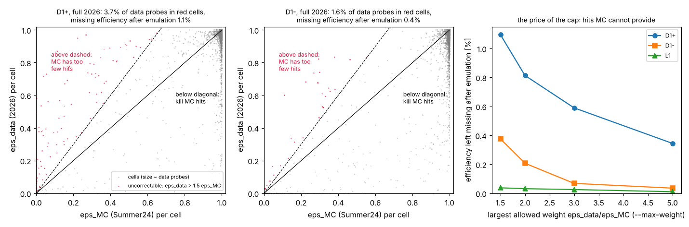

*Left and middle: every D1 cell of full 2026, data hit efficiency ε_data against MC hit efficiency ε_MC (`eps_data`, `eps_MC` on the axes; point size ∝ data probes). Below the diagonal: hits are removed. Red, above the dashed line: uncorrectable. These are cells where Summer24 MC is partly dead and 2026 data is not (median ε_MC 0.11 against ε_data 0.39 on D1+). Right: the efficiency left missing after the emulation as a function of the cap. On D1+ it falls from 1.1% at cap 1.5 to 0.6% at cap 3. L1 is never a problem: data is almost everywhere worse than MC there. On the kill maps' own (coarser) cells most of the D1+ uncorrectable probes turn out to sit at the outer edge of the disk (section 9.6).*

### 3.5 What to look at in `killmaps_<epoch>.pdf`

In this PDF `eps_data` and `eps_MC` are the hit efficiencies ε_data and ε_MC (section 1).

| page | look for | worry if |
|---|---|---|
| summary text | number of ranges, `kill L1` per range, fallback counts, uncorrectable fractions | one range on a full epoch; uncorrectable > few % |
| run ranges | boundaries on the visible steps (e.g. 2024 D1 at run 382799) | a clear step without a boundary: raise `--max-ranges` |
| ε_data / P_kill per range, L1 and D1± | dead blocks dark in ε_data and bright in P_kill, growing over the ranges | P_kill structure outside \|z\| ≈ 15 cm (fallback values, not measurements) |
| summary per surface: ε_data, ε_MC, largest weight | grey cells inside acceptance = uncorrectable | grey cells where ε_MC is *not* dark: then the cause is a fallback artefact, not a real MC-dead region |

`python inspect_killmaps.py <stem>` prints, per surface and range, which fallback level the data probes sit in and how much efficiency the uncorrectable cells leave missing, for any cap (`--max-weight 1.5 2 3`).

---

## 4. Step 2: emulating the hit loss in one MC event

For every selected MC event, `emulate_hit_loss.py` does the following.

1. **Pick a run range** at random with the luminosity shares.
2. **For each muon**, compute the L1 and D1± crossings (the same helix as in the maps).
3. **Remove the L1 hit** with probability P_kill(range, L1 cell) = 1 − ε_data/ε_MC (ratio of the hit efficiencies) if the muon has an L1 hit (`first_b == 1`). Same for D1.
4. **Update the context** (right panel of the detector figure in section 1):
   - n_pix and n_pix_b (or n_pix_e) decrease by 1;
   - the first BPix layer becomes the **next layer the helix crosses in acceptance** (L2, else L3, else L4, else none), and likewise for the disks.
5. **Multiply the event weight** by w_hit or w_nohit in cells where data beats MC.
6. **Flag the muon** as "lost L1" / "lost D1": these are the muons whose covariance routes A/B must change (section 7).

**The weak point is step 4: "the next layer crossed is assumed to have a valid hit".** The ntuple has only the *first* layer and the hit counts, not a per-layer mask. So after removing L1 we do not know whether the MC track also lacked an L2 hit. And even if we knew, we would have no L2 map telling us how often data lacks L2. Section 9 shows that this is the main thing the 2026 test exposed.

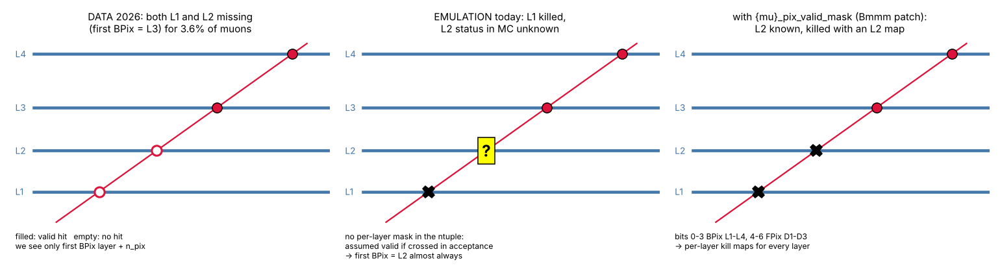

*Left: a data muon without L1 and L2. Middle: today the emulation removes L1 and must guess L2 ("valid if crossed"), so emulated muons almost never start at L3. Right: with a per-layer hit mask `{mu}_pix_valid_mask` in the ntuple (the "Bmmm patch"), L2 is known, and an L2 kill map can be built exactly like the L1 one.*

---

## 5. Step 3: closure

Two checks, both in `emu_<epoch>.pdf` and in the printed summary.

**Per-cell closure.** For each L1 / D1± cell: the *measured* data hit efficiency ε_data (raw hits / probes, summed over run ranges) against the emulated-MC efficiency, both averaged with the data probes of the cell as weights. Two columns are printed:

- **all cells**;
- **measured cells only** (≥ 30 data probes), where the per-cell comparison is meaningful.

By construction emulated = data, except in uncorrectable cells (MC stays lower) and through the fallback approximations. (The first version compared with the kill-map values instead of the raw counts, which in sparse cells are the fallback values themselves. That hid where the problem was; see section 9.3.)

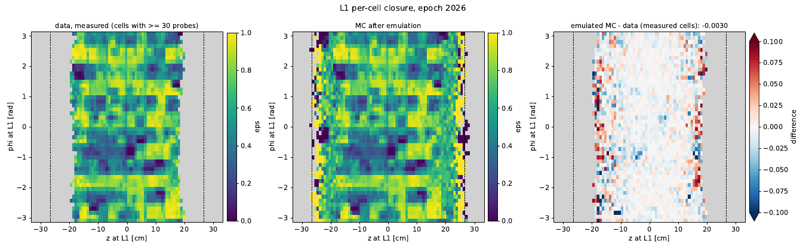

*Real page, full 2026, L1. Left: measured data hit efficiency ε per cell. Middle: hit efficiency of the emulated MC. Right: emulated − data. The difference is noise in the centre, with a few structured cells at |z| > 15 cm; the average is −0.0030 (section 9.7).*

**Context closure.** This is what covflow actually sees. Two distributions are compared, in each \|η\| bin:

- the joint distribution of (first BPix layer, first FPix disk);
- the pixel-hit count.

Each is compared for data, MC before and MC emulated, and summarised by the total variation. TV is computed per \|η\| bin and averaged with the data \|η\| spectrum, so a pt/η spectrum difference between data and MC does not count.

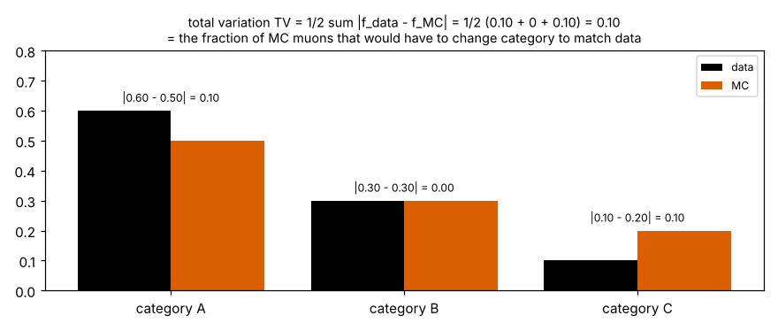

*What a TV number means: 0.10 = 10% of the MC muons are in the wrong category. "MC before 0.315, emulated 0.063" means the fraction of misplaced MC muons fell from 31% to 6%.*

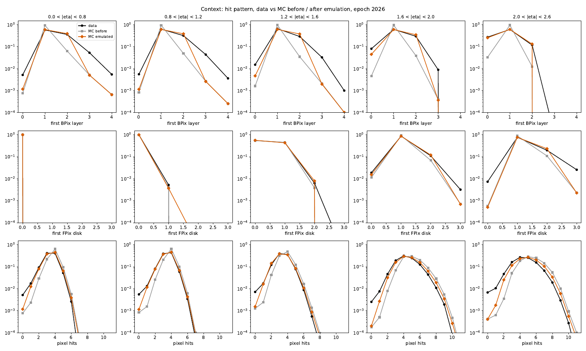

*Real context page, full 2026. Per |η| bin (columns):*

- *top: first BPix layer;*
- *middle: first FPix disk;*
- *bottom: number of pixel hits.*

*Black: data. Grey: MC before. Orange: MC after the emulation. The orange points follow the black ones at L1 and L2 but stay ~10× below them at L3/L4, at D3, and in the low-hit tail. That is the missing L2/L3/D2 loss of section 9.2.*

---

## 6. Step 4: the mixture test

Route A (section 7) takes as its target "the covariance of data tracks without L1". That is only right if a data track without L1 is like an emulated MC track without L1: a good track that happened to cross a dead module. But a track can also lack the hit for other reasons:

- the hit was rejected by the fit as an outlier;
- the cluster was lost or merged;
- the track scattered a lot.

Such tracks have different (worse) covariances, and none of them is produced by the emulation.

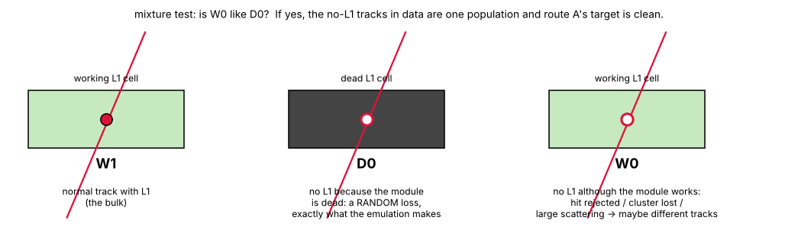

`noL1_data_study.py` splits the data tracks into the three populations of the drawing:

- **D0:** no hit, dead cell (data hit efficiency ε_data < 0.4, option `--eps-dead`). These are random losses, exactly what the emulation makes.
- **W0:** no hit, working cell (data hit efficiency ε_data > 0.95). The suspicious population.
- **W1:** hit, working cell. The bulk.

It then compares the distributions of log10 σ of the five track parameters for W0 and D0, after reweighting both to D0 in (pt, \|η\|, pixel hits, z0·sign η).

- **W0 ≈ D0** (median shift < 0.01 in log10 σ, i.e. 2%; width ratio < 1.1; KS < 0.05): the no-L1 tracks in data are one population. Route A's target is clean.
- **W0 ≠ D0:** the no-L1 data tracks are a mixture. Route A would give the emulated losses the wrong tails. Use route B, or take the target from D0 only.

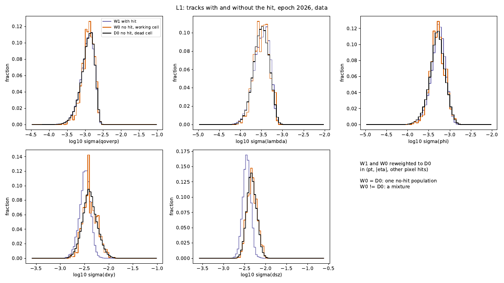

*Real page, full 2026 data, L1: log10 σ of the five track parameters for W1 (blue, with hit), W0 (orange) and D0 (black), all reweighted to D0. W0 lies on D0 (one population, the test passes; section 9.8), and both are ~0.2 in log10 above W1 in σ(d_xy) and σ(d_sz). A failing test would show W0 with its own tail or shifted peak.*

The same script also fits the **hit errors V** used by route B (section 7.2), and with `--sample mc` it does the same on MC.

---

## 7. Step 5: routes A and B

### 7.1 Why the covariance must change at all

Removing the innermost hit lengthens the extrapolation from the first measurement to the vertex. The impact-parameter error grows a lot, and more for low-momentum tracks, where multiple scattering dominates.

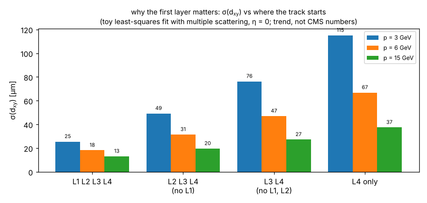

*Toy least-squares fit with multiple scattering (pixel + strip layers, η = 0). This shows the trend, not CMS numbers. σ(d_xy) roughly doubles when the track starts at L2 instead of L1, and triples at L3. So an MC track that lost L1 but kept its "with L1" covariance would be far too precise. And the muons that start at L3 / L4 form the tail of the IP-significance distribution.*

An MC muon that lost its hit therefore needs a new covariance C′ (and its parameters must be smeared by δ ~ N(0, C′ − C), so that the residuals match the larger errors). Two independent ways to get C′:

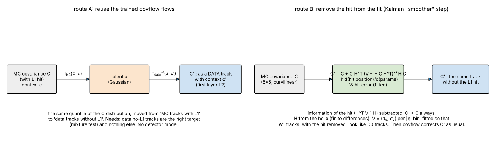

### 7.2 Route A: reuse the trained covflow flows

covflow has two flows per epoch and muon:

- f_MC maps (MC covariance, context) to a Gaussian latent u;
- f_data does the same for data.

Route A sends the MC track through f_MC **with its original context** (it had L1), then back through f_data⁻¹ **with the new context** (first layer L2):

&nbsp;&nbsp;&nbsp;&nbsp;C′ = f_data⁻¹( f_MC(C; c) ; c′ )

In words: "the track that was at the 70th percentile of MC tracks with L1 becomes the 70th percentile of *data* tracks without L1". The output is already data-like, so covflow is not applied again.

- Advantages: no detector model; uses what is already trained.
- Requirements: f_data at context c′ must be trained on enough no-L1 data tracks (true in 2024–2026), and those must be the right target (section 6).

### 7.3 Route B: take the hit out of the fit

A track fit adds up the information of its hits. Removing one hit means subtracting its information. With the "inverse Kalman update" (Woodbury identity) this is exact for a linear fit:

&nbsp;&nbsp;&nbsp;&nbsp;C′ = C + C Hᵀ (V − H C Hᵀ)⁻¹ H C

The ingredients:

- **H (2×5):** how the hit position (two local coordinates on the module) moves when the five track parameters (q/p, λ, φ, d_xy, d_sz) move. Computed from the helix by finite differences.
- **V (2×2):** the hit position error, diag(σ_u², σ_v²), per surface and \|η\| bin. It is not in the ntuple, so `noL1_data_study.py` **fits** it: V is chosen so that W1 tracks (with the hit), after removing it, have the same median σ(d_xy) and σ(d_sz) as D0 tracks (without it) at the same (pt, η, position). A V that is too large removes too little information; one that is too small removes too much.

The result is MC-like ("B, raw"). covflow then corrects it like any MC track ("B, final"). The check "B, raw against MC's own tracks without L1" must close. It does on synthetic samples (within 0.01 in log10 σ), but **not on real 2026 data and MC beyond |η| ≈ 0.5** with one V per |η| bin (section 9.8).

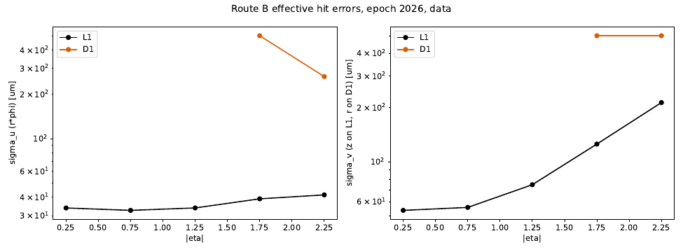

*Real page, full 2026 data: fitted hit errors per |η| bin; left σ_u (rφ), right σ_v (z on L1, r on D1).*

- *L1: σ_u ≈ 34–42 µm, while σ_v rises from 54 to 213 µm with |η|. Above |η| = 0.5 these values are pinned by the positive-definiteness limit and are too large (section 9.8).*
- *D1: at the 500 µm upper limit, flagged UNCONSTRAINED. Removing D1 changes nothing measurable.*

*A bin without a fit takes its value from the neighbours, or from another file (`--hit-errors a.json b.json`, first file with a fit wins).*

### 7.4 What the route pages show

Real 2026 page **without routes** (they have not been run on real data yet):

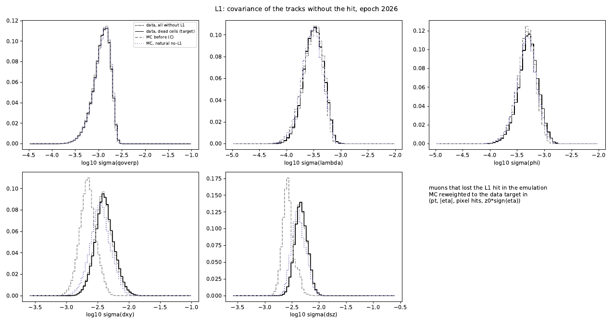

*Full 2026, the MC muons that lost L1 in the emulation:*

- *grey dashed: their unchanged "with L1" covariance;*
- *black solid: the target, data tracks in dead L1 cells;*
- *black dotted: all data tracks without L1;*
- *blue dotted: MC tracks that naturally lack L1.*

*In σ(d_xy) and σ(d_sz) the grey curve is ~0.25 in log10 below the target. This gap is what the routes must close.*

With routes the same page gains three curves. Until they are run on real data, here is a **synthetic** example:

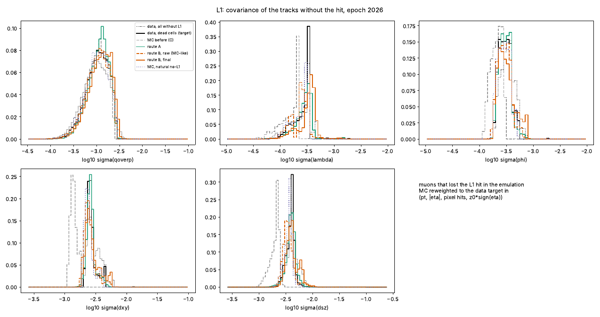

*Synthetic example, the muons that lost L1:*

- *grey dashed: MC before, with the L1 hit; too precise;*
- *black: target, data D0 tracks reweighted to the same kinematics;*
- *green: route A;*
- *orange dashed: route B, raw;*
- *orange solid: route B, final.*

*Both routes should move the grey curve onto the black one.*

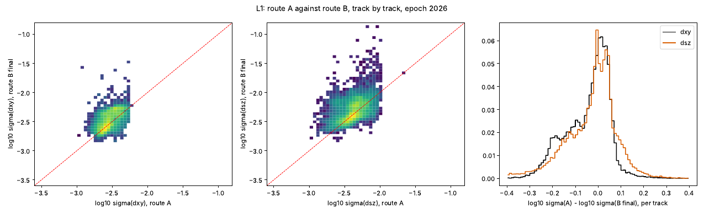

*Synthetic example (no real equivalent yet): route A against route B (final), track by track, in log10 σ(d_xy) and σ(d_sz). A narrow diagonal means the two routes agree for each track, not only on average.*

---

## 8. How to choose between A and B

| observation | decision |
|---|---|
| mixture test clean **and** A ≈ B track by track **and** both ≈ D0 target | **route A** in production (no new code beyond the kill step); B stays as validation |
| mixture test fails (W0 ≠ D0) | **route B** (A's target is contaminated) |
| A and B agree on average but not track by track, or differ in the tails | **route B**: its per-track behaviour comes from the fit, not from a learned quantile |
| B, raw does not close on MC's own no-L1 tracks | V or H is wrong: fix B before using either |

**Status after the 2026 tests (section 9.8):**

- the mixture test is clean (W0 = D0 within ~3%), so route A is the primary route;
- route B with one hit error per |η| bin does not close beyond |η| ≈ 0.5, so it is a check only centrally until the relative hit error V = k · H C Hᵀ is in;
- D1 kills need no covariance change.

With route B the last step (6) is to retrain covflow's MC side on the emulated MC (`WRITE_TREE = 1` in `run_hitemu.csh`; `emu_<epoch>_routeB.json` lists which branches are replaced).

---

## 9. Worked example: the 2026 test

Three iterations, read in order:

| | what was run | what it showed |
|---|---|---|
| 9.1–9.5 | 300k events (first 13 runs), first code | the L1 kill works; data also lose L2/L3 (the main finding); a D1 closure problem (a code bug, fixed in 9.3); a slow MC pass |
| 9.6 | kill maps on the full year | 7 run ranges; fallback negligible; D1 disk-edge mismatch between data and MC; cap raised to 3 |
| 9.7 | emulation on the full year | closure −0.002/−0.003; L2/L3/D2 loss confirmed; low-hit muons are physical; 5.5 min for the year |
| 9.8 | no-L1 study on the full year | mixture test clean, so route A is primary; route B's single hit error fails beyond \|η\| ≈ 0.5 (fix: V = k · H C Hᵀ); D1 kills need no covariance change |

Two commands were run on t3ui07:

```
python build_kill_maps.py  --epoch 2026 --max-events 300000 --out test_km
python emulate_hit_loss.py --epoch 2026 --killmaps test_km/killmaps_2026 --max-events 300000 --out test_emu
```

Routes A and B were not requested, so this test is about steps 1–3 only.

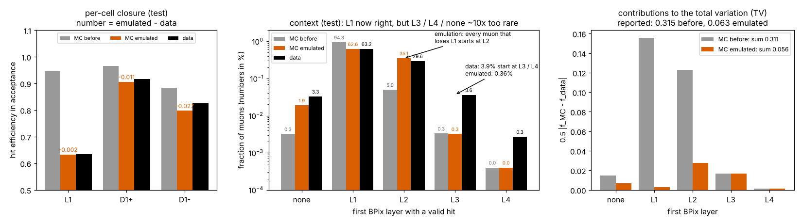

*Left: per-cell closure as printed by the first version of the script (compared with the kill-map values; superseded, see 9.3). Middle: fraction of muons by first BPix layer (log scale; numbers in %). Right: how much each category contributes to the total variation of the first-BPix-layer distribution, before and after emulation.*

### 9.1 The log, line by line

| log line | meaning | verdict |
|---|---|---|
| `13 runs, 91648 L1 probes ... minimum per range 122880` | `--max-events` reads the *first* 300k events = runs 401844–402046, 6.3% of 2026. 91.6k probes < 122.9k needed to split, so **1 run range**. | expected for a test. The full sample gives 7 ranges (section 3.1). |
| `eps L1 0.6370  eps D1 0.8616` | `eps` = hit efficiency ε: in those 13 runs 63.7% of the data muons crossing L1 have an L1 hit, 86.2% for D1 | consistent with the per-run plot (start of the year, ε ≈ 0.63) |
| `kill L1 0.3298` | average P_kill over data probes | 1 − 0.637/0.945 = 0.326 ✓ |
| `cells by fallback level 0/1/2/3 (L1): 1156/0/1276/640` | 38% of L1 cells measured, 42% surface average, 21% no probe | the statistics of 6% of the year; matches the prediction of section 3.3. Level 1 is 0 because there is only one range. |
| `L1 ... eps_data > eps_MC: 0.021 ... UNCORRECTABLE: 0.0002` | 2% of L1 cells have a slightly higher hit efficiency in data than in MC (fluctuations of sparse cells); uncorrectable negligible | ✓ |
| `D1+ ... UNCORRECTABLE 0.0308`, `D1- ... 0.0337` | 3% of D1 data probes are in cells where ε_data > 1.5·ε_MC | **mostly a fallback artefact in this test**: 89% of the D1 data probes sit in level-2 cells, whose ε_data was the surface average. Compared with a real MC dead cell, that average looks "much better than MC". With the new fallback it drops to 0.0% (D1+) and 0.2% (D1−). On the full year, real uncorrectable cells exist too (3.7% / 1.6% of the probes, section 3.4). |
| `selected MC events 107619; event weight ... mean 1.0016, min 0.083, max 1.713, 10.8% != 1` | weights come only from cells where data beats MC | **mild** (compare with ~10³ for plain reweighting): the method does what it was built for |
| `L1 hits removed: 0.3386`, `D1 hits removed: 0.0802` | fraction of MC hits removed, on MC illumination | ✓ (differs slightly from 0.33 because MC and data illuminate the cells differently) |
| `muons left with no pixel hit: 0.0010, with <= 2: 0.0925` | after the emulation | the test PDF has no pixel-hit panel yet (now added). No-hit muons (0.1%) are negligible; the ≤ 2 comparison with data needs the next run. |
| `PER-CELL CLOSURE L1 data 0.6351 / before 0.9449 / emulated 0.6330` | L1 hit efficiency: the kill brings MC from 0.945 to 0.633, for a data value of 0.635 | **✓ closes** to −0.002 |
| `D1+ 0.9169 / 0.9656 / 0.9059`, `D1- 0.8247 / 0.8844 / 0.7973` | emulated below data by 0.011 (D1+) and 0.027 (D1−) | **understood and fixed** (9.3): the old level-2 fallback double-counts dead regions. With the new fallback, the expected closure from the same maps is +0.001 on both disks. |
| `CONTEXT ... first BPix x first FPix: 0.3150 → 0.0634; pixel hits 0.2304 → 0.0499` | the misplaced fraction falls by 5× | good, but 6% is still misplaced. Next line says where. |
| `fraction with first BPix layer 0/1/2/3/4` | the key line, see 9.2 | **the emulation misses data's L2/L3 inefficiency** |
| (json) first FPix disk 0/1/2/3: data `0.696 0.271 0.031 0.0026`, emulated `0.733 0.237 0.030 0.0002` | the same on the disks | muons starting at D3 are 13× too rare in the emulated MC: D2 is also lost in data (forward bin of the context page, 9.5) |

### 9.2 The main finding: data also lose L2 (and L3), the emulation cannot

Among the muons **without** an L1 hit, the first BPix layer is distributed as follows:

| | no L1 (of all) | → first L2 | → first L3 | → first L4 | → no BPix hit |
|---|---|---|---|---|---|
| data | 36.8% | 80.4% | 9.9% | 0.7% | 8.9% |
| MC before | 5.6% | 87.8% | 5.8% | 0.7% | 5.7% |
| MC emulated | 37.4% | **94.0%** | **0.9%** | 0.1% | 5.1% |

- The **amount** of L1 loss is right: 37.4% emulated against 36.8% in data.
- **What follows is not.** In data, one no-L1 muon in ten also has no L2 hit and starts at L3. In the emulation, almost every muon that lost L1 starts at L2 (94%), because "the next crossed layer is assumed valid" (section 4).
- The right panel of the test-results figure shows that the L2 and L3 bins make **0.045 of the 0.056** total variation left in the first-BPix-layer distribution. That is most of the remaining 0.063.

**Why it matters for the analysis.** The 3.9% of data muons that start at L3/L4 have σ(d_xy) about three times that of an L1 track (section 7.1). They make the tail of the IP and vertex-displacement uncertainty. The emulated MC has only 0.36% of them, so MC would under-populate exactly the tail that a displaced-vertex selection cares about.

**Two reasons, both needing per-layer information:**

1. **MC's own missing L2 hits are invisible.** Without a per-layer mask, an MC track with L1 valid and L2 missing looks the same as one with both valid. After removing its L1, it is wrongly promoted to "first = L2".
2. **Data's L2 is less efficient than MC's.** In MC, about 6% of no-L1 tracks lack L2 too (geometry: gaps, edges); in data about 11%. So there are dead or inefficient L2 regions in 2026 as well. They need an L2 kill map, which in turn needs to know, for every track, whether it has an L2 hit.

Both are solved by the per-layer hit mask `{mu}_pix_valid_mask` (bits 0–3 BPix L1–L4, bits 4–6 FPix D1–D3, filled in `TrackHitContent` of the Bmmm ntuplizer). With it:

- `pixel_eff_maps.py --surfaces all` and the kill maps extend to L2–L4 and D2–D3;
- the emulation kills each layer with its own map and knows exactly which hits remain.

**This is the motivation for the Bmmm patch.**

### 9.3 The D1 closure: a fallback artefact, now fixed

**Diagnosis.** On the test maps, `inspect_killmaps.py` shows where the D1 data probes sit:

| surface | data probes in level-0 cells | in level-2 cells (surface average) |
|---|---|---|
| L1 | 86.5% | 13.5% |
| D1+ | 10.4% | **89.6%** |
| D1− | 11.3% | **88.7%** |

The D1 statistics of 300k events are ~14 probes per cell, so almost every D1 cell used the old level-2 value, the data surface average. That average **already contains** data's dead regions. Giving it to every sparse cell does two things:

- in MC-alive cells it removes hits down to the average hit efficiency (ε ≈ 0.81 on D1− instead of ≈ 0.92);
- in MC's dead sector nothing can be removed, because MC has no hits there.

So the dead sector is counted twice and the emulated MC ends up below data. The figure shows this on the real test maps:

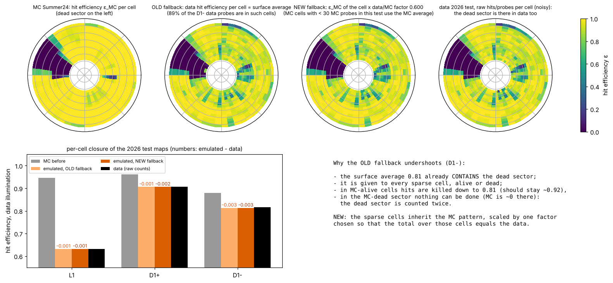

*Top, D1−:*

- *1st panel: MC efficiency per cell, with a dead sector on the left;*
- *2nd panel: old fallback, flat;*
- *3rd panel: new fallback, the MC pattern scaled by one factor (0.918);*
- *4th panel: raw data counts, which show the same dead sector in data.*

*Bottom: expected per-cell closure computed from the test maps (each MC cell's efficiency after kill or reweighting, on the data illumination, against raw data). D1+: −0.005 → +0.001; D1−: −0.014 → +0.001.*

Two more things made the printed numbers (−0.011, −0.027) look worse than these (−0.005, −0.014):

- the printed "data" was the kill-map value, i.e. the fallback itself, not the raw counts;
- the old fallback created 1.5–2% spurious uncorrectable D1 cells: an average compared with a dead MC cell.

Both are fixed in the code:

- level 2 = MC shape × factor (`--fallback mcshape`, the default);
- the closure is computed against raw data counts, with a separate "measured cells only" column;
- the build log prints the probes per fallback level and the efficiency left missing.

The earlier hypotheses for D1− (different conditions in the first runs, cells too coarse) are not needed: the dead sector is present in both data and MC (top-right panel) and matches.

**No new kill maps are needed to check this:** the npz holds the raw counts and the fallback is applied when the maps are loaded. Rerunning `emulate_hit_loss.py` on the existing `test_km` maps uses the new fallback automatically.

### 9.4 Speed (first test; solved, see 9.7)

| pass | rate | full 2026 (4.78M data, 10.1M MC events) |
|---|---|---|
| kill maps, data (2 passes) | 45k ev/s | ~4 min |
| kill maps, MC | 15.5k ev/s | ~11 min |
| emulation, data | 3.9k ev/s | ~21 min |
| **emulation, MC** | **0.5k ev/s** | **~5.5 h** |

On the synthetic samples the same code runs at ~30k events/s, so the 511 events/s is specific to the real ntuples. The emulation reads ~35 more branches than the kill maps: the 15 covariance elements per muon and the beam-spot IP. Reading them is the most likely cost, but this cannot be checked from here. Changes in this version:

- the script now prints `TIMING (s): data pass ... (reading ...), MC pass ... (reading ...)`: the next run tells whether reading or computing dominates;
- with `--max-events` the reading step is now limited to the requested events (before, a whole 200 MB step was read and decompressed, then cut);
- `np.add.at` is replaced by `np.bincount` everywhere;
- **`--closure-only`** skips the covariance and beam-spot branches and all route/target histograms. It is meant for iterating on the kill maps and the context closure, which is everything this test was about.

### 9.5 What the two PDFs of the test show

**`killmaps_2026.pdf`**

- **Run-range page:** the 13 runs scatter around a hit efficiency ε(L1) = 0.637 and ε(D1) = 0.862 within their errors. One range is right for this slice.
- **L1 `eps_data` (data hit efficiency) and P_kill:** structure (dead modules) only in \|z\| < 10 cm; flat outside, where the cells are level 2 (as predicted in 3.3).
- **D1± ε_data:** almost flat. The cells are level 2, which is the cause of 9.3.
- **D1± ε_MC:** a dead sector in D1− (φ ≈ 2.4–3.4 rad, the full r range) and scattered dead cells in D1+. The raw data counts show the same D1− sector dead in data (figure in 9.3).

**`emu_2026.pdf`, context page (real):**

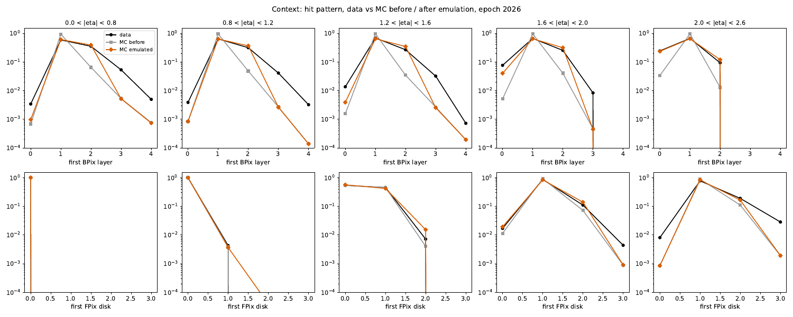

*Top row: in every |η| bin with barrel coverage, data (black) starting at L3 or L4 is ~10× above the emulated MC (orange), while L1 and L2 agree. This is 9.2 seen bin by bin. Bottom row, last bin (2.0 < |η| < 2.6): data starting at D3 is ~15× above the emulation, and data with no FPix hit at all is ~10× above. Same mechanism on the disks: after a D1 kill the emulation assumes D2 is there.*

**Not in the test PDF:** a pixel-hit panel (added now, third row of the context page), the routes (not requested) and the mixture test (`noL1_data_study.py` was not run).

### 9.6 Second iteration: the full-2026 kill maps

`build_kill_maps.py` was rerun on the whole of 2026: 4.78M data events (777k selected), all of the MC, the new level-2 fallback, cap 1.5. The emulation was not rerun, so `emu_2026.pdf` is still the one of section 9.5.

**What the full statistics give**

| | test (300k events) | full 2026 |
|---|---|---|
| run ranges | 1 | **7** (L1 hit efficiency ε 0.633 → 0.662 → 0.639 → 0.604 → 0.613 → 0.581 → 0.560) |
| L1 data probes in level-0 / level-2 cells | 86.5% / 13.5% | **95.6% / 0.4%** (4.0% level 1) |
| D1+ data probes in level-0 / level-2 cells | 10.4% / 89.6% | **92.5% / 0.1%** |
| D1− data probes in level-0 / level-2 cells | 11.3% / 88.7% | **87.9% / 0.0%** |
| expected per-cell closure of the hit efficiency ε (emulated − data), nominal acceptance, cap 1.5 | L1 −0.003, D1 −0.005 / −0.014 (old fallback) | **L1 −0.0003, D1+ −0.0020, D1− −0.0017** |

The cells now carry their own measurement and the closure is at the per-mille level. The remaining −0.002 on the disks are real uncorrectable cells: MC dead, data alive.

**How the dead modules evolve during the year**

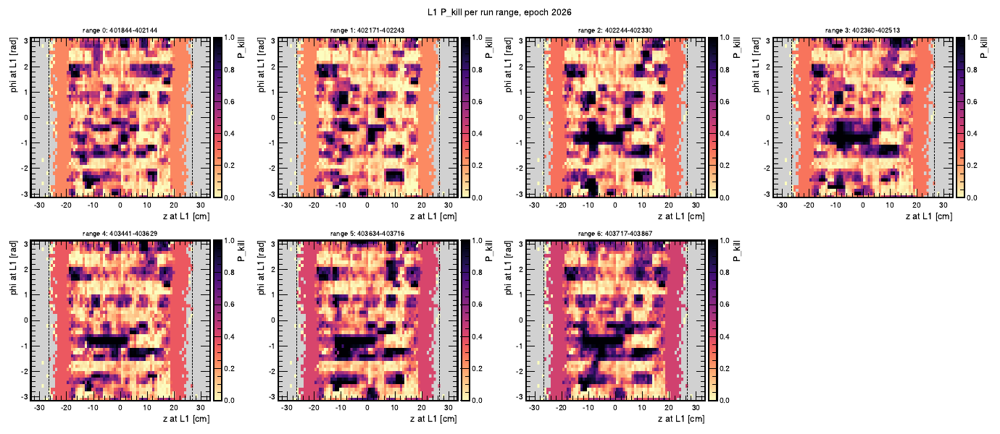

*L1 P_kill per run range (black = data dead where MC works). Dead blocks appear and grow over the year: the region around z ≈ −10…0 cm, φ ≈ −1 rad becomes a large dead area from range 3 onwards. One map for the whole year would smear this over all of the MC. The flat orange band at |z| > 18 cm is the level-2 region: MC pattern × one factor.*

**The disks**

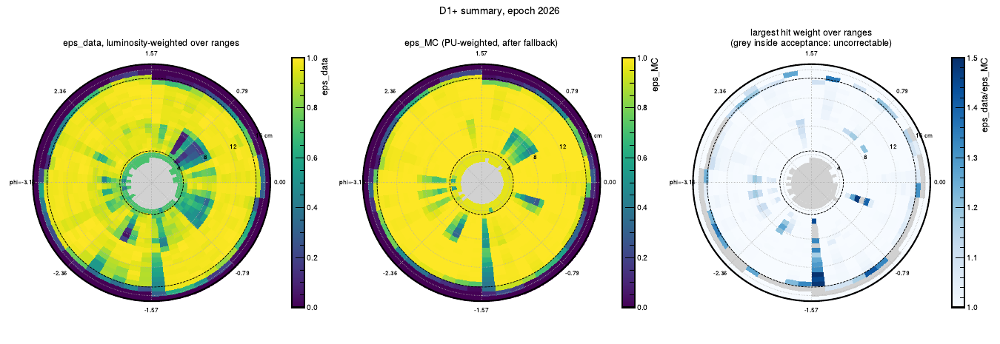

*D1+ over the whole year:*

- *left: data efficiency;*
- *middle: MC efficiency;*
- *right: largest weight; grey = uncorrectable.*

*Inner ring (r < 9 cm): data has inefficient "spokes" (blades) that MC does not have, so they are killed, plus a few MC-dead spokes that data does not have, so they are reweighted (blue, e.g. φ ≈ −1.6). Outer ring: grey, uncorrectable.*

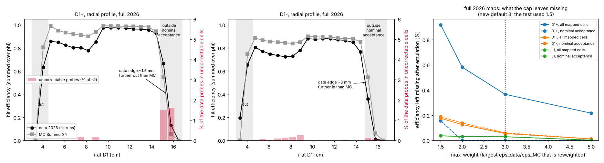

*Left and middle: D1 efficiency against the radius of the crossing, summed over φ and the year. Red bars: data probes in uncorrectable cells. Right: efficiency left missing after the emulation as a function of `--max-weight`, all mapped cells (solid) and nominal acceptance only (dashed).*

New finding: **data and MC do not agree on where the disks end**.

- On D1+ the data hit efficiency drops ~1.5 mm further out than in MC: ε at r ≈ 15.8 cm is 0.13 in data against 0.06 in MC.
- On D1− it drops ~3 mm further in.

The sign flips between the two sides, and the size changes with φ. That points to a mm-scale difference between data and MC in where the disks sit relative to the reconstructed track: mainly a z shift, plus a smaller transverse part. These are not dead modules. The emulation handles it cell by cell:

- on D1− the extra loss is killed;
- on D1+ the extra hits are reweighted, up to the cap.

Of the 3.5% of D1+ data probes counted as uncorrectable at cap 1.5, 3.1% are these edge cells, outside the nominal acceptance (4.5 < r < 14.8 cm). The rest are MC-dead spokes.

- **Default cap raised to 3** (`--max-weight`): what stays missing on D1+ drops from 0.92% to 0.37% (all cells), and to 0.00% inside the nominal acceptance.
- Inner ring: data is ~10% less efficient than MC on both disks at r < 9 cm. This is the largest D1 effect, and the kill reproduces it.

**Do the conclusions change?**

1. **D1 closure (9.3):** confirmed fixed. With full statistics the fallback affects < 0.5% of the probes, and the expected closure is −0.002 or better.
2. **Run ranges (3.1):** confirmed. 7 ranges, as predicted from the efficiency maps; the dead areas move during the year, so they are needed.
3. **Uncorrectable cells:** smaller than the test suggested, and mostly the D1+ outer edge rather than dead modules. Handled by the cap of 3.
4. **Main finding (9.2), L2/L3 and D2 loss:** unchanged. It comes from the emulation's "next layer is valid" assumption, not from the maps; the full maps can't change it. It still needs the per-layer hit mask (Bmmm patch).

**Next run** (tcsh; no need to rebuild the maps, the cap is applied when they are loaded):

```tcsh
python inspect_killmaps.py test_km/killmaps_2026 --max-weight 1.5 3
python emulate_hit_loss.py --epoch 2026 --killmaps test_km/killmaps_2026 --max-weight 3 --closure-only --out test_emu_full
```

### 9.7 Third iteration: the full-2026 emulation

`emulate_hit_loss.py` was then run on the full-year maps over all of 2026: 4.78M data events and the whole MC (3.63M selected events), new code, cap 3, without routes.

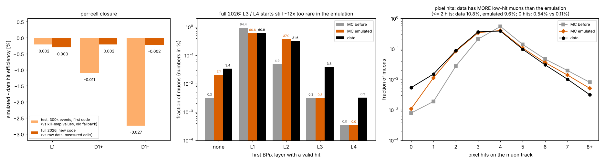

*Left: per-cell closure, emulated − data, first test against full run. Middle: first BPix layer, full 2026. Right: number of pixel hits on the muon track, full 2026.*

**1. The hit removal closes.** Hit efficiency ε (`eps`) on the measured cells, and emulated − data:

| | data | MC before | MC emulated | emulated − data |
|---|---|---|---|---|
| L1 | 0.6141 | 0.9451 | 0.6111 | **−0.0030** |
| D1+ | 0.9082 | 0.9612 | 0.9061 | **−0.0021** |
| D1− | 0.8124 | 0.8826 | 0.8102 | **−0.0022** |

- **Disks:** the −0.002 is what the uncorrectable cells must leave (section 9.6).
- **L1:** −0.003 is a little more than the maps alone predict (−0.0003), but still 0.5% of the efficiency. The L1 closure map shows where it comes from. The centre is noise; the residual sits in a few cells at |z| > 15 cm, which borrow their value from the neighbouring run ranges (level 1) and are scaled by the surface's time trend. It is second-order; finer or wider cells at large |z| would reduce it if needed.


*Real L1 closure page, full 2026: measured data, emulated MC, difference (−0.0030 on the measured cells).*

**2. Weights stay mild.** Mean 1.0003; max 2.28 (cap 3); 19% of the events have a weight ≠ 1.

**3. The context: the main finding is confirmed with full statistics.**

| | first BPix L1 | L2 | L3 | L4 | none | first FPix D3 |
|---|---|---|---|---|---|---|
| data | 60.9% | 31.6% | **3.83%** | **0.32%** | 3.37% | **0.20%** |
| MC before | 94.4% | 4.9% | 0.31% | 0.04% | 0.32% | 0.02% |
| MC emulated | 60.6% | 37.0% | **0.31%** | **0.03%** | 2.08% | **0.02%** |

- The total variation falls from 0.338 to 0.064 (first BPix layer × first FPix disk) and from 0.246 to 0.053 (pixel hits).
- 83% of what is left comes from the L2/L3 bins.
- L1 loss is right (60.6% against 60.9%). Starting at L3/L4 is 12× too rare; starting at D3 is 10× too rare.

**4. Pixel hits: the open question of section 10 (item 3) is answered.** Data has *more* low-hit muons than the emulation:

- ≤ 2 pixel hits: 10.8% in data against 9.6% emulated;
- no pixel hit at all: 0.54% against 0.11%.

So the emulated low-hit muons are not unphysical: data reconstructs (and the medium ID keeps) even more of them. The deficit is the same missing L2/L3/D2 losses seen in item 3.


*Real context page, full 2026. Top: first BPix layer. Middle: first FPix disk. Bottom (new): pixel hits. The black points sit above the orange ones in the low-hit tail, at L3/L4 and at D3, in every |η| bin.*

**5. A first look at the covariance of the muons that lost L1** (routes not run yet):


*L1 covariance page, full 2026:*

- *grey dashed: the MC muons that lost L1 in the emulation, still with their "with L1" covariance;*
- *black solid: the target (data tracks crossing dead L1 cells);*
- *black dotted: all data tracks without L1;*
- *blue dotted: MC tracks that naturally lack L1.*

*In σ(d_xy) and σ(d_sz) the grey curve is ~0.25 in log10 (×1.8) below the target: these muons need routes A/B. The two black curves almost coincide. That is a first hint that the data no-L1 tracks are one population, mostly dead-module losses; the mixture test (`noL1_data_study.py`) has to confirm it.*

**6. Speed: solved.** The whole year took 5.5 min:

- data pass: 75 s, of which 68 s reading;
- MC pass: 253 s, of which 192 s reading;
- about 40,000 events/s in the MC pass, against 511 in the first test.

The two changes of section 9.4 were enough: the reading step capped to `--max-events`, and `bincount` instead of `np.add.at`. Reading now dominates, as it should.

**Do the conclusions change?** No. Each point is confirmed with full statistics, and two open questions are closed:

- the hit removal closes to −0.002 / −0.003;
- the remaining difference is the L2/L3/D2 loss, which needs the per-layer hit mask (Bmmm patch);
- the low-hit muons are physical;
- the speed is fine.

**Next:**

1. the mixture test and the hit-error fits on full 2026:
   ```tcsh
   python noL1_data_study.py --epoch 2026 --killmaps test_km/killmaps_2026 --split-test --out test_nol1
   python noL1_data_study.py --epoch 2026 --killmaps test_km/killmaps_2026 --sample mc --split-test --out test_nol1_mc
   ```
2. routes A/B in the emulation;
3. the Bmmm hit-mask patch.

### 9.8 Fourth iteration: the no-L1 study on full 2026 (mixture test, hit errors)

`noL1_data_study.py` was run on all of 2026, on data and on MC (`--split-test`). It answers two questions:

- (a) are the data tracks without L1 one population? This is the mixture test, which decides whether route A's target is clean.
- (b) can route B reproduce them by removing the hit with one fitted hit error per |η| bin?

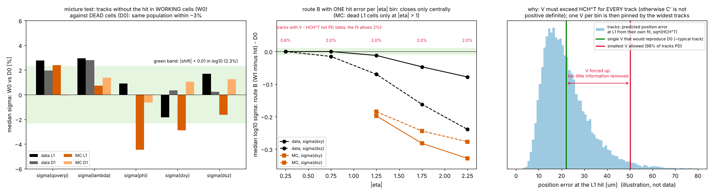

*Left: mixture test, median σ of W0 (no hit, working cell) against D0 (no hit, dead cell), per track parameter, data and MC, L1 and D1. Middle: route B closure, median log10 σ after removing the hit from W1 tracks minus that of D0 tracks, against |η|. Right (drawing, illustrative numbers): why one hit error per bin gets stuck.*

**1. The mixture test passes: the tracks without the hit are one population.**

| | largest \|shift\| in σ(d_xy), σ(d_sz) | width ratio | KS |
|---|---|---|---|
| data L1 | 0.008 (1.8%) | 1.01 / 1.04 | 0.03 |
| data D1 | 0.002 | 1.02 / 1.00 | ≤ 0.014 |
| MC L1 | 0.013 (2.9%) | 1.02 / 1.00 | ≤ 0.03 |
| MC D1 | 0.005 | 1.01 / 1.06 | ≤ 0.04 |

All shifts are at or below ~3%, against a factor ~1.6–2 between tracks with and without L1. The few slightly larger values (data σ(q/p) and σ(λ) +0.012, MC σ(φ) −0.019) are in parameters the L1 hit hardly affects. **A data track that lost L1 in a working module looks like one that crossed a dead module: route A's target is clean.**


*Real page, data L1: W1 (blue, with hit), W0 (orange), D0 (black). In σ(d_xy) and σ(d_sz) W0 and D0 lie on top of each other, both ~0.2 in log10 above W1.*

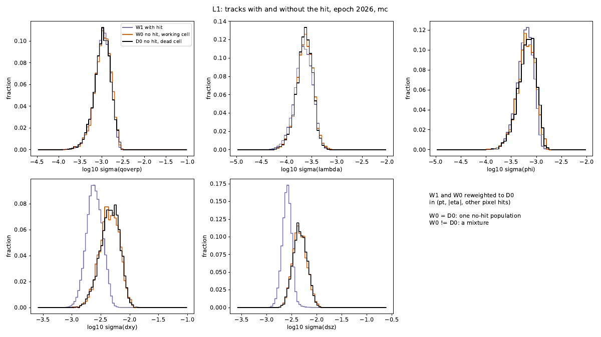

*Same page on MC: W0 = D0 again; the gap to W1 is ~0.3 in log10. In MC the dead L1 cells are only at |η| > 1, where removing L1 costs more.*

Two side observations from the counts on the first page:

- **In 2026 data almost no L1 cell is fully efficient.** Only 53k tracks cross cells with a hit efficiency ε ≥ 0.95, against 243k in dead cells (ε ≤ 0.4) and 1.13M in cells in between. The L1 loss is not just whole dead modules; much of it is partial inefficiency. The kill maps handle that (P_kill is continuous); the mixture test only probes the two extremes.
- **Losing D1 barely changes the covariance:**

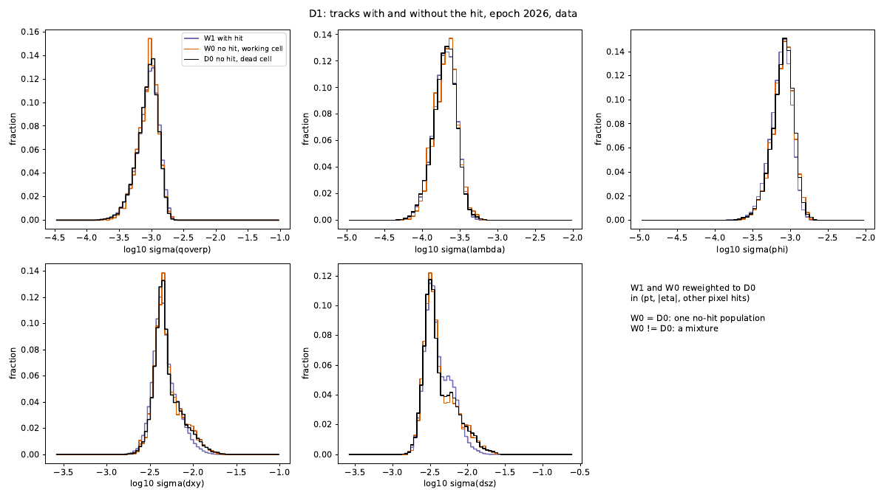

*Real page, data D1: W1, W0 and D0 almost coincide in all five parameters. For forward tracks the impact parameters are set by L1 and L2, and D1 adds little.*

So a D1 kill needs **no covariance change**, only the context change. The route B fit says the same: it pushes the D1 hit error to the 500 µm limit, which means "remove nothing", and still closes.

**2. Route B, as implemented, does not close for L1 beyond |η| ≈ 0.5.** After removing the L1 hit from W1 tracks with the fitted hit error, the median σ is compared with D0:

| \|η\| | 0–0.5 | 0.5–1 | 1–1.5 | 1.5–2 | 2–2.5 |
|---|---|---|---|---|---|
| data σ(d_xy) | 0.000 | 0.000 | −0.012 | −0.047 | −0.078 |
| data σ(d_sz) | 0.000 | −0.015 | −0.070 | **−0.162** | **−0.239** |
| MC σ(d_xy) | – | – | **−0.198** | **−0.282** | **−0.328** |
| MC σ(d_sz) | – | – | **−0.185** | **−0.244** | **−0.277** |

Negative means route B removes too little information: the result is still too precise, by up to a factor 1.7 (data, d_sz) and 2.1 (MC).

**Why** (right panel): removing a hit is only defined if V − H C Hᵀ is positive definite, i.e. if the hit error V is larger than the track's own predicted position error at that layer, H C Hᵀ. That quantity varies a lot from track to track, with momentum, angle and cluster shape. With one V per |η| bin, V must clear H C Hᵀ for 98% of the tracks (the fit's tolerance). In every bin above |η| = 0.5 the fit sits exactly at that limit: 2.0% of the tracks not positive definite (0.6% in the central bin, which closes). V is therefore pinned by the tracks with the largest H C Hᵀ, and is far too large for the typical track. A large V means little information removed, hence a too-small C′. The effect grows with |η|, where L1 carries most of the z information, so σ(d_sz) suffers most.

This is a limitation of the "one hit error per bin" model, not of the method. The synthetic samples used a single hit error per surface, which is why they closed. The natural fix is a hit error relative to each track, **V = k · H C Hᵀ** with one factor k > 1 fitted per |η| bin. It is positive definite for every track by construction, and removes the same *fraction* of information from every track. It also gives the closed form C′ = C + C Hᵀ (H C Hᵀ)⁻¹ H C / (k − 1).

**What this means for the routes**

- **Route A** has a clean target (item 1) and does not depend on hit errors. It is now the primary route.
- **Route B** is usable as an independent check only at |η| < 0.5 until the relative hit error is implemented. Then it must close on MC first (the MC rows above), before being compared with A.
- **D1 kills** need no covariance change in either route.

**Next:**

1. run routes on the full year: A with the trained flows; B at |η| < 0.5 only, as a cross-check:
   ```tcsh
   python emulate_hit_loss.py --epoch 2026 --killmaps test_km/killmaps_2026 --route A B \
          --flow-dir "<RUNS>/@epoch@/@mu@/task_0" \
          --hit-errors test_nol1_mc/hiterrors_mc_2026.json test_nol1/hiterrors_data_2026.json --out test_emu_routes
   ```
2. implement the relative hit error (V = k · H C Hᵀ) in route B and refit (on request);
3. the Bmmm hit-mask patch (on request).

---

## 10. Approximations, open items, speed

1. **No per-layer hit mask** (section 9.2). After a kill, the next crossed layer is assumed valid, and L2–L4 / D2–D3 cannot be emulated. This is the dominant residual in 2026. Fix: `{mu}_pix_valid_mask` in Bmmm.
2. **Two hits on one layer** (module overlaps) count as one when killed: for those tracks n_pix stays 1 too high.
3. **Tracks left with ≤ 2 pixel hits are kept.** Checked on full 2026 (section 9.7): data has even more of them (10.8% against 9.6%; no pixel hit 0.54% against 0.11%), so keeping them is right.
4. **MC share per run range** = share of selected data events, which includes trigger and selection efficiency. `--lumi-csv` takes the brilcalc recorded luminosity instead.
5. **Uncorrectable cells** (MC dead where data works) cannot be emulated by removing hits. In 2026 they are mostly the D1+ outer edge, where data's disk extends ~1.5 mm further than MC's (section 9.6). With cap 1.5 they leave 0.9% of the D1+ efficiency missing; with the new default cap 3, 0.4%, at the price of weights up to 3 on those few tracks. Inside the nominal acceptance it is below 0.2% on every surface.
6. **Fallback cells** (level 2) take MC's pattern scaled to the data total: data-only dead modules in a sparse cell are spread over the surface. They hold few probes by definition, and with the full sample most of them become level 1 (same cell, neighbouring months).
7. **Route B hit errors** are one (σ_u, σ_v) per \|η\| bin. On 2026 data and MC this does not close beyond \|η\| ≈ 0.5 (section 9.8): V is pinned by the positive-definiteness of the widest tracks. To be replaced by a per-track relative error V = k · H C Hᵀ.
8. **Route A** uses the flows as trained on non-emulated MC: f_MC is evaluated at the original context, where MC is plentiful.
9. **Offline only.** The smearing δ ~ N(0, C′ − C) is applied here only to the beam-spot IP-significance check. Production needs the kill step, the chosen route and the smearing in Bmmm before the vertex fits; the functions in `hitemu.py` are plain numpy.
10. **Early epochs** (2022–2023) have few dead cells, so the hit-error fits may be empty. `EXTRA_HITERR` in `run_hitemu.csh` can point to a later epoch's fits.
11. **Speed:** solved (section 9.7). The full year takes 5.5 min without routes, dominated by reading. `--closure-only` is still there for even faster iterations.

---

## 11. Reference

### Files (repository root)

| file | step | what it does |
|---|---|---|
| `hitemu.py` | – | library: helix crossings, run ranges, `KillMaps`, `emulate`, route B (`jacobian`, `remove_hit`, `HitErrors`), route A (`CovFlow`), smearing, reweighting histograms |
| `build_kill_maps.py` | 1 | per-run table → run ranges → data maps per range, MC map, P_kill, weights → `killmaps_<epoch>.npz/.json/.pdf` |
| `inspect_killmaps.py` | 1 | where the data probes sit (fallback level, uncorrectable) and what stays missing, for any cap |
| `noL1_data_study.py` | 4 (+5) | W1/W0/D0, mixture test, fit of route B hit errors → `noL1_<sample>_<epoch>.pdf`, `hiterrors_<sample>_<epoch>.json` |
| `emulate_hit_loss.py` | 2, 3, 5 | hit killing in MC, per-cell and context closure, routes A/B and their checks, optional emulated MC tree → `emu_<epoch>.pdf/.json` |
| `run_hitemu.csh` | all | all steps for every epoch, for screen |
| `pixel_eff_maps.py` | – | geometry and helpers (needs the version with `set_thetalim`) |

### Main options

| script | option | default | meaning |
|---|---|---|---|
| build_kill_maps | `--max-ranges` | 8 | maximum number of run ranges |
| | `--min-cell-probes` | 40 | minimum mean probes per L1 cell in a range (× 3072 = minimum per range) |
| | `--min-gain` | 25 | minimum −2 ln L gain to split |
| | `--min-cell` | 30 | probes for a cell's own value (else fallback) |
| | `--max-weight` | 3 | ratio of hit efficiencies ε_data/ε_MC above which a cell is uncorrectable (1.5 until Oct 2026) |
| | `--min-weight` | 0.2 | floor of w_nohit |
| | `--nbins-phi`, `--nbins-r` | 48, 20 | cell granularity (L1 z is fixed to the ROC pitch) |
| | `--lumi-csv` | – | brilcalc csv for the MC shares |
| | `--fallback` | mcshape | level-2 data efficiency: `mcshape` (ε_MC of the cell × factor) or `average` (old) |
| emulate_hit_loss | `--route` | none | `A`, `B` or both |
| | `--flow-dir` | – | trained flows, with `@epoch@` / `@mu@` placeholders |
| | `--hit-errors` | – | one or more `hiterrors_*.json` (first with a fit wins, per surface) |
| | `--eps-dead` | 0.4 | data hit efficiency ε_data below which a cell counts as dead (D0 target) |
| | `--write-tree` | off | write the emulated MC tree (route B) for retraining |
| | `--closure-only` | off | only hit killing and closure; no covariance / beam-spot branches, no routes (fast) |
| | `--fallback` | as stored | re-finalise the kill maps with another level-2 fallback (maps from before Oct 2026: `mcshape`) |
| | `--max-weight` | as stored | re-finalise the kill maps with another cap (no need to rebuild them) |
| all | `--max-events` | all | read only the first N events (= first runs) |

### Outputs per epoch (`run_hitemu.csh`)

```
hitemu/<epoch>/killmaps/killmaps_<epoch>.{npz,json,pdf}
hitemu/<epoch>/noL1_data/{noL1_data_<epoch>.pdf, hiterrors_data_<epoch>.json}
hitemu/<epoch>/noL1_mc/{noL1_mc_<epoch>.pdf, hiterrors_mc_<epoch>.json}
hitemu/<epoch>/emu/{emu_<epoch>.pdf, emu_<epoch>.json [, emu_<epoch>_routeB.root/.json]}
hitemu/logs/<epoch>_<step>.log, summary_<timestamp>.txt
```
