# Hit-loss emulation for covflow, explained

*What the scripts `build_kill_maps.py`, `noL1_data_study.py` and `emulate_hit_loss.py` do, why, how to read their output, and what the first 2026 test showed.*

Figure names tell where a figure comes from:

- **`f…`**: drawings, toys (f18–f20: route A and its smearing, made by `docs/hitemu_figs/make_f18_f20.py`), or plots made from real 2026 numbers;
- **`r…`**: pages of the scripts' own PDFs, run on the **real 2026 data and Summer24 MC** (October 2026);
- **`s…`**: pages produced on **synthetic** samples. Only two are left (the route A/B pages in section 7.4), because routes A and B have not been run on real data yet. They show what those pages look like, not CMS results;
- **`e…`**: plots made from the outputs of the **per-epoch run of 7 October 2026** (all seven Run 3 epochs, section 10).

**ε is the Greek letter epsilon and always means hit efficiency** (section 1). Only command-line options and log lines spell it `eps` (e.g. `--eps-dead`).

---

## Contents

0. [The problem in one picture](#0-the-problem-in-one-picture)
1. [Words used everywhere](#1-words-used-everywhere)
2. [The chain and the commands](#2-the-chain-and-the-commands)
3. [Step 1: kill maps (`build_kill_maps.py`)](#3-step-1-kill-maps)
4. [Step 2: emulating the hit loss in one MC event](#4-step-2-emulating-the-hit-loss-in-one-mc-event)
5. [Step 3: did it work? Closure and total variation](#5-step-3-closure)
6. [Step 4: are the data tracks without L1 a single population? (mixture test)](#6-step-4-the-mixture-test)
7. [Step 5: the covariance of a track that lost a hit, routes A and B](#7-step-5-routes-a-and-b)
8. [How to choose between A and B](#8-how-to-choose-between-a-and-b)
9. [Worked example: the 2026 test, number by number](#9-worked-example-the-2026-test)
10. [All Run 3 epochs: the run of 7 October 2026, and its oddities](#10-all-run-3-epochs)
11. [Approximations, open items, speed](#11-approximations-open-items-speed)
12. [Reference: files, options, outputs](#12-reference)

---

## 0. The problem in one picture

covflow corrects the MC track covariance (5×5) towards data with a normalising flow. That flow is *conditioned* on a **context** of five variables: p<sub>T</sub> (as log p<sub>T</sub>) and η of the muon's best track, and its hit pattern: number of pixel hits, first BPix layer, first FPix disk. The emulation reads this list from each trained run (`covflow.json`), so it always matches the training. The correction is only meaningful if MC and data tracks with the **same context** are comparable.

In 2026 they are not comparable, because the pixel detector in data has lost many more modules than the MC conditions (Summer24) know about. The figure shows the **hit efficiency** ε (section 1): the fraction of muons crossing a piece of detector that leave a valid hit there.


*Left and middle: BPix layer 1 hit efficiency for muons that cross it, as a function of where they cross it (z, φ), for all of 2026 data and for the MC. Data shows dark blocks (dead or partly dead modules) all over; MC is almost uniformly yellow. Right: as a result, 63% of data muons start at L1 against 94% in MC, and the no-L1 data muons pile up at L2 and L3.*

In 2026, **one data track in three has no L1 hit, compared with a few per cent in MC**. covflow trained as it is would be asked to map, say, "MC tracks starting at L2" (5% of MC, mostly geometric gaps) onto "data tracks starting at L2" (30% of data, mostly dead modules). These are different populations.

Reweighting MC to the data hit pattern, even in variables that locate the crossing (p<sub>T</sub>, η, φ, z0), does not work: the hit loss is localised in (z, φ) cells that are dead in data and working in MC, so the MC tracks that "should" have lost the hit are a tiny minority and get weights up to ~10³.

**The approach here: make the MC lose the same hits as data, track by track.** In a cell where the hit efficiency is 40% in data and 97% in MC (ε<sub>data</sub> = 0.40, ε<sub>MC</sub> = 0.97), each MC hit is removed with probability 1 − 0.40/0.97 = 0.59. The MC then has the data hit pattern, with weights ≈ 1. Two questions remain:

1. which hits to remove, and when in the year (steps 1–3);
2. what the covariance of an MC track becomes once its hit is gone (steps 4–5, routes A and B).

---

## 1. Words used everywhere


*Left: r-z view of the Phase-1 pixel detector: four barrel layers L1–L4 (r = 2.9, 6.8, 10.9, 16.0 cm, |z| < 26.6 cm) and three disks per side D1–D3 (|z| = 29.1, 39.6, 51.6 cm, 4.5 < r < 14.8 cm). A central track crosses the four layers; a forward track crosses L1 and then the disks. Right: what the emulation does to one MC muon whose L1 crossing falls in a cell that is dead in data.*

> **The one symbol to remember: ε = hit efficiency**, the fraction of tracks crossing a piece of detector that leave a valid hit there. ε<sub>data</sub> and ε<sub>MC</sub> are that fraction in data and in MC.

| word | meaning |
|---|---|
| **crossing** | the point (z, φ) where a muon's helix, from its PCA to the PV, crosses a pixel surface (L1, or D1±: r, φ). Computed from p<sub>T</sub>, η, φ, charge, PV x/y and z<sub>0</sub> = `pv_z` + dz, with a helix in a 3.8 T field: equations, cells and two worked examples in section 3.6. |
| **in acceptance** | the crossing is on the sensitive surface: \|z\| < 26.6 cm on L1, 4.5 < r < 14.8 cm on D1. |
| **cell** | a bin of the surface. L1: 48 bins in φ × bins of one ROC pitch (0.83 cm) in z, so 3072 cells in acceptance. D1±: 48 in φ × 20 in r. |
| **probe** | a muon that crosses the surface in acceptance and has at least 2 other valid pixel hits (so that the track is certainly a good track and did not need the surface hit to be reconstructed). |
| **ε = hit EFFICIENCY** | ε is the Greek letter epsilon. **Wherever you read ε, it means the HIT EFFICIENCY of a cell:** of the probes that cross the cell, the fraction that has a valid hit there. ε = (probes with a valid hit) / (probes). "Valid L1 hit" = `pix_first_b_layer == 1`; "valid D1 hit" = `pix_first_e_disk == 1`. MC probes are weighted with `pu_weight_<year>`. ε = 1: every track has the hit; ε = 0.6: 40% of the tracks lose it; ε = 0: dead module. |
| **ε<sub>data</sub>, ε<sub>MC</sub>** | the hit efficiency of the same cell measured in data and in MC. |
| **P<sub>kill</sub>** | probability to remove an existing MC hit in a cell: 1 − ε<sub>data</sub>/ε<sub>MC</sub>, used where ε<sub>data</sub> < ε<sub>MC</sub>. |
| **run range** | a block of consecutive runs with roughly constant efficiency, found automatically. Each has its own data maps. |
| **fallback level** | how a cell got its ε<sub>data</sub> when it has too few probes (section 3.3): 0 own value, 1 neighbouring run ranges, 2 surface average, 3 nothing. |
| **uncorrectable cell** | ε<sub>data</sub> > 3 · ε<sub>MC</sub> (`--max-weight`, 1.5 before Oct 2026): the data hit efficiency is so much higher than MC's that MC has too few hits there to reproduce data (section 3.4). |
| **context** | the covflow conditioning variables. Here, the part that changes: `n_pix`, `n_pix_b`, `n_pix_e`, first BPix layer (0 = none, 1–4), first FPix disk (0 = none, 1–3). |
| **TV (total variation)** | distance between two distributions: ½ Σ \|f<sub>data</sub> − f<sub>MC</sub>\|. 0 = identical, 1 = disjoint. It equals the fraction of MC tracks that would have to change category to match data (section 5). |
| **W1, W0, D0** | data tracks crossing a working L1 cell with a hit (W1) or without a hit (W0), and crossing a dead L1 cell, hence without a hit (D0) (section 6). |
| **route A, route B** | two independent ways to compute the covariance of an MC track after its hit is removed (section 7). |

**Abbreviations and symbols**

| short | spelled out |
|---|---|
| **ε** | **hit efficiency** (Greek epsilon; not an acronym). ε<sub>data</sub>, ε<sub>MC</sub>: in data, in MC. Options and log lines spell it `eps`: `--eps-dead`, `--eps-working` are the hit-efficiency thresholds for dead and working cells |
| BPix, FPix | barrel pixel detector, forward pixel detector |
| L1–L4 | BPix layers 1–4 (L1 innermost, r = 2.9 cm) |
| D1–D3, D1± | FPix disks 1–3; + / − = the disk at positive / negative z |
| ROC | readout chip: a pixel module is read by 16 ROCs; the L1 cells are one ROC wide in z |
| PV | primary vertex |
| PCA | point of closest approach of the track to the beam line (where its parameters are given) |
| PU | pile-up; `pu_weight_<year>` reweights the MC pile-up to data |
| MC | Monte Carlo simulation (here Summer24 for 2024–2026) |
| P<sub>kill</sub> | probability to remove an MC hit in a cell |
| w<sub>hit</sub>, w<sub>nohit</sub> | weights of MC muons with / without the hit in cells where data has the higher hit efficiency |
| W1, W0, D0 | Working cell with hit, Working cell without hit, Dead cell (without hit) |
| TV | total variation (distance between two distributions) |
| KS | Kolmogorov–Smirnov distance (largest difference of two cumulative distributions) |
| C, C′ | track covariance matrix (5×5) before / after removing a hit |
| H, V | how the hit position depends on the track parameters (2×5); hit position error (2×2) |
| PD | positive definite (a valid covariance matrix) |
| σ(d<sub>xy</sub>), σ(d<sub>sz</sub>) | uncertainties of the transverse and longitudinal impact parameters |
| IP | impact parameter |
| q/p, λ, φ, d<sub>xy</sub>, d<sub>sz</sub> | the five track parameters: charge/momentum, dip angle, azimuth, transverse and longitudinal impact parameters |

---

## 2. The chain and the commands


*The scripts and what they pass to each other. Steps are numbered as in the plan: 1 kill maps, 2 hit killing, 3 closure, 4 mixture test and hit errors, 5 routes A/B, 6 retraining covflow on the emulated MC (not automated yet).*

Everything runs from the covflow repository root and reads the same ntuples, selection and epoch table (`configs/run3_epochs.py`) as covflow. The branch defaults (`vx=pv_x`, `vy=pv_y`, z0 from `pv_z + dz`) are the ones of the efficiency-map runs, so no option is needed for them.

```tcsh
cd /work/manzoni/correct_track_covariance/covflow
conda activate covflow

# quick look at one epoch (a few minutes each; --max-events reads the FIRST N events, i.e. the first runs)
python build_kill_maps.py   --epoch 2026 --max-events 300000 --out test_km
python inspect_killmaps.py  test_km/killmaps_2026                      # where the probes sit, what stays missing
python noL1_data_study.py   --epoch 2026 --killmaps test_km/killmaps_2026 --max-events 300000 --split-test --out test_nol1
python emulate_hit_loss.py  --epoch 2026 --killmaps test_km/killmaps_2026 --max-events 300000 --out test_emu
# hit pattern only (no covariance branches, much faster): for iterating on kill maps and context closure
python emulate_hit_loss.py  --epoch 2026 --killmaps test_km/killmaps_2026 --max-events 300000 --closure-only --out test_emu_co

# everything, every epoch, under screen (edit RUNS at the top of the script first: the trained-flow production)
screen -S hitemu
tcsh run_hitemu.csh                 # or: tcsh run_hitemu.csh 2024 2025 2026
```

`run_hitemu.csh` writes `hitemu/<epoch>/{killmaps,noL1_data,noL1_mc,emu}/`, logs in `hitemu/logs/`, and a summary table at the end.

---

## 3. Step 1: kill maps

`build_kill_maps.py` makes three passes over the ntuples:

1. per-run L1 and D1 efficiency in data, to find the run ranges;
2. data maps of the hit efficiency, ε<sub>data</sub>(cell), per run range;
3. the MC map of the hit efficiency, ε<sub>MC</sub>(cell), one for the whole MC.

(Reminder: ε is the hit efficiency of a cell, section 1.) It then turns each pair (ε<sub>data</sub>, ε<sub>MC</sub>) into an action: remove MC hits, reweight MC tracks, or do nothing.

### 3.1 Run ranges: why, and how they are found

Modules die (and are sometimes recovered) during the year, so one map per epoch would smear a module that died in July over the whole year. The per-run efficiency is split into blocks by **binary segmentation**:

- start from the whole epoch;
- try every split point; keep the one that most improves the binomial likelihood of "one efficiency per block" (L1 and D1 together);
- repeat on the block where the best split gains most.

It stops when one of three things happens:

- there are 10 blocks (8 until 8 Oct 2026) (`--max-ranges`);
- a further split would leave a block with fewer than 122,880 L1 probes, i.e. 40 per L1 cell on average (`--min-cell-probes` × 3072);
- the gain is below 25 in −2 ln L (`--min-gain`).


*Black: L1 efficiency per run, full 2026 (from the effmaps run table). Orange: the 7 run ranges the segmentation finds on it, from ε = 0.66 down to 0.56 at the end of the year. Shaded: the 13 runs read by the 300k-event test, which therefore gets a single range. The full-year `build_kill_maps.py` run (section 9.6) found the same 7 ranges; one boundary is 2 runs off, because the real run also uses D1.*

MC has no runs. Each MC event is assigned to a run range at random, with probability equal to the range's share of the luminosity. The proxy is the share of selected data events; brilcalc's recorded luminosity can be passed with `--lumi-csv`. The event is then treated with that range's maps.

The same page in the kill-maps PDF, real full-2026 run (top: L1, bottom: D1; orange: range averages, dashed: boundaries):


### 3.2 From probes to efficiency maps

For every probe, the cell of its crossing is filled in a "probes" map and, if the hit is valid, in a "hits" map. The hit efficiency is ε = hits / probes per cell, per run range in data and once in MC.

### 3.3 Cells with too few probes: fallback levels

A cell needs at least 30 probes (`--min-cell`) for its own efficiency to be trusted. Otherwise:

| level | the data hit efficiency ε<sub>data</sub> of the cell is taken from | when |
|---|---|---|
| 0 | the cell itself, in this run range | ≥ 30 probes |
| 1 | the same cell summed over the neighbouring run ranges (the narrowest window with ≥ 30 probes), scaled by (this range's surface average) / (the window's surface average) | sparse in this range, but not over the year |
| 2 | **ε<sub>MC</sub> of the same cell × one data/MC factor per range** (the factor makes the data efficiency summed over all level-2 cells equal to the measured one) | sparse everywhere |
| 3 | nothing: the cell is left unchanged (P<sub>kill</sub> = 0) | no data probe at all |

The same rule applies to MC: own cell if ≥ 30 effective probes, else the MC surface average.

Level 2 was the *data surface average* until October 2026. The 2026 test showed that this is biased whenever MC has dead regions (section 9.3): the average already contains data's dead regions, and MC's dead regions then stay dead on top. Level 2 now keeps MC's live/dead pattern and only rescales it. `--fallback average` brings back the old behaviour, for comparison.

How many cells fall back depends almost only on statistics and on z: the luminous region is ±4 cm, so L1 cells at \|z\| > 15 cm are rarely crossed by anybody.


*Expected L1 probes per kill-map cell (estimated from the full-2026 probe map, scaled). Green: own measurement (level 0). Orange: fallback. Violet: practically no probes. The test (left: 41% / 40% / 19%) matches the log line `1156/0/1276/640` (38% / 42% / 21%). With the full sample about half the cells of each run range are measured directly; the rest use level 1, i.e. the same cell over the neighbouring months. In data probes rather than cells, the full-year run puts **95.6% of the L1 probes, 92.5% of D1+ and 87.9% of D1− in level-0 cells, and only 0.0–0.4% in level 2**: the fallback no longer matters. The right panel shows why the outer |z| region is empty in data and MC alike.*

### 3.4 From the two hit efficiencies (ε<sub>data</sub>, ε<sub>MC</sub>) to an action


*Left: what is done to a cell as a function of the ratio of hit efficiencies, ε<sub>data</sub>/ε<sub>MC</sub>. Right: three example cells with 1000 MC muons each, before (grey) and after (orange) the emulation; after = ε<sub>data</sub> in all three.*

- **ε<sub>data</sub> < ε<sub>MC</sub> (most cells in 2025–2026):** each existing MC hit is removed with P<sub>kill</sub> = 1 − ε<sub>data</sub>/ε<sub>MC</sub>. The MC efficiency becomes ε<sub>MC</sub> · (1 − P<sub>kill</sub>) = ε<sub>data</sub>. Nothing is weighted.
- **ε<sub>data</sub> > ε<sub>MC</sub>:** hits cannot be created. Instead, MC muons with a hit get weight w<sub>hit</sub> = ε<sub>data</sub>/ε<sub>MC</sub> and those without get w<sub>nohit</sub> = (1 − ε<sub>data</sub>)/(1 − ε<sub>MC</sub>), floored at 0.2. The weighted MC efficiency is then ε<sub>data</sub>. The event weight is the product over the two muons.
- **ε<sub>data</sub> > 3 · ε<sub>MC</sub>: "uncorrectable"** (`--max-weight`, default 3 since October 2026; it was 1.5). MC is (nearly) dead where data works: the weight would be large and carried by very few tracks. Nothing is done (weights 1). The emulated MC then stays below data in that cell, by ε<sub>data</sub> − ε<sub>MC</sub>.

How much the uncorrectable cells matter, on the full 2026 sample:


*Left and middle: every D1 cell of full 2026, data hit efficiency ε<sub>data</sub> against MC hit efficiency ε<sub>MC</sub> (point size ∝ data probes). Below the diagonal: hits are removed. Red, above the dashed line: uncorrectable. These are cells where Summer24 MC is partly dead and 2026 data is not (median ε<sub>MC</sub> 0.11 against ε<sub>data</sub> 0.39 on D1+). Right: the efficiency left missing after the emulation as a function of the cap. On D1+ it falls from 1.1% at cap 1.5 to 0.6% at cap 3. L1 is never a problem: data is almost everywhere worse than MC there. On the kill maps' own (coarser) cells most of the D1+ uncorrectable probes turn out to sit at the outer edge of the disk (section 9.6).*

### 3.5 What to look at in `killmaps_<epoch>.pdf`

This PDF is written by the script, whose labels spell the hit efficiencies ε<sub>data</sub> and ε<sub>MC</sub> as `eps_data` and `eps_MC` (section 1).

| page | look for | worry if |
|---|---|---|
| summary text | number of ranges, `kill L1` per range, fallback counts, uncorrectable fractions | one range on a full epoch; uncorrectable > few % |
| run ranges | boundaries on the visible steps (e.g. 2024 D1 at run 382799) | a clear step without a boundary: raise `--max-ranges` |
| ε<sub>data</sub> / P<sub>kill</sub> per range, L1 and D1± | dead blocks dark in ε<sub>data</sub> and bright in P<sub>kill</sub>, growing over the ranges | P<sub>kill</sub> structure outside \|z\| ≈ 15 cm (fallback values, not measurements) |
| summary per surface: ε<sub>data</sub>, ε<sub>MC</sub>, largest weight | grey cells inside acceptance = uncorrectable | grey cells where ε<sub>MC</sub> is *not* dark: then the cause is a fallback artefact, not a real MC-dead region |

`python inspect_killmaps.py <stem>` prints, per surface and range, which fallback level the data probes sit in and how much efficiency the uncorrectable cells leave missing, for any cap (`--max-weight 1.5 2 3`).

### 3.6 Where a muon crosses a pixel surface: the helix equations

Every probe (section 3.2) and every MC muon in the emulation (section 4) needs one thing first: **the cell of each pixel surface its track crosses**. It is computed track by track, from the reconstructed muon, by propagating a helix in a uniform 3.8 T field from the primary vertex outwards. Code: `pixel_eff_maps.cross_barrel` and `cross_disk`; `hitemu.cross` calls them for every surface.

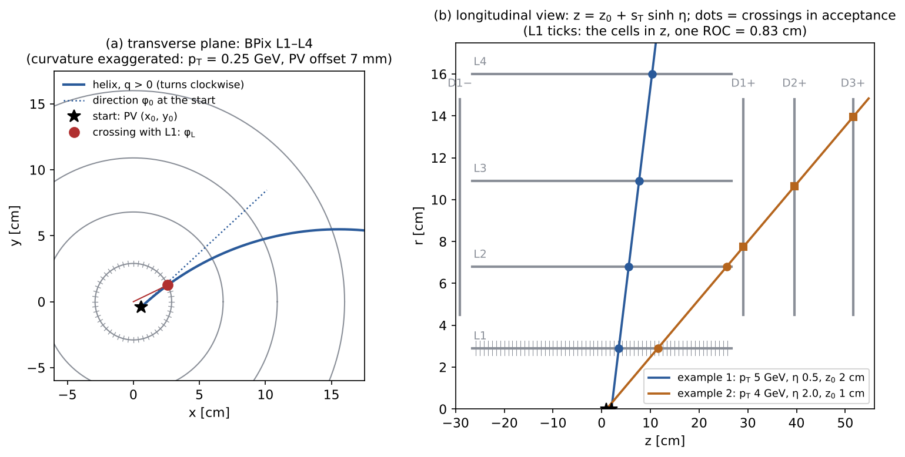

*(a) Transverse plane, curvature exaggerated (p<sub>T</sub> = 0.25 GeV, PV 7 mm off the axis): the helix starts at the PV in the direction φ<sub>0</sub>, a positive track turns clockwise, and φ<sub>L</sub> is the azimuth of the point where it reaches the L1 radius. The ticks on L1 are its 48 φ cells. (b) Longitudinal view, real numbers of the two examples below: z grows linearly with the transverse path length; the dots are the crossings in acceptance, circles on the barrel layers and squares on the disks. Example 2 crosses L1, L2 and then D1+, D2+, D3+. Made by `docs/hitemu_figs/make_f21.py` with the repository's own functions.*

**Inputs, per muon** (branch names for the 2026 runs; all overridable with `--branch`):

| symbol | meaning | branch |
|---|---|---|
| p<sub>T</sub>, η | transverse momentum and pseudorapidity of the muon's best track | `{mu}_best_trk_pt`, `{mu}_best_trk_eta` |
| φ<sub>0</sub> | azimuth of the momentum at the start of the helix | `{mu}_phi` |
| q | charge sign, ±1 | `{mu}_charge` |
| (x<sub>0</sub>, y<sub>0</sub>) | transverse start point = position of the primary vertex | `pv_x`, `pv_y` |
| z<sub>0</sub> | longitudinal start point = z of the track at its closest approach to the PV | `pv_z` + `{mu}_dz` |
| B | magnetic field along +z | 3.8 T |

**Step 1: radius and centre of the circle in the transverse plane.**

&nbsp;&nbsp;&nbsp;&nbsp;R [cm] = 100 · p<sub>T</sub> [GeV] / (0.299792458 · B [T]) &nbsp;&nbsp;&nbsp;&nbsp;(R = 439 cm at 5 GeV, 263 cm at 3 GeV)

&nbsp;&nbsp;&nbsp;&nbsp;x<sub>c</sub> = x<sub>0</sub> + q R sin φ<sub>0</sub>, &nbsp;&nbsp; y<sub>c</sub> = y<sub>0</sub> − q R cos φ<sub>0</sub>

The centre lies on the right of the direction of flight for q > 0: with B along +z a positive track turns **clockwise**, its azimuth decreases.

**Step 2: position after a turning angle α.** The track rotates about the centre by −q α:

&nbsp;&nbsp;&nbsp;&nbsp;x(α) = x<sub>c</sub> + (x<sub>0</sub> − x<sub>c</sub>) cos(qα) + (y<sub>0</sub> − y<sub>c</sub>) sin(qα)<br>
&nbsp;&nbsp;&nbsp;&nbsp;y(α) = y<sub>c</sub> − (x<sub>0</sub> − x<sub>c</sub>) sin(qα) + (y<sub>0</sub> − y<sub>c</sub>) cos(qα)

The transverse path length is s<sub>T</sub> = R α.

**Step 3: z along the track.** The dip angle is constant on a helix, dz / ds<sub>T</sub> = cot θ = sinh η, so

&nbsp;&nbsp;&nbsp;&nbsp;z(α) = z<sub>0</sub> + R α sinh η

**Barrel layer of radius r<sub>L</sub>** (L1–L4 at 2.9, 6.8, 10.9, 16.0 cm). α<sub>L</sub> is the smallest α with x(α)² + y(α)² = r<sub>L</sub>², found by bisection (45 steps, α ≤ π: a track that curls up before r<sub>L</sub> does not cross). The crossing is

&nbsp;&nbsp;&nbsp;&nbsp;z<sub>L</sub> = z<sub>0</sub> + R α<sub>L</sub> sinh η, &nbsp;&nbsp; φ<sub>L</sub> = atan2( y(α<sub>L</sub>), x(α<sub>L</sub>) )

and it is in acceptance if |z<sub>L</sub>| < 26.6 cm. For a track starting on the beam axis (x<sub>0</sub> = y<sub>0</sub> = 0) the solution is closed:

&nbsp;&nbsp;&nbsp;&nbsp;α<sub>L</sub> = 2 arcsin( r<sub>L</sub> / 2R ), &nbsp;&nbsp; φ<sub>L</sub> = φ<sub>0</sub> − q α<sub>L</sub> / 2, &nbsp;&nbsp; z<sub>L</sub> = z<sub>0</sub> + 2R arcsin( r<sub>L</sub> / 2R ) sinh η ≈ z<sub>0</sub> + r<sub>L</sub> sinh η

**Endcap disk at z<sub>D</sub>** (D1–D3 at ±29.1, ±39.6, ±51.6 cm; the sign selects the side). The disk fixes z, so α follows directly:

&nbsp;&nbsp;&nbsp;&nbsp;α<sub>D</sub> = (z<sub>D</sub> − z<sub>0</sub>) / (R sinh η), &nbsp;&nbsp; r<sub>D</sub> = √( x(α<sub>D</sub>)² + y(α<sub>D</sub>)² ), &nbsp;&nbsp; φ<sub>D</sub> = atan2( y(α<sub>D</sub>), x(α<sub>D</sub>) )

The track reaches the disk only if 0 < α<sub>D</sub> < π (α<sub>D</sub> < 0: it goes towards the other side), and the crossing is in acceptance if 4.5 < r<sub>D</sub> < 14.8 cm. From the beam axis: r<sub>D</sub> = 2R sin(α<sub>D</sub> / 2) ≈ (z<sub>D</sub> − z<sub>0</sub>) / sinh η, φ<sub>D</sub> = φ<sub>0</sub> − q α<sub>D</sub> / 2.

**From the crossing to the cell** (`hitemu.cell_index`, binary search in the bin edges):

| surface | first coordinate | φ |
|---|---|---|
| L1–L4 | z in bins of one ROC, 0.8325 cm, edges from −33.3 to +33.3 cm (64 bins inside \|z\| < 26.6) | 48 bins of 2π/48 = 0.131 rad from −π |
| D1±–D3± | r in 20 bins of 0.69 cm from 3.0 to 16.8 cm | 48 bins, as above |

At the L1 radius a φ cell is 0.131 × 2.9 cm = 3.8 mm wide. (`pixel_eff_maps.py` alone uses finer binning by default, 96 × 30, for display.)

**Two worked examples** (computed with the code; PV at the origin unless stated):

| | example 1 (barrel) | example 2 (forward) |
|---|---|---|
| p<sub>T</sub>, η, φ<sub>0</sub>, q, z<sub>0</sub> | 5 GeV, 0.5, 1.000 rad, +1, 2.0 cm | 4 GeV, 2.0, −2.000 rad, −1, 1.0 cm |
| R | 438.9 cm | 351.1 cm |
| surface | L1 (r<sub>L</sub> = 2.9 cm) | D1+ (z<sub>D</sub> = 29.1 cm) |
| α | 2 arcsin(2.9 / 877.8) = 0.006607 | (29.1 − 1.0) / (351.1 · sinh 2) = 0.02207 |
| crossing | z<sub>L</sub> = 2.0 + 438.9 · 0.006607 · sinh 0.5 = 3.511 cm; φ<sub>L</sub> = 1.000 − 0.0033 = 0.9967 rad | r<sub>D</sub> = 2 · 351.1 · sin(0.01103) = 7.748 cm; φ<sub>D</sub> = −2.000 + 0.0110 = −1.9890 rad |
| cell | z bin 44 = [3.33, 4.16) cm, φ bin 31 = [0.916, 1.047) rad | r bin 6 = [7.14, 7.83) cm, φ bin 8 = [−2.094, −1.963) rad |
| other surfaces crossed in acceptance | L2 at z = 5.54 cm, L3, L4 | L1 at z = 11.52 cm, L2 at z = 25.66 cm, D2+, D3+ |

With the PV at (x<sub>0</sub>, y<sub>0</sub>) = (0.5, −0.3) mm instead of the origin, example 1 crosses L1 at φ<sub>L</sub> = 0.9766 rad (−0.020 rad, 15% of a cell) and z<sub>L</sub> = 3.510 cm: the same cell, but a transverse offset of the start point matters ~1/r<sub>L</sub> more than the curvature.

**What matters, and what is approximated.**

- **z<sub>0</sub> moves z<sub>L</sub> one to one**, and an L1 cell is 0.83 cm long: z<sub>0</sub> is essential, which is why it is taken from the PV and the track's dz, not from the beam spot.
- **The curvature is a small correction** inside the pixel detector: φ<sub>L</sub> − φ<sub>0</sub> = −q α<sub>L</sub>/2 ≈ −q r<sub>L</sub>/2R, 0.003 rad at 5 GeV on L1 (2.5% of a cell), 0.011 rad on D1 in example 2. The sign of q still matters on L4 and the disks.
- **Start point = PV, not the track's point of closest approach.** The transverse impact parameter d<sub>xy</sub> is ignored. A transverse offset d shifts φ<sub>L</sub> by about d / r<sub>L</sub>: 0.003 rad for 100 µm (2.6% of a cell), 0.03 rad for 1 mm.
- **φ<sub>0</sub> is the muon's φ** (`{mu}_phi`), while p<sub>T</sub> and η are those of the best track; for a muon whose best track is its inner track the two directions coincide.
- **No multiple scattering or energy loss** before the surface: the deflection by the beam pipe is ~10⁻⁴ rad at 5 GeV, a few µm at L1.
- **Nominal geometry:** one cylinder per barrel layer and one plane per disk, at the radii and z above (`GEOM` in `pixel_eff_maps.py`, marked "CHECK against the CMSSW geometry"). Real modules are flat and overlap, so the true radius varies by a few mm around the nominal one; a radius error Δr moves z<sub>L</sub> by Δr · sinh η, a fraction of a cell. The data–MC mismatch of ~1.5 mm at the outer edge of D1 (section 9.6) is of this kind.
- **Without a charge branch** the helix becomes a straight line (a warning is printed); the 2026 ntuples have it.

---

## 4. Step 2: emulating the hit loss in one MC event

For every selected MC event, `emulate_hit_loss.py` does the following.

1. **Pick a run range** at random with the luminosity shares.
2. **For each muon**, compute the L1 and D1± crossings (the same helix as in the maps).
3. **Remove the L1 hit** with probability P<sub>kill</sub>(range, L1 cell) = 1 − ε<sub>data</sub>/ε<sub>MC</sub> (ratio of the hit efficiencies) if the muon has an L1 hit (`first_b == 1`). Same for D1.
4. **Update the context** (right panel of the detector figure in section 1):
   - n<sub>pix</sub> and n<sub>pix,b</sub> (or n<sub>pix,e</sub>) decrease by 1;
   - the first BPix layer becomes the **next layer the helix crosses in acceptance** (L2, else L3, else L4, else none), and likewise for the disks.
5. **Multiply the event weight** by w<sub>hit</sub> or w<sub>nohit</sub> in cells where data beats MC.
6. **Flag the muon** as "lost L1" / "lost D1": these are the muons whose covariance routes A/B must change (section 7).

**The weak point is step 4: "the next layer crossed is assumed to have a valid hit".** The ntuple has only the *first* layer and the hit counts, not a per-layer mask. So after removing L1 we do not know whether the MC track also lacked an L2 hit. And even if we knew, we would have no L2 map telling us how often data lacks L2. Section 9 shows that this is the main thing the 2026 test exposed.

**With the per-layer hit masks (Bmmm patch, section 9.9) this step becomes exact.** The kill maps then cover all ten surfaces (L1–L4, D1±–D3±), every layer is killed with its own map, and the context after killing is recomputed from the hits that are really left:

- the first BPix layer is the lowest layer still in the mask;
- n<sub>pix</sub> drops by the hits on the killed layers, overlaps included.

The scripts switch automatically: the ten surfaces with the masks in the ntuple, L1/D1 without.


*Left: a data muon without L1 and L2. Middle: today the emulation removes L1 and must guess L2 ("valid if crossed"), so emulated muons almost never start at L3. Right: with a per-layer hit mask `{mu}_pix_valid_mask` in the ntuple (the "Bmmm patch"), L2 is known, and an L2 kill map can be built exactly like the L1 one.*

---

## 5. Step 3: closure

Two checks, both in `emu_<epoch>.pdf` and in the printed summary.

**Per-cell closure.** For each L1 / D1± cell: the *measured* data hit efficiency ε<sub>data</sub> (raw hits / probes, summed over run ranges) against the emulated-MC efficiency, both averaged with the data probes of the cell as weights. Two columns are printed:

- **all cells**;
- **measured cells only** (≥ 30 data probes), where the per-cell comparison is meaningful.

By construction emulated = data, except in uncorrectable cells (MC stays lower) and through the fallback approximations. (The first version compared with the kill-map values instead of the raw counts, which in sparse cells are the fallback values themselves. That hid where the problem was; see section 9.3.)


*Real page, full 2026, L1. Left: measured data hit efficiency ε per cell. Middle: hit efficiency of the emulated MC. Right: emulated − data. The difference is noise in the centre, with a few structured cells at |z| > 15 cm; the average is −0.0030 (section 9.7).*

**Context closure.** This is what covflow actually sees. Two distributions are compared, in each \|η\| bin:

- the joint distribution of (first BPix layer, first FPix disk);
- the pixel-hit count.

Each is compared for data, MC before and MC emulated, and summarised by the total variation. TV is computed per \|η\| bin and averaged with the data \|η\| spectrum, so a p<sub>T</sub>/η spectrum difference between data and MC does not count.


*What a TV number means: 0.10 = 10% of the MC muons are in the wrong category. "MC before 0.315, emulated 0.063" means the fraction of misplaced MC muons fell from 31% to 6%.*


*Real context page, full 2026. Per |η| bin (columns):*

- *top: first BPix layer;*
- *middle: first FPix disk;*
- *bottom: number of pixel hits.*

*Black: data. Grey: MC before. Orange: MC after the emulation. The orange points follow the black ones at L1 and L2 but stay ~10× below them at L3/L4, at D3, and in the low-hit tail. That is the missing L2/L3/D2 loss of section 9.2.*

---

## 6. Step 4: the mixture test

Route A (section 7) takes as its target "the covariance of data tracks without L1". That is only right if a data track without L1 is like an emulated MC track without L1: a good track that happened to cross a dead module. But a track can also lack the hit for other reasons:

- the hit was rejected by the fit as an outlier;
- the cluster was lost or merged;
- the track scattered a lot.

Such tracks have different (worse) covariances, and none of them is produced by the emulation.


`noL1_data_study.py` splits the data tracks into the three populations of the drawing:

- **D0:** no hit, dead cell (data hit efficiency ε<sub>data</sub> < 0.4, option `--eps-dead`). These are random losses, exactly what the emulation makes.
- **W0:** no hit, working cell (data hit efficiency ε<sub>data</sub> > 0.95). The suspicious population.
- **W1:** hit, working cell. The bulk.

It then compares the distributions of log<sub>10</sub> σ of the five track parameters for W0 and D0, after reweighting both to D0 in (p<sub>T</sub>, \|η\|, pixel hits, z0·sign η).

- **W0 ≈ D0** (median shift < 0.01 in log<sub>10</sub> σ, i.e. 2%; width ratio < 1.1; KS < 0.05): the no-L1 tracks in data are one population. Route A's target is clean.
- **W0 ≠ D0:** the no-L1 data tracks are a mixture. Route A would give the emulated losses the wrong tails. Use route B, or take the target from D0 only.


*Real page, full 2026 data, L1: log<sub>10</sub> σ of the five track parameters for W1 (blue, with hit), W0 (orange) and D0 (black), all reweighted to D0. W0 lies on D0 (one population, the test passes; section 9.8), and both are ~0.2 in log<sub>10</sub> above W1 in σ(d<sub>xy</sub>) and σ(d<sub>sz</sub>). A failing test would show W0 with its own tail or shifted peak.*

The same script also fits the **hit errors V** used by route B (section 7.2), and with `--sample mc` it does the same on MC.

---

## 7. Step 5: routes A and B

### 7.1 Why the covariance must change at all

Removing the innermost hit lengthens the extrapolation from the first measurement to the vertex. The impact-parameter error grows a lot, and more for low-momentum tracks, where multiple scattering dominates.


*Toy least-squares fit with multiple scattering (pixel + strip layers, η = 0). This shows the trend, not CMS numbers. σ(d<sub>xy</sub>) roughly doubles when the track starts at L2 instead of L1, and triples at L3. So an MC track that lost L1 but kept its "with L1" covariance would be far too precise. And the muons that start at L3 / L4 form the tail of the IP-significance distribution.*

An MC muon that lost its hit therefore needs a new covariance, and its parameters must be smeared so that their scatter matches the larger errors (for route A, δ ~ N(0, C′<sub>MC</sub> − C), section 7.2.5). Two independent ways to get the new covariance:


### 7.2 Route A: reuse the trained covflow flows

**In short.** For each MC muon that lost a hit (the kill of section 4 decides which, at random, track by track), route A does two things:

- **a new covariance, deterministic.** The muon keeps its rank among MC muons, but among those with the new hit pattern. Only the **MC flow** is used, forward with the old context and inverse with the new one. The result, C′<sub>MC</sub>, is an MC-like covariance for "this track, had it lost its hit".
- **a smearing, random.** The track parameters are shifted by δ ~ N(0, C′<sub>MC</sub> − C): the extra scatter that a fit with one hit less really has.

After that the emulated MC is an ordinary MC sample, and the usual covflow (MC flow forward, data flow inverse, at the new context) is applied to it like to any other track. Together this gives the formula used on the slides, C′ = f<sub>data</sub>⁻¹( f<sub>MC</sub>(C; c) ; c′ ).

#### 7.2.1 The objects

| symbol | what it is | where it lives |
|---|---|---|
| θ | the 5 track parameters (q/p, λ, φ, d<sub>xy</sub>, d<sub>sz</sub>) | ntuple |
| C | their 5×5 covariance, from the fit with all hits | `{mu}_cov_*` |
| y = φ(C) | the 9 flow features: 5 log σ, plus 4 atanh of the partial correlations kept by the r–φ / r–z blocks. φ is invertible, and every y gives a positive-definite C | `features.py` |
| c | the context of the muon **as reconstructed**: p<sub>T</sub>, η, number of pixel hits, first BPix layer, first FPix disk (the five context variables of the trained flows; no φ) | ntuple |
| c′ | the context **after the kill**: p<sub>T</sub> and η unchanged; pixel hits minus the hits on the killed layer; first layer / disk moved to the next one that has a hit | `hitemu.emulate` |
| f<sub>MC</sub>(y; c) | the MC flow: a bijection between MC features and the latent space, trained on MC muons of all contexts | covflow run, `flow_mc` |
| f<sub>data</sub>(y; c) | the same, for data | covflow run, `flow_data` |
| u | latent point, u ~ N(0, 1) in 9 dimensions | — |

Both flows are bijections **feature space ↔ latent space**, for every value of the context:

- "forward" (y → u) is written f(y; c);
- "inverse" (u → y) is written f⁻¹(u; c).

For any context, f( f⁻¹(u; c) ; c ) = u: the inverse at a context undoes the forward **at the same context**. Everything below follows from this one identity.

#### 7.2.2 The MC part: C → C′<sub>MC</sub>, with the MC flow only

&nbsp;&nbsp;&nbsp;&nbsp;u = f<sub>MC</sub>( φ(C) ; c ) &nbsp;&nbsp;&nbsp;&nbsp; C′<sub>MC</sub> = φ⁻¹( f<sub>MC</sub>⁻¹( u ; c′ ) )

The **MC ↔ latent bijection is used twice**: forward with the old context c, then inverse with the new context c′. The data flow plays no part in C′<sub>MC</sub>. Code: `hitemu.CovFlow.morph_mc`.

In one dimension, with log<sub>10</sub> σ(d<sub>xy</sub>) the only feature, a flow is the cumulative distribution followed by a fixed map to a Gaussian. "Forward at c, inverse at c′" then means:

1. find the track's percentile among MC muons with context c;
2. take the value at **the same percentile** among MC muons with context c′.

A track more precise than 30% of the MC muons with an L1 hit becomes more precise than 30% of the MC muons without it.

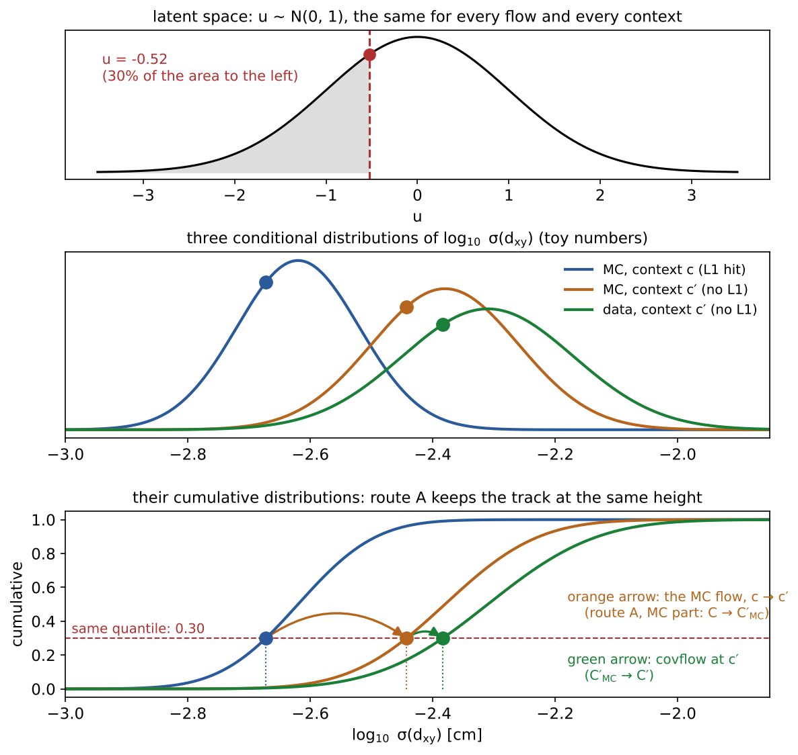

*Toy numbers, one feature.*

- *Top: the latent Gaussian; the track sits at u = −0.52, the 30th percentile.*
- *Middle and bottom: MC with the L1 hit (blue), MC without it (orange), data without it (green), as densities and as cumulative distributions.*
- <i>Route A moves the track along the horizontal line at 0.30: first to the orange curve with the MC flow (C′<sub>MC</sub>), then to the green one with the usual covflow (C′).</i>

**Why the MC flow can do this at all.** f<sub>MC</sub> was trained on MC muons of **all** contexts. About 6% of MC muons have no L1 hit for natural reasons (gaps between modules, the MC's own small inefficiency). So f<sub>MC</sub>( · ; c′) already knows what the MC reconstruction gives for a muon without an L1 hit, at every p<sub>T</sub> and η. Route A borrows that knowledge: no detector model, no fit, no retraining.

**What it assumes.** An MC muon that lost its hit at random (our kill) has the covariance distribution of MC muons that lack the hit for natural reasons, at the same (p<sub>T</sub>, η, hit pattern). This is the mixture test of sections 6 and 10.10, in its MC version: W0 (no hit in a working cell) against D0 (no hit in a dead cell) agree within 0.03 in log<sub>10</sub> σ(d<sub>xy</sub>) for L1.

#### 7.2.3 Adding the data part: the usual covflow at c′

The emulated MC tree carries C′<sub>MC</sub> and the new context c′. Covflow, applied to it as to any MC track:

&nbsp;&nbsp;&nbsp;&nbsp;C′ = φ⁻¹( f<sub>data</sub>⁻¹( f<sub>MC</sub>( φ(C′<sub>MC</sub>) ; c′ ) ; c′ ) ) = φ⁻¹( f<sub>data</sub>⁻¹( u ; c′ ) )

The inner step collapses because f<sub>MC</sub>( f<sub>MC</sub>⁻¹(u; c′) ; c′ ) = u: covflow finds the **same latent point u**, and the data flow at c′ turns it into a data-like covariance. Two steps give **exactly** the one-step formula C′ = f<sub>data</sub>⁻¹( f<sub>MC</sub>(C; c) ; c′ ). The emulator computes both and checks the difference per track (`A_split`, logged as "covflow(A, MC part) vs route A"): |Δ log<sub>10</sub> σ| ~ 10⁻⁷ on the synthetic sample.

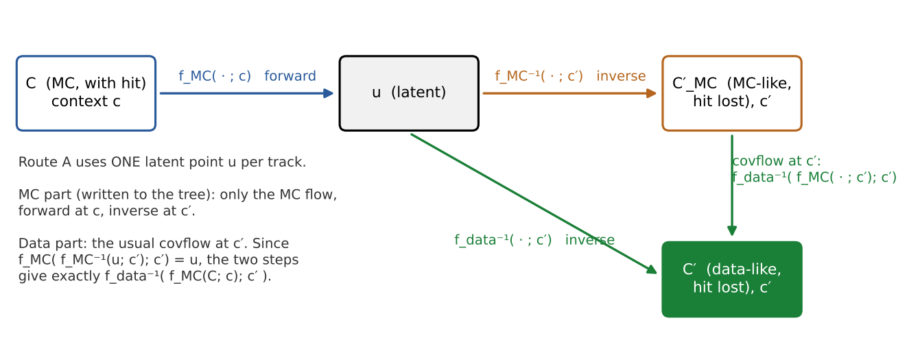

*One latent point u per track. Orange: the MC part, written to the emulated tree. Green: the usual covflow at c′, which recovers the same u and gives the data-like C′.*

Why split it, if the result is the same?

- **The tree stays an MC.** Downstream, covflow treats the emulated MC like any other MC, with no special case for the killed muons.
- **The two smearings stay separate** (section 7.2.5): one is certain physics, the other an open question.

**One caveat: "the same percentile" in 9 dimensions.** In one dimension it is unique. In 9 dimensions it is defined by the flow's latent space, and a different, equally good flow could pair tracks slightly differently while giving the same distributions at c and at c′. So the pairing of each track is a modelling choice, not a measurement. What is tested is the population: the emulated MC muons that lost L1 against data muons in dead modules agree within −0.010 … +0.027 in log<sub>10</sub> σ(d<sub>xy</sub>) in all seven epochs, and in all five σ in 2026 (section 10.13).

#### 7.2.4 Why smear at all

Removing a hit does two things to a real track:

1. its reported uncertainty grows (C → C<sub>R</sub>);
2. its fitted parameters really scatter more around the truth, because the fit has less information.

The new covariance only gives the first. Stopping there would leave parameters with the precision of the full fit and the uncertainty of the reduced one: pulls too narrow (width 0.58 instead of 1 in the toy below).

#### 7.2.5 The smearing is the difference of two covariances: δ ~ N(0, C′<sub>MC</sub> − C)

Fit one track twice: with all hits (θ, covariance C) and without one hit (θ<sub>R</sub>, covariance C<sub>R</sub>). For a linear fit with Gaussian errors (a Kalman fit, to a good approximation):

1. θ is the best unbiased estimate there is: nothing has a smaller covariance;
2. so the change θ<sub>R</sub> − θ is **uncorrelated with θ**. If it were correlated, the mixture θ + k(θ<sub>R</sub> − θ) would beat θ for some small k, which is impossible;
3. hence Cov(θ<sub>R</sub>) = Cov(θ) + Cov(θ<sub>R</sub> − θ), that is **Cov(θ<sub>R</sub> − θ) = C<sub>R</sub> − C**.

The reduced fit is the full fit plus an independent Gaussian step whose covariance is the difference of the two covariances:

&nbsp;&nbsp;&nbsp;&nbsp;θ<sub>R</sub> = θ + δ, &nbsp;&nbsp; δ ~ N(0, C<sub>R</sub> − C), &nbsp;&nbsp; δ independent of θ

Route A uses this with C′<sub>MC</sub> in place of C<sub>R</sub>: <b>θ′ = θ + δ, δ ~ N(0, C′<sub>MC</sub> − C)</b>, one fresh draw per killed muon. Both C′<sub>MC</sub> and C are MC-like, so δ is the **hit loss only**.

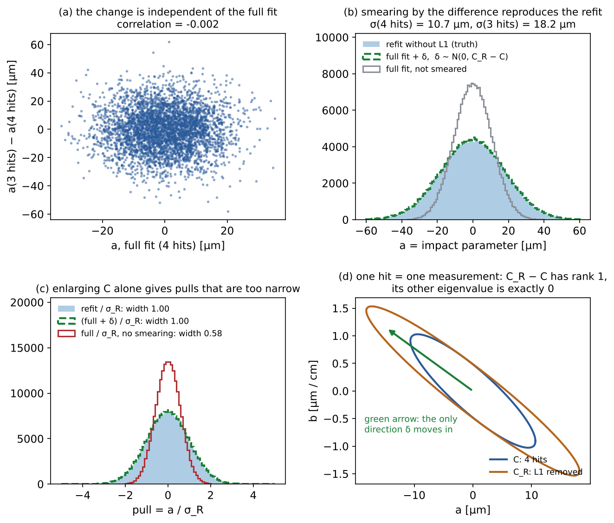

*Toy: a straight track through the four BPix layers (r = 2.9, 6.8, 10.9, 16.0 cm, 10 µm per hit), fitted with all four hits and without L1, 200k tracks.*

- *(a) The change of the impact parameter is uncorrelated with the full fit (−0.002).*
- *(b) Full fit + δ (dashed) reproduces the refit without L1 (filled); the full fit alone (grey) is too narrow.*
- *(c) Pulls have width 1 only with the smearing (0.58 without).*
- *(d) The two covariance ellipses touch along one direction; δ moves only along the other (next paragraph).*
- <i>Removing L1 raises σ(d<sub>xy</sub>) from 10.7 to 18.2 µm, +0.23 in log<sub>10</sub>: the size of the MC-before offset we see for dead-cell muons (−0.23 … −0.30).</i>

**How the draw is made** (`hitemu.smear`):

1. D = C′<sub>MC</sub> − C, symmetrised;
2. eigen-decomposition D = Q Λ Qᵀ;
3. negative eigenvalues set to 0;
4. δ = Q √Λ ξ, with ξ five independent standard normals, one draw per killed muon;
5. stored as `{mu}_emu_delta_<param>`, 0 for muons not killed. The tree replaces `{mu}_cov_*` with C′<sub>MC</sub> but **does not** add δ to the parameters: whoever builds a vertex or a significance from the emulated tree applies θ + δ.

<b>One hit, two measurements: C′<sub>MC</sub> − C is almost degenerate.</b> A pixel hit measures two coordinates (r–φ and z). Removing it removes two measurements, so the true C<sub>R</sub> − C has **rank 2**: three of its five eigenvalues are exactly zero (Woodbury, section 7.3: C<sub>R</sub> − C = C Hᵀ (V − H C Hᵀ)⁻¹ H C, and H has two rows). In panel (d) of the toy, one coordinate and two parameters, the rank is 1.

The flow knows nothing about this. Its output carries small noise on the three zero directions, so a small negative eigenvalue is expected for nearly every track. Clipping it to zero is the right thing: δ then lives in the directions where information was really lost. This is the "not PD" of section 10.13 for L1: 97% of the tracks, median −0.6% of the largest eigenvalue.

**Why not δ ~ N(0, C′ − C)?** C′ − C = (C′<sub>MC</sub> − C) + (C′ − C′<sub>MC</sub>), and the two terms are different effects:

| term | what it is | certain? |
|---|---|---|
| C′<sub>MC</sub> − C | losing the hit, inside MC | **yes**: the hit is gone, the parameters scatter more. Always smear. |
| C′ − C′<sub>MC</sub> | data against MC at the same context c′: covflow's usual correction | **open**: is data's *resolution* worse, or only its *reported* uncertainty? To be measured with the J/ψ pulls (prompt d<sub>xy</sub>/σ, mass pull, vertex probability). |

The second term is not specific to killed muons: every MC muon at every context poses the same question to covflow, so it is answered once, in covflow. If the pulls say data's resolution is worse, covflow adds δ₂ ~ N(0, C′ − C′<sub>MC</sub>) on top. Independent Gaussian steps add, so δ + δ₂ ~ N(0, C′ − C). That one-step version is what the IP-significance check of the emulator uses (section 10.13), because it compares with data directly. It checks the combination; it does not establish the second term.

#### 7.2.6 The whole recipe for one muon

| step | random? | uses | input → output | branch |
|---|---|---|---|---|
| 1. run range | yes, once per event | luminosity shares | event → r | `emu_range` |
| 2. kill | yes, per muon and surface | P<sub>kill</sub>(r, cell) | hit → removed or kept | `{mu}_emu_kill_L1`, `_D1`, `_mask` |
| 3. new context | no | per-layer masks | c → c′ | `{mu}_n_pix_hit`, `{mu}_pix_first_b_layer`, `{mu}_pix_first_e_disk`, masks (originals in `{mu}_orig_*`) |
| 4. new covariance | no | **f<sub>MC</sub> forward at c, f<sub>MC</sub> inverse at c′** | C → C′<sub>MC</sub> | `{mu}_cov_*` |
| 5. smearing | yes, per killed muon | C′<sub>MC</sub> − C, negative eigenvalues clipped | δ | `{mu}_emu_delta_*` |
| 6. covflow (downstream, every muon) | no (plus δ₂ if the pulls require it) | f<sub>MC</sub> forward at c′, f<sub>data</sub> inverse at c′ | C′<sub>MC</sub> → C′ | — |

Two consequences worth keeping in mind:

- A killed and a non-killed muon with identical C and c end up different: the first is read at c′, the second stays at c. Two killed muons with identical C and c get the same C′<sub>MC</sub> (step 4 is deterministic) but different δ (step 5 draws for each).
- f<sub>MC</sub>( · ; c′) must have seen enough MC muons at c′. Where MC has (almost) none, the flow extrapolates: it still returns a valid matrix, but nothing constrains it. Only the dead-cell closure against data (section 10.13) would show it.

**Advantages and requirements.**

- Advantages: no detector model; uses what is already trained; no retraining.
- Requirements: f<sub>MC</sub> and f<sub>data</sub> at context c′ must be trained on enough no-L1 tracks (true in 2024–2026), and the no-L1 data tracks must be the right target (section 6).

### 7.3 Route B: take the hit out of the fit

A track fit adds up the information of its hits. Removing one hit means subtracting its information. With the "inverse Kalman update" (Woodbury identity) this is exact for a linear fit:

&nbsp;&nbsp;&nbsp;&nbsp;C′ = C + C Hᵀ (V − H C Hᵀ)⁻¹ H C

The ingredients:

- **H (2×5):** how the hit position (two local coordinates on the module) moves when the five track parameters (q/p, λ, φ, d<sub>xy</sub>, d<sub>sz</sub>) move. Computed from the helix by finite differences.
- **V (2×2):** the hit position error, diag(σ<sub>u</sub>², σ<sub>v</sub>²), per surface and \|η\| bin. It is not in the ntuple, so `noL1_data_study.py` **fits** it: V is chosen so that W1 tracks (with the hit), after removing it, have the same median σ(d<sub>xy</sub>) and σ(d<sub>sz</sub>) as D0 tracks (without it) at the same (p<sub>T</sub>, η, position). A V that is too large removes too little information; one that is too small removes too much.

The result is MC-like ("B, raw"). covflow then corrects it like any MC track ("B, final"). The check "B, raw against MC's own tracks without L1" must close. It does on synthetic samples (within 0.01 in log<sub>10</sub> σ), but **not on real 2026 data and MC beyond |η| ≈ 0.5** with one V per |η| bin (section 9.8).


*Real page, full 2026 data: fitted hit errors per |η| bin; left σ<sub>u</sub> (rφ), right σ<sub>v</sub> (z on L1, r on D1).*

- *L1: σ<sub>u</sub> ≈ 34–42 µm, while σ<sub>v</sub> rises from 54 to 213 µm with |η|. Above |η| = 0.5 these values are pinned by the positive-definiteness limit and are too large (section 9.8).*
- *D1: at the 500 µm upper limit, flagged UNCONSTRAINED. Removing D1 changes nothing measurable.*

*A bin without a fit takes its value from the neighbours, or from another file (`--hit-errors a.json b.json`, first file with a fit wins).*

### 7.4 What the route pages show

Real 2026 page **without routes** (they have not been run on real data yet):


*Full 2026, the MC muons that lost L1 in the emulation:*

- *grey dashed: their unchanged "with L1" covariance;*
- *black solid: the target, data tracks in dead L1 cells;*
- *black dotted: all data tracks without L1;*
- *blue dotted: MC tracks that naturally lack L1.*

*In σ(d<sub>xy</sub>) and σ(d<sub>sz</sub>) the grey curve is ~0.25 in log<sub>10</sub> below the target. This gap is what the routes must close.*

With routes the same page gains three curves. Until they are run on real data, here is a **synthetic** example:


*Synthetic example, the muons that lost L1:*

- *grey dashed: MC before, with the L1 hit; too precise;*
- *black: target, data D0 tracks reweighted to the same kinematics;*
- *green: route A;*
- *orange dashed: route B, raw;*
- *orange solid: route B, final.*

*Both routes should move the grey curve onto the black one.*


*Synthetic example (no real equivalent yet): route A against route B (final), track by track, in log<sub>10</sub> σ(d<sub>xy</sub>) and σ(d<sub>sz</sub>). A narrow diagonal means the two routes agree for each track, not only on average.*

---

## 8. How to choose between A and B

| observation | decision |
|---|---|
| mixture test clean **and** A ≈ B track by track **and** both ≈ D0 target | **route A** in production (no new code beyond the kill step); B stays as validation |
| mixture test fails (W0 ≠ D0) | **route B** (A's target is contaminated) |
| A and B agree on average but not track by track, or differ in the tails | **route B**: its per-track behaviour comes from the fit, not from a learned quantile |
| B, raw does not close on MC's own no-L1 tracks | V or H is wrong: fix B before using either |

**Status after the 2026 tests (section 9.8):**

- the mixture test is clean (W0 = D0 within ~3%), so route A is the primary route;
- route B with one hit error per |η| bin does not close beyond |η| ≈ 0.5, so it is a check only centrally until the relative hit error V = k · H C Hᵀ is in;
- D1 kills need no covariance change.

With route B the last step (6) is to retrain covflow's MC side on the emulated MC (`WRITE_TREE = 1` in `run_hitemu.csh`; `emu_<epoch>_routeB.json` lists which branches are replaced).

**Status after the per-epoch run with flows (section 10.13, 8 Oct 2026): route A.** It closes on the dead-cell target in every epoch (L1: within 0.03; 2024 −0.008, 2025 −0.010, 2026 −0.003), route B does not. Route A is split into an MC-only morph plus the usual covflow, so the emulated MC tree needs no retraining (`--tree-route A`, the default).

---

## 9. Worked example: the 2026 test

The iterations, in order:

| | what was run | what it showed |
|---|---|---|
| 9.1–9.5 | 300k events (first 13 runs), first code | the L1 kill works; data also lose L2/L3 (the main finding); a D1 closure problem (a code bug, fixed in 9.3); a slow MC pass |
| 9.6 | kill maps on the full year | 7 run ranges; fallback negligible; D1 disk-edge mismatch between data and MC; cap raised to 3 |
| 9.7 | emulation on the full year | closure −0.002/−0.003; L2/L3/D2 loss confirmed; low-hit muons are physical; 5.5 min for the year |
| 9.8 | no-L1 study on the full year | mixture test clean, so route A is primary; route B's single hit error fails beyond \|η\| ≈ 0.5 (fix: V = k · H C Hᵀ); D1 kills need no covariance change |
| 9.9 | per-layer masks, synthetic test | the mask-based emulation reproduces L2/L3/D2 losses (first layer = L3: 0.0051 vs data 0.0051, against 0.0001 before); weight floor removed |

Two commands were run on t3ui07:

```
python build_kill_maps.py  --epoch 2026 --max-events 300000 --out test_km
python emulate_hit_loss.py --epoch 2026 --killmaps test_km/killmaps_2026 --max-events 300000 --out test_emu
```

Routes A and B were not requested, so this test is about steps 1–3 only.


*Left: per-cell closure as printed by the first version of the script (compared with the kill-map values; superseded, see 9.3). Middle: fraction of muons by first BPix layer (log scale; numbers in %). Right: how much each category contributes to the total variation of the first-BPix-layer distribution, before and after emulation.*

### 9.1 The log, line by line

| log line | meaning | verdict |
|---|---|---|
| `13 runs, 91648 L1 probes ... minimum per range 122880` | `--max-events` reads the *first* 300k events = runs 401844–402046, 6.3% of 2026. 91.6k probes < 122.9k needed to split, so **1 run range**. | expected for a test. The full sample gives 7 ranges (section 3.1). |
| `eps L1 0.6370  eps D1 0.8616` | ε = hit efficiency: in those 13 runs 63.7% of the data muons crossing L1 have an L1 hit, 86.2% for D1 | consistent with the per-run plot (start of the year, ε ≈ 0.63) |
| `kill L1 0.3298` | average P<sub>kill</sub> over data probes | 1 − 0.637/0.945 = 0.326 ✓ |
| `cells by fallback level 0/1/2/3 (L1): 1156/0/1276/640` | 38% of L1 cells measured, 42% surface average, 21% no probe | the statistics of 6% of the year; matches the prediction of section 3.3. Level 1 is 0 because there is only one range. |
| `L1 ... eps_data > eps_MC: 0.021 ... UNCORRECTABLE: 0.0002` | 2% of L1 cells have a slightly higher hit efficiency in data than in MC (fluctuations of sparse cells); uncorrectable negligible | ✓ |
| `D1+ ... UNCORRECTABLE 0.0308`, `D1- ... 0.0337` | 3% of D1 data probes are in cells where ε<sub>data</sub> > 1.5·ε<sub>MC</sub> | **mostly a fallback artefact in this test**: 89% of the D1 data probes sit in level-2 cells, whose ε<sub>data</sub> was the surface average. Compared with a real MC dead cell, that average looks "much better than MC". With the new fallback it drops to 0.0% (D1+) and 0.2% (D1−). On the full year, real uncorrectable cells exist too (3.7% / 1.6% of the probes, section 3.4). |
| `selected MC events 107619; event weight ... mean 1.0016, min 0.083, max 1.713, 10.8% != 1` | weights come only from cells where data beats MC | **mild** (compare with ~10³ for plain reweighting): the method does what it was built for |
| `L1 hits removed: 0.3386`, `D1 hits removed: 0.0802` | fraction of MC hits removed, on MC illumination | ✓ (differs slightly from 0.33 because MC and data illuminate the cells differently) |
| `muons left with no pixel hit: 0.0010, with <= 2: 0.0925` | after the emulation | the test PDF has no pixel-hit panel yet (now added). No-hit muons (0.1%) are negligible; the ≤ 2 comparison with data needs the next run. |
| `PER-CELL CLOSURE L1 data 0.6351 / before 0.9449 / emulated 0.6330` | L1 hit efficiency: the kill brings MC from 0.945 to 0.633, for a data value of 0.635 | **✓ closes** to −0.002 |
| `D1+ 0.9169 / 0.9656 / 0.9059`, `D1- 0.8247 / 0.8844 / 0.7973` | emulated below data by 0.011 (D1+) and 0.027 (D1−) | **understood and fixed** (9.3): the old level-2 fallback double-counts dead regions. With the new fallback, the expected closure from the same maps is +0.001 on both disks. |
| `CONTEXT ... first BPix x first FPix: 0.3150 → 0.0634; pixel hits 0.2304 → 0.0499` | the misplaced fraction falls by 5× | good, but 6% is still misplaced. Next line says where. |
| `fraction with first BPix layer 0/1/2/3/4` | the key line, see 9.2 | **the emulation misses data's L2/L3 inefficiency** |
| (json) first FPix disk 0/1/2/3: data `0.696 0.271 0.031 0.0026`, emulated `0.733 0.237 0.030 0.0002` | the same on the disks | muons starting at D3 are 13× too rare in the emulated MC: D2 is also lost in data (forward bin of the context page, 9.5) |

### 9.2 The main finding: data also lose L2 (and L3), the emulation cannot

Among the muons **without** an L1 hit, the first BPix layer is distributed as follows:

| | no L1 (of all) | → first L2 | → first L3 | → first L4 | → no BPix hit |
|---|---|---|---|---|---|
| data | 36.8% | 80.4% | 9.9% | 0.7% | 8.9% |
| MC before | 5.6% | 87.8% | 5.8% | 0.7% | 5.7% |
| MC emulated | 37.4% | **94.0%** | **0.9%** | 0.1% | 5.1% |

- The **amount** of L1 loss is right: 37.4% emulated against 36.8% in data.
- **What follows is not.** In data, one no-L1 muon in ten also has no L2 hit and starts at L3. In the emulation, almost every muon that lost L1 starts at L2 (94%), because "the next crossed layer is assumed valid" (section 4).
- The right panel of the test-results figure shows that the L2 and L3 bins make **0.045 of the 0.056** total variation left in the first-BPix-layer distribution. That is most of the remaining 0.063.

**Why it matters for the analysis.** The 3.9% of data muons that start at L3/L4 have σ(d<sub>xy</sub>) about three times that of an L1 track (section 7.1). They make the tail of the IP and vertex-displacement uncertainty. The emulated MC has only 0.36% of them, so MC would under-populate exactly the tail that a displaced-vertex selection cares about.

**Two reasons, both needing per-layer information:**

1. **MC's own missing L2 hits are invisible.** Without a per-layer mask, an MC track with L1 valid and L2 missing looks the same as one with both valid. After removing its L1, it is wrongly promoted to "first = L2".
2. **Data's L2 is less efficient than MC's.** In MC, about 6% of no-L1 tracks lack L2 too (geometry: gaps, edges); in data about 11%. So there are dead or inefficient L2 regions in 2026 as well. They need an L2 kill map, which in turn needs to know, for every track, whether it has an L2 hit.

Both are solved by the per-layer hit mask `{mu}_pix_valid_mask` (bits 0–3 BPix L1–L4, bits 4–6 FPix D1–D3, filled in `TrackHitContent` of the Bmmm ntuplizer). With it:

- `pixel_eff_maps.py --surfaces all` and the kill maps extend to L2–L4 and D2–D3;
- the emulation kills each layer with its own map and knows exactly which hits remain.

**This is the motivation for the Bmmm patch.**

### 9.3 The D1 closure: a fallback artefact, now fixed

**Diagnosis.** On the test maps, `inspect_killmaps.py` shows where the D1 data probes sit:

| surface | data probes in level-0 cells | in level-2 cells (surface average) |
|---|---|---|
| L1 | 86.5% | 13.5% |
| D1+ | 10.4% | **89.6%** |
| D1− | 11.3% | **88.7%** |

The D1 statistics of 300k events are ~14 probes per cell, so almost every D1 cell used the old level-2 value, the data surface average. That average **already contains** data's dead regions. Giving it to every sparse cell does two things:

- in MC-alive cells it removes hits down to the average hit efficiency (ε ≈ 0.81 on D1− instead of ≈ 0.92);
- in MC's dead sector nothing can be removed, because MC has no hits there.

So the dead sector is counted twice and the emulated MC ends up below data. The figure shows this on the real test maps:


*Top, D1−:*

- *1st panel: MC efficiency per cell, with a dead sector on the left;*
- *2nd panel: old fallback, flat;*
- *3rd panel: new fallback, the MC pattern scaled by one factor (0.918);*
- *4th panel: raw data counts, which show the same dead sector in data.*

*Bottom: expected per-cell closure computed from the test maps (each MC cell's efficiency after kill or reweighting, on the data illumination, against raw data). D1+: −0.005 → +0.001; D1−: −0.014 → +0.001.*

Two more things made the printed numbers (−0.011, −0.027) look worse than these (−0.005, −0.014):

- the printed "data" was the kill-map value, i.e. the fallback itself, not the raw counts;
- the old fallback created 1.5–2% spurious uncorrectable D1 cells: an average compared with a dead MC cell.

Both are fixed in the code:

- level 2 = MC shape × factor (`--fallback mcshape`, the default);
- the closure is computed against raw data counts, with a separate "measured cells only" column;
- the build log prints the probes per fallback level and the efficiency left missing.

The earlier hypotheses for D1− (different conditions in the first runs, cells too coarse) are not needed: the dead sector is present in both data and MC (top-right panel) and matches.

**No new kill maps are needed to check this:** the npz holds the raw counts and the fallback is applied when the maps are loaded. Rerunning `emulate_hit_loss.py` on the existing `test_km` maps uses the new fallback automatically.

### 9.4 Speed (first test; solved, see 9.7)

| pass | rate | full 2026 (4.78M data, 10.1M MC events) |
|---|---|---|
| kill maps, data (2 passes) | 45k ev/s | ~4 min |
| kill maps, MC | 15.5k ev/s | ~11 min |
| emulation, data | 3.9k ev/s | ~21 min |
| **emulation, MC** | **0.5k ev/s** | **~5.5 h** |

On the synthetic samples the same code runs at ~30k events/s, so the 511 events/s is specific to the real ntuples. The emulation reads ~35 more branches than the kill maps: the 15 covariance elements per muon and the beam-spot IP. Reading them is the most likely cost, but this cannot be checked from here. Changes in this version:

- the script now prints `TIMING (s): data pass ... (reading ...), MC pass ... (reading ...)`: the next run tells whether reading or computing dominates;
- with `--max-events` the reading step is now limited to the requested events (before, a whole 200 MB step was read and decompressed, then cut);
- `np.add.at` is replaced by `np.bincount` everywhere;
- **`--closure-only`** skips the covariance and beam-spot branches and all route/target histograms. It is meant for iterating on the kill maps and the context closure, which is everything this test was about.

### 9.5 What the two PDFs of the test show

**`killmaps_2026.pdf`**

- **Run-range page:** the 13 runs scatter around a hit efficiency ε(L1) = 0.637 and ε(D1) = 0.862 within their errors. One range is right for this slice.
- **L1 ε<sub>data</sub> (data hit efficiency) and P<sub>kill</sub>:** structure (dead modules) only in \|z\| < 10 cm; flat outside, where the cells are level 2 (as predicted in 3.3).
- **D1± ε<sub>data</sub>:** almost flat. The cells are level 2, which is the cause of 9.3.
- **D1± ε<sub>MC</sub>:** a dead sector in D1− (φ ≈ 2.4–3.4 rad, the full r range) and scattered dead cells in D1+. The raw data counts show the same D1− sector dead in data (figure in 9.3).

**`emu_2026.pdf`, context page (real):**


*Top row: in every |η| bin with barrel coverage, data (black) starting at L3 or L4 is ~10× above the emulated MC (orange), while L1 and L2 agree. This is 9.2 seen bin by bin. Bottom row, last bin (2.0 < |η| < 2.6): data starting at D3 is ~15× above the emulation, and data with no FPix hit at all is ~10× above. Same mechanism on the disks: after a D1 kill the emulation assumes D2 is there.*

**Not in the test PDF:** a pixel-hit panel (added now, third row of the context page), the routes (not requested) and the mixture test (`noL1_data_study.py` was not run).

### 9.6 Second iteration: the full-2026 kill maps

`build_kill_maps.py` was rerun on the whole of 2026: 4.78M data events (777k selected), all of the MC, the new level-2 fallback, cap 1.5. The emulation was not rerun, so `emu_2026.pdf` is still the one of section 9.5.

**What the full statistics give**

| | test (300k events) | full 2026 |
|---|---|---|
| run ranges | 1 | **7** (L1 hit efficiency ε 0.633 → 0.662 → 0.639 → 0.604 → 0.613 → 0.581 → 0.560) |
| L1 data probes in level-0 / level-2 cells | 86.5% / 13.5% | **95.6% / 0.4%** (4.0% level 1) |
| D1+ data probes in level-0 / level-2 cells | 10.4% / 89.6% | **92.5% / 0.1%** |
| D1− data probes in level-0 / level-2 cells | 11.3% / 88.7% | **87.9% / 0.0%** |
| expected per-cell closure of the hit efficiency ε (emulated − data), nominal acceptance, cap 1.5 | L1 −0.003, D1 −0.005 / −0.014 (old fallback) | **L1 −0.0003, D1+ −0.0020, D1− −0.0017** |

The cells now carry their own measurement and the closure is at the per-mille level. The remaining −0.002 on the disks are real uncorrectable cells: MC dead, data alive.

**How the dead modules evolve during the year**


*L1 P<sub>kill</sub> per run range (black = data dead where MC works). Dead blocks appear and grow over the year: the region around z ≈ −10…0 cm, φ ≈ −1 rad becomes a large dead area from range 3 onwards. One map for the whole year would smear this over all of the MC. The flat orange band at |z| > 18 cm is the level-2 region: MC pattern × one factor.*

**The disks**


*D1+ over the whole year:*

- *left: data efficiency;*
- *middle: MC efficiency;*
- *right: largest weight; grey = uncorrectable.*

*Inner ring (r < 9 cm): data has inefficient "spokes" (blades) that MC does not have, so they are killed, plus a few MC-dead spokes that data does not have, so they are reweighted (blue, e.g. φ ≈ −1.6). Outer ring: grey, uncorrectable.*


*Left and middle: D1 efficiency against the radius of the crossing, summed over φ and the year. Red bars: data probes in uncorrectable cells. Right: efficiency left missing after the emulation as a function of `--max-weight`, all mapped cells (solid) and nominal acceptance only (dashed).*

New finding: **data and MC do not agree on where the disks end**.

- On D1+ the data hit efficiency drops ~1.5 mm further out than in MC: ε at r ≈ 15.8 cm is 0.13 in data against 0.06 in MC.
- On D1− it drops ~3 mm further in.

The sign flips between the two sides, and the size changes with φ. That points to a mm-scale difference between data and MC in where the disks sit relative to the reconstructed track: mainly a z shift, plus a smaller transverse part. These are not dead modules. The emulation handles it cell by cell:

- on D1− the extra loss is killed;
- on D1+ the extra hits are reweighted, up to the cap.

Of the 3.5% of D1+ data probes counted as uncorrectable at cap 1.5, 3.1% are these edge cells, outside the nominal acceptance (4.5 < r < 14.8 cm). The rest are MC-dead spokes.

- **Default cap raised to 3** (`--max-weight`): what stays missing on D1+ drops from 0.92% to 0.37% (all cells), and to 0.00% inside the nominal acceptance.
- Inner ring: data is ~10% less efficient than MC on both disks at r < 9 cm. This is the largest D1 effect, and the kill reproduces it.

**Do the conclusions change?**

1. **D1 closure (9.3):** confirmed fixed. With full statistics the fallback affects < 0.5% of the probes, and the expected closure is −0.002 or better.
2. **Run ranges (3.1):** confirmed. 7 ranges, as predicted from the efficiency maps; the dead areas move during the year, so they are needed.
3. **Uncorrectable cells:** smaller than the test suggested, and mostly the D1+ outer edge rather than dead modules. Handled by the cap of 3.
4. **Main finding (9.2), L2/L3 and D2 loss:** unchanged. It comes from the emulation's "next layer is valid" assumption, not from the maps; the full maps can't change it. It still needs the per-layer hit mask (Bmmm patch).

**Next run** (tcsh; no need to rebuild the maps, the cap is applied when they are loaded):

```tcsh
python inspect_killmaps.py test_km/killmaps_2026 --max-weight 1.5 3
python emulate_hit_loss.py --epoch 2026 --killmaps test_km/killmaps_2026 --max-weight 3 --closure-only --out test_emu_full
```

### 9.7 Third iteration: the full-2026 emulation

`emulate_hit_loss.py` was then run on the full-year maps over all of 2026: 4.78M data events and the whole MC (3.63M selected events), new code, cap 3, without routes.


*Left: per-cell closure, emulated − data, first test against full run. Middle: first BPix layer, full 2026. Right: number of pixel hits on the muon track, full 2026.*

**1. The hit removal closes.** Hit efficiency ε on the measured cells, and emulated − data:

| | data | MC before | MC emulated | emulated − data |
|---|---|---|---|---|
| L1 | 0.6141 | 0.9451 | 0.6111 | **−0.0030** |
| D1+ | 0.9082 | 0.9612 | 0.9061 | **−0.0021** |
| D1− | 0.8124 | 0.8826 | 0.8102 | **−0.0022** |

- **Disks:** the −0.002 is what the uncorrectable cells must leave (section 9.6).
- **L1:** −0.003 is a little more than the maps alone predict (−0.0003), but still 0.5% of the efficiency. ~~The residual sits in a few cells at |z| > 15 cm, which borrow their value from the neighbouring run ranges.~~ **Corrected in section 10.4 (all epochs):** the −0.0026 of it is explained by a different effect. A cell yields fewer selected data muons in the run ranges where it is dead, so the data average over ranges weights its good ranges more than the MC (which is assigned to ranges by luminosity) does.


*Real L1 closure page, full 2026: measured data, emulated MC, difference (−0.0030 on the measured cells).*

**2. Weights stay mild.** Mean 1.0003; max 2.28 (cap 3); 19% of the events have a weight ≠ 1.

**3. The context: the main finding is confirmed with full statistics.**

| | first BPix L1 | L2 | L3 | L4 | none | first FPix D3 |
|---|---|---|---|---|---|---|
| data | 60.9% | 31.6% | **3.83%** | **0.32%** | 3.37% | **0.20%** |
| MC before | 94.4% | 4.9% | 0.31% | 0.04% | 0.32% | 0.02% |
| MC emulated | 60.6% | 37.0% | **0.31%** | **0.03%** | 2.08% | **0.02%** |

- The total variation falls from 0.338 to 0.064 (first BPix layer × first FPix disk) and from 0.246 to 0.053 (pixel hits).
- 83% of what is left comes from the L2/L3 bins.
- L1 loss is right (60.6% against 60.9%). Starting at L3/L4 is 12× too rare; starting at D3 is 10× too rare.

**4. Pixel hits: the open question of section 11 (item 3) is answered.** Data has *more* low-hit muons than the emulation:

- ≤ 2 pixel hits: 10.8% in data against 9.6% emulated;
- no pixel hit at all: 0.54% against 0.11%.

So the emulated low-hit muons are not unphysical: data reconstructs (and the medium ID keeps) even more of them. The deficit is the same missing L2/L3/D2 losses seen in item 3.


*Real context page, full 2026. Top: first BPix layer. Middle: first FPix disk. Bottom (new): pixel hits. The black points sit above the orange ones in the low-hit tail, at L3/L4 and at D3, in every |η| bin.*

**5. A first look at the covariance of the muons that lost L1** (routes not run yet):


*L1 covariance page, full 2026:*

- *grey dashed: the MC muons that lost L1 in the emulation, still with their "with L1" covariance;*
- *black solid: the target (data tracks crossing dead L1 cells);*
- *black dotted: all data tracks without L1;*
- *blue dotted: MC tracks that naturally lack L1.*

*In σ(d<sub>xy</sub>) and σ(d<sub>sz</sub>) the grey curve is ~0.25 in log<sub>10</sub> (×1.8) below the target: these muons need routes A/B. The two black curves almost coincide. That is a first hint that the data no-L1 tracks are one population, mostly dead-module losses; the mixture test (`noL1_data_study.py`) has to confirm it.*

**6. Speed: solved.** The whole year took 5.5 min:

- data pass: 75 s, of which 68 s reading;
- MC pass: 253 s, of which 192 s reading;
- about 40,000 events/s in the MC pass, against 511 in the first test.

The two changes of section 9.4 were enough: the reading step capped to `--max-events`, and `bincount` instead of `np.add.at`. Reading now dominates, as it should.

**Do the conclusions change?** No. Each point is confirmed with full statistics, and two open questions are closed:

- the hit removal closes to −0.002 / −0.003;
- the remaining difference is the L2/L3/D2 loss, which needs the per-layer hit mask (Bmmm patch);
- the low-hit muons are physical;
- the speed is fine.

**Next:**

1. the mixture test and the hit-error fits on full 2026:
   ```tcsh
   python noL1_data_study.py --epoch 2026 --killmaps test_km/killmaps_2026 --split-test --out test_nol1
   python noL1_data_study.py --epoch 2026 --killmaps test_km/killmaps_2026 --sample mc --split-test --out test_nol1_mc
   ```
2. routes A/B in the emulation;
3. the Bmmm hit-mask patch.

### 9.8 Fourth iteration: the no-L1 study on full 2026 (mixture test, hit errors)

`noL1_data_study.py` was run on all of 2026, on data and on MC (`--split-test`). It answers two questions:

- (a) are the data tracks without L1 one population? This is the mixture test, which decides whether route A's target is clean.
- (b) can route B reproduce them by removing the hit with one fitted hit error per |η| bin?


*Left: mixture test, median σ of W0 (no hit, working cell) against D0 (no hit, dead cell), per track parameter, data and MC, L1 and D1. Middle: route B closure, median log<sub>10</sub> σ after removing the hit from W1 tracks minus that of D0 tracks, against |η|. Right (drawing, illustrative numbers): why one hit error per bin gets stuck.*

**1. The mixture test passes: the tracks without the hit are one population.**

| | largest \|shift\| in σ(d<sub>xy</sub>), σ(d<sub>sz</sub>) | width ratio | KS |
|---|---|---|---|
| data L1 | 0.008 (1.8%) | 1.01 / 1.04 | 0.03 |
| data D1 | 0.002 | 1.02 / 1.00 | ≤ 0.014 |
| MC L1 | 0.013 (2.9%) | 1.02 / 1.00 | ≤ 0.03 |
| MC D1 | 0.005 | 1.01 / 1.06 | ≤ 0.04 |

All shifts are at or below ~3%, against a factor ~1.6–2 between tracks with and without L1. The few slightly larger values (data σ(q/p) and σ(λ) +0.012, MC σ(φ) −0.019) are in parameters the L1 hit hardly affects. **A data track that lost L1 in a working module looks like one that crossed a dead module: route A's target is clean.**


*Real page, data L1: W1 (blue, with hit), W0 (orange), D0 (black). In σ(d<sub>xy</sub>) and σ(d<sub>sz</sub>) W0 and D0 lie on top of each other, both ~0.2 in log<sub>10</sub> above W1.*


*Same page on MC: W0 = D0 again; the gap to W1 is ~0.3 in log<sub>10</sub>. In MC the dead L1 cells are only at |η| > 1, where removing L1 costs more.*

Two side observations from the counts on the first page:

- **In 2026 data almost no L1 cell is fully efficient.** Only 53k tracks cross cells with a hit efficiency ε ≥ 0.95, against 243k in dead cells (ε ≤ 0.4) and 1.13M in cells in between. The L1 loss is not just whole dead modules; much of it is partial inefficiency. The kill maps handle that (P<sub>kill</sub> is continuous); the mixture test only probes the two extremes.
- **Losing D1 barely changes the covariance:**


*Real page, data D1: W1, W0 and D0 almost coincide in all five parameters. For forward tracks the impact parameters are set by L1 and L2, and D1 adds little.*

So a D1 kill needs **no covariance change**, only the context change. The route B fit says the same: it pushes the D1 hit error to the 500 µm limit, which means "remove nothing", and still closes.

**2. Route B, as implemented, does not close for L1 beyond |η| ≈ 0.5.** After removing the L1 hit from W1 tracks with the fitted hit error, the median σ is compared with D0:

| \|η\| | 0–0.5 | 0.5–1 | 1–1.5 | 1.5–2 | 2–2.5 |
|---|---|---|---|---|---|
| data σ(d<sub>xy</sub>) | 0.000 | 0.000 | −0.012 | −0.047 | −0.078 |
| data σ(d<sub>sz</sub>) | 0.000 | −0.015 | −0.070 | **−0.162** | **−0.239** |
| MC σ(d<sub>xy</sub>) | – | – | **−0.198** | **−0.282** | **−0.328** |
| MC σ(d<sub>sz</sub>) | – | – | **−0.185** | **−0.244** | **−0.277** |

Negative means route B removes too little information: the result is still too precise, by up to a factor 1.7 (data, d<sub>sz</sub>) and 2.1 (MC).

**Why** (right panel): removing a hit is only defined if V − H C Hᵀ is positive definite, i.e. if the hit error V is larger than the track's own predicted position error at that layer, H C Hᵀ. That quantity varies a lot from track to track, with momentum, angle and cluster shape. With one V per |η| bin, V must clear H C Hᵀ for 98% of the tracks (the fit's tolerance). In every bin above |η| = 0.5 the fit sits exactly at that limit: 2.0% of the tracks not positive definite (0.6% in the central bin, which closes). V is therefore pinned by the tracks with the largest H C Hᵀ, and is far too large for the typical track. A large V means little information removed, hence a too-small C′. The effect grows with |η|, where L1 carries most of the z information, so σ(d<sub>sz</sub>) suffers most.

This is a limitation of the "one hit error per bin" model, not of the method. The synthetic samples used a single hit error per surface, which is why they closed. The natural fix is a hit error relative to each track, **V = k · H C Hᵀ** with one factor k > 1 fitted per |η| bin. It is positive definite for every track by construction, and removes the same *fraction* of information from every track. It also gives the closed form C′ = C + C Hᵀ (H C Hᵀ)⁻¹ H C / (k − 1).

**What this means for the routes**

- **Route A** has a clean target (item 1) and does not depend on hit errors. It is now the primary route.
- **Route B** is usable as an independent check only at |η| < 0.5 until the relative hit error is implemented. Then it must close on MC first (the MC rows above), before being compared with A.
- **D1 kills** need no covariance change in either route.

**Next:**

1. run routes on the full year: A with the trained flows; B at |η| < 0.5 only, as a cross-check:
   ```tcsh
   python emulate_hit_loss.py --epoch 2026 --killmaps test_km/killmaps_2026 --route A B \
          --flow-dir "<RUNS>/@epoch@/@mu@/task_0" \
          --hit-errors test_nol1_mc/hiterrors_mc_2026.json test_nol1/hiterrors_data_2026.json --out test_emu_routes
   ```
2. implement the relative hit error (V = k · H C Hᵀ) in route B and refit (on request);
3. the Bmmm hit-mask patch (on request).

### 9.9 Preparing for the per-layer masks (tested on synthetic samples)

The Bmmm patch (branch `pix-layer-masks`) adds four muon branches:

| branch | meaning |
|---|---|
| `{mu}_pix_valid_mask` | layers with at least one valid hit |
| `{mu}_pix_miss_mask` | layers crossed on a **working** module without a hit |
| `{mu}_pix_inact_mask` | layers crossed on an **inactive or bad** module |
| `{mu}_pix_hit_count` | valid hits per layer, 2 bits each |

Bits 0–3 are BPix L1–L4, bits 4–6 FPix D1–D3. The covflow scripts now use them whenever they are in the ntuples (data and MC):

- **`build_kill_maps.py`** maps all ten surfaces. For each surface:
  - a probe is a muon whose helix crosses it, with ≥ 2 pixel hits on other layers (counted with the per-layer counts, so overlaps on that layer are excluded);
  - the hit comes from the valid mask.

  The log ends with a table of data and MC hit efficiency ε and kill probability per surface and run range. The run ranges are still defined by L1 and D1.
- **`emulate_hit_loss.py`** kills each layer with its own map and recomputes the whole context exactly: masks, counts, n<sub>pix</sub>, first BPix layer, first FPix disk, `n_pix_layer`, `pix_first_layer`. Route A changes the covariance of every muon that lost any hit. Route B still removes only L1/D1 hits (it is a check only). The written tree carries the emulated masks and counts, plus `{mu}_emu_kill_mask` (layers whose hits were removed). Removed hits are added to `pix_miss_mask`.
- **`pixel_eff_maps.py --surfaces all`** uses the counts for the probe definition too.
- **Without the masks** (current ntuples) everything runs as before.

**The synthetic test.** I built a sample with the 2026 failure mode:

- data lose L1 and L2 in the same region, L2 elsewhere, L3 in a region the conditions do not know about, and part of D2+;
- MC has its own dead modules on L1 and L2;
- 8% of the hits come in pairs (module overlaps).

On it, the old L1/D1-only emulation reproduces exactly the problem seen in real 2026 data, and the per-layer emulation removes it:

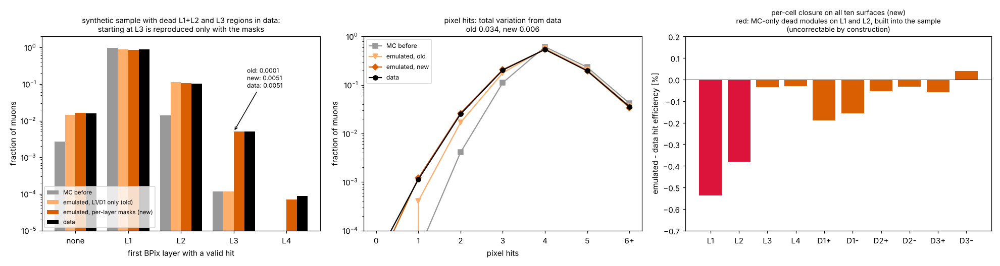

*Synthetic sample. Left: first BPix layer. Muons starting at L3 are 0.51% in data, 0.01% with the old emulation, 0.51% with the new one. Middle: number of pixel hits; the total variation from data drops from 0.034 to 0.006. Right: per-cell closure on all ten surfaces with the new emulation. L1 and L2 (red) keep −0.5% and −0.4%: these are MC-only dead modules built into the sample, where data has hits that MC cannot provide (uncorrectable by construction). Every other surface is within 0.2%.*

| | old (L1/D1, next layer assumed valid) | new (per-layer masks) | data |
|---|---|---|---|
| first BPix layer = L3 | 0.0001 | 0.0051 | 0.0051 |
| first FPix disk = D3 | 0.0000 | 0.0005 | 0.0006 |
| TV, first layer × first disk | 0.0115 | 0.0063 | – |
| TV, pixel hits | 0.0343 | 0.0062 | – |

The emulated tree was checked entry by entry, for every muon:

- first BPix layer, first FPix disk, n<sub>pix,b</sub>, n<sub>pix,e</sub>, n<sub>pix</sub>, `n_pix_layer` and `pix_first_layer` agree with the written masks and counts;
- the removed layers are a subset of the original hits;
- emulated mask = original mask minus removed layers.

**One more change: no floor on w<sub>nohit</sub>.** In cells where data has the higher hit efficiency, MC muons without the hit get the weight w<sub>nohit</sub> = (1 − ε<sub>data</sub>)/(1 − ε<sub>MC</sub>). Until now it had a floor of 0.2. With ten surfaces many cells have data ≈ MC ≈ 0.99, where a small statistical excess of ε<sub>data</sub> hits the floor. The floor then overweights the MC muons without the hit, and the emulated efficiency comes out ~0.15% low on every such surface. Without the floor the expected closure on L4, D3± goes from −0.0015 to ~0 (synthetic sample). The cost is a few events with weight 0: the effective sample size is still 97% of the events with ten surfaces. The new default is `--min-weight 0`, and `emulate_hit_loss.py --min-weight` re-finalises existing maps.

**Known small residual.** Cells where the MC itself has fewer than 30 probes take the MC surface average as ε<sub>MC</sub>. Where the real MC cell differs (disk edges), this leaves ≤ 0.1% in the synthetic test, whose MC is only 150k events. In the full Summer24 MC these cells hold < 0.2% of the probes.

---

## 10. All Run 3 epochs

*`run_hitemu.csh` was run on all seven epochs on 7 October 2026 (t3ui07, about 2 h 20 min in total). The code was from before the per-layer masks, so only L1, D1+ and D1− are emulated. Settings: cap 3, `mcshape` fallback, and still the old floor `min_weight` 0.2 (stored in every map). This section reads every output and lists what is odd, with the reason where it was found.*

### 10.0 The oddities in one table

Ranked by how much they matter for the analysis. "Section" points to the explanation below.

| # | what is odd | why | matters? | section |
|---|---|---|---|---|
| 1 | **Route A did not run in any epoch.** The summary says `OK_B`, never `OK_AB`. **Solved 8 Oct** (wrong flow directory); route A closes, section 10.13 | No `covflow.json` found under `$RUNS/<epoch>/mu{1,2}/task_0` (`RUNS = …/run3_epochs_05oct26`): wrong tag or path, or production not finished | **yes**: route A is the primary route, and without flows the route checks only compare *raw* MC to data | 10.1, 10.11 |
| 2 | **2024 D1−: emulated hit efficiency 4.2% below data** (all other surfaces and epochs: −0.1% to −0.3%) | Summer24 MC has a dead D1− sector (upper left, φ ≈ 2.4–3.1 rad) that data only lost at run ~382799. Before that (37% of 2024), data has hits that MC cannot provide (uncorrectable cells, 11% of D1− probes) | yes, for 2024: ~0.6% of the 2024 muons are on the wrong side | 10.5 |
| 3 | **2024, 2025 and 2026 use one and the same MC** (3,627,107 events), and **2025 and 2026 have bit-identical MC maps and no-L1 MC outputs** | One Summer24 sample for three years; `pu_weight_2026` gives exactly the same weights as `pu_weight_2025` | the PU profile of 2026 is not used; the Summer24 conditions (snapshot, see #2) for 2025–26 | 10.6 |
| 4 | **The L1 closure gets worse with time:** −0.09% (2024), −0.18% (2025), −0.30% (2026) | **A dead cell yields 2–9% fewer *selected* data muons than an alive one** (depending on how it is counted) (the J/ψ selection or the trigger needs the hit). The data average over run ranges then favours each cell's good ranges. Not an emulation bug; a selection-efficiency effect that the emulation (kill after selection) does not model | second order for the context (0.3%), but **the effect itself is an efficiency difference** worth knowing | 10.4 |
| 5 | **Muons starting at L3 or with no BPix hit**: 3.8% / 3.4% in 2026 data, 0.3% / 2.1% emulated; 2.5% / 1.8% against 0.3% / 1.2% in 2025; also visible in 2024 | Data also lose L2/L3, which the L1/D1-only code cannot emulate (known, section 9.2) | yes: what the Bmmm mask patch is for | 10.7 |
| 6 | **The run ranges stop at 8 in 2024 and 2025**, and inside every range the L1 hit efficiency of single runs scatters by 1–2% rms more than statistics (χ²/ndf 5–30) | `--max-ranges 8` is binding; modules come and go from run to run | small for single-layer marginals (they average exactly); matters for correlations between layers once all layers are killed | 10.8 |
| 7 | **D1 is starved in the small epochs:** up to 54% of the D1 probes of a range take their value from neighbouring ranges (2023 pre‑BPix range 2; 2022 pre‑EE 27–33%) | Range size is set by L1 only (≥ 40 probes per L1 cell); D1 has fewer probes per cell | moderate: D1 in 2022–23 is followed with a delay | 10.9 |
| 8 | **Mixture test fails for D1 in 2022–2023 data**: W0 has 19–38% wider σ(d<sub>xy</sub>) than D0 (KS 0.17–0.29) | Not statistics: the "dead" D1 cells of 2022–23 are the disk's outer ring (94–100% of D0 probes at r > 13.8 cm), where data and MC disk radii differ. **Fixed:** data D0 cells must be alive in MC | the test was comparing with the wrong population | 10.10 |
| 9 | **Route B is skipped in 2022 pre‑EE and 2023 post‑BPix**; elsewhere it moves σ(d<sub>xy</sub>) by only 0.02–0.03 in log<sub>10</sub> out of 0.2–0.27; the D1 hit errors sit at the 500 µm bound | Too few dead cells for a fit (early epochs); one V per \|η\| bin pinned by non-PD tracks (known, section 9.8) | none any more: **route B is dropped** (route A closes; B, final is worse than no correction, section 10.13) | 10.11, 10.13 |
| 10 | **Files and logs missing from the copy** (first run) | Partial copy from t3ui07 | **solved** in the rerun | 10.1 |
| 11 | **Closure residuals all negative on L1/D1 (−0.04 to −0.15%)** in the early epochs | The floor 0.2 on w<sub>nohit</sub> (fixed: default 0 since the mask commit) | small; gone at the next run | 10.3 |
| 12 | 2022 pre‑EE and 2022 post‑EE both use `pu_weight_2022` | Probably one 2022 PU profile in the ntuples; the two MC samples differ (Summer22 / Summer22EE), so the maps differ | minor; check the pre/post-EE PU profiles | 10.1 |

### 10.1 What was run, and what came back

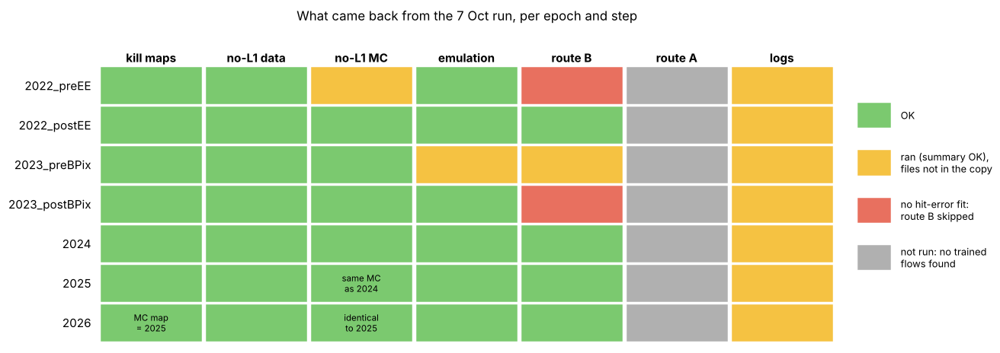

*Per epoch (rows) and step (columns), for the rerun of 8 October with the correct flow directory. Green: output present. Red: route B could not run (no hit-error fit, see 10.11). In the first run (7 October) route A was missing everywhere (no flows found under the wrong `RUNS` tag), and two outputs plus most logs were missing from the copy; both are solved.*

| epoch | data runs | run ranges | selected data events | MC events | MC PU weight | L1 ε data / MC | D1+ ε data / MC | D1− ε data / MC |
|---|---|---|---|---|---|---|---|---|
| 2022 pre‑EE | 131 (355862–357900) | 3 | 238k | 0.31M | `pu_weight_2022` | 0.929 / 0.944 | 0.960 / 0.967 | 0.968 / 0.986 |
| 2022 post‑EE | 182 (359569–362760) | 7 | 928k | 1.14M | `pu_weight_2022` | 0.915 / 0.940 | 0.957 / 0.970 | 0.963 / 0.986 |
| 2023 pre‑BPix | 125 (367095–368823) | 6 | 685k | 0.67M | `pu_weight_2023` | 0.920 / 0.938 | 0.953 / 0.963 | 0.968 / 0.983 |
| 2023 post‑BPix | 43 (369927–370790) | 4 | 364k | 0.30M | `pu_weight_2023` | 0.930 / 0.946 | 0.947 / 0.958 | 0.965 / 0.982 |
| 2024 | 451 (379416–386951) | **8 (cap)** | 3.33M | **3.63M** | `pu_weight_2024` | 0.894 / 0.946 | 0.952 / 0.959 | **0.893 / 0.871** |
| 2025 | 458 (391688–398860) | **8 (cap)** | 3.25M | **3.63M (same)** | `pu_weight_2025` | 0.773 / 0.945 | 0.914 / 0.960 | 0.821 / 0.879 |
| 2026 | 91 (401844–403867) | 7 | 777k | **3.63M (same)** | `pu_weight_2026` **(= 2025)** | 0.614 / 0.945 | 0.908 / 0.961 | 0.812 / 0.883 |

*Hit efficiency ε in nominal acceptance, MC averaged on the data illumination (as in the per-cell closure). D1− in 2024 is the only place where data is more efficient than MC (10.5).*

**Route A (#1), solved 8 Oct.** The driver looks for `$RUNS/<epoch>/mu1/task_0/covflow.json` and `…/mu2/…`. In the first run not one epoch had both (wrong `RUNS` tag), so every emulation ran with route B alone (`OK_B`). With `RUNS = …/run3_epochs_05oct26_trgmatch_e1200` all seven epochs ran route A (section 10.13). The check, for the future:

```
ls /work/manzoni/correct_track_covariance/covflow-runs/run3_epochs_05oct26/*/mu?/task_0/covflow.json
```

**Missing files (#10), solved 8 Oct.** The rerun's copy is complete (all outputs, one log per epoch and step); the 2023 pre‑BPix entries in the plots below are filled in. The 2022 pre‑EE MC hit-error fit is empty too (0–16 D0 tracks per bin), hence `OK_A_noB` there.

### 10.2 One look at all of Run 3

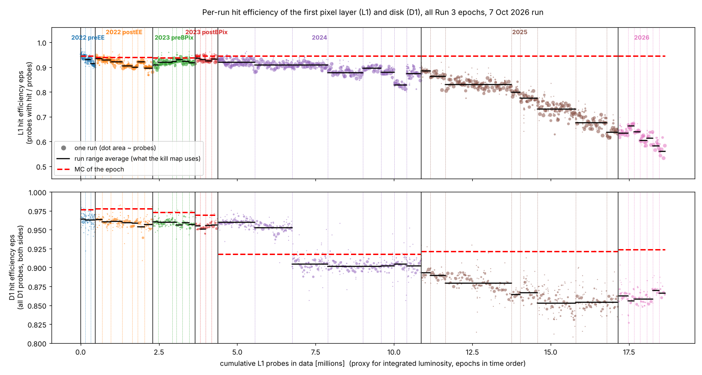

*Each dot is one data run (area ∝ its probes); black steps: the run-range averages the kill maps use; red dashes: the MC of the epoch (same definition). x axis: cumulative L1 probes, a proxy for luminosity, so each epoch is as wide as its data. Top: L1. Bottom: D1, both sides.*

How to read it:

- **L1** loses efficiency steadily: 0.93 in 2022, 0.89 in 2024, 0.77 in 2025, 0.61 in 2026, down to 0.53 in the last 2026 runs. The MC (red) stays at 0.945 throughout. The kill maps follow the steps; the scatter of single runs around a step is the subject of 10.8.
- **D1** has one sharp drop, in **2024 at run ~382799**, from 0.96 to 0.905. Before it, data is *above* the MC (0.918): the MC already has the loss that data has only later. This is #2 (section 10.5).
- 2022–2023 data are within 1–2% of their MC on both surfaces. These epochs need little killing; that is also why they have few dead cells for the no-L1 study (10.10, 10.11).

### 10.3 The closure per epoch

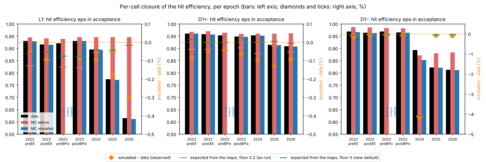

*Bars (left axis): hit efficiency ε in acceptance for data (black), MC before (red), MC after emulation (blue), per epoch. Right axis, %: emulated − data as observed (diamonds), and as expected from the kill maps alone, with the floor 0.2 used in this run (orange tick) and with the new default floor 0 (green tick). Since the rerun all seven epochs are in.*

- Everywhere except 2024 D1−, emulated − data is between −0.04% and −0.30%.
- **Early epochs (2022–2023):** observed ≈ orange tick. The residual is the old floor 0.2 on w<sub>nohit</sub> (section 9.9). Without the floor (green) it nearly vanishes. **Fixed** by the default `--min-weight 0` (#11).
- **L1 in 2025–2026:** observed (−0.18%, −0.30%) is well below both ticks. The maps alone predict −0.05% / −0.02%. Explained in 10.4 (#4).
- **D1− in 2024:** −4.2%, predicted almost exactly by the maps (−4.1%): uncorrectable cells. Explained in 10.5 (#2).

### 10.4 Why the L1 closure gets worse with time: a dead cell costs selected muons

The per-cell closure averages each cell over the epoch. Data and emulated MC weigh the run ranges of a cell differently:

- **MC** assigns each event to a run range with the luminosity share of that range (`lumi_fraction`), whatever cell its muons cross. The emulated efficiency of cell c is therefore Σ<sub>r</sub> L<sub>r</sub> · ε<sub>data</sub>(r, c).
- **Data** is averaged with its own probes, n(r, c) · ε<sub>data</sub>(r, c). **If a cell yields fewer selected muons while it is dead, the data average leans towards the ranges where the cell works**, and comes out higher than the MC one.

That is what happens:

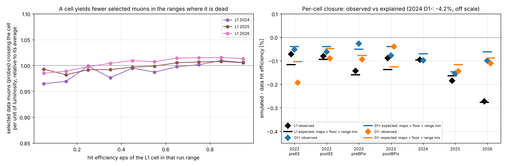

*Left: for every L1 cell and run range with ≥ 30 probes, the number of selected data muons crossing the cell per unit luminosity, relative to the cell's average over the epoch, against the cell's hit efficiency in that range. A dead cell (ε < 0.2) yields 2–4% fewer muons than an alive one (ε > 0.8). Counting only the cells that switch between alive (ε > 0.85) and dead (ε < 0.25) within the epoch, the drop is 6–9% (L1: 2024 0.91, 2025 0.93, 2026 0.94; D1−: 2024 0.84). Right: emulated − data per epoch and surface (diamonds), against the sum of three expected terms: the kill maps, the floor 0.2, and this range mix (ticks). Within 0.03% everywhere.*

| | 2022 post‑EE | 2024 | 2025 | 2026 |
|---|---|---|---|---|
| L1, emulated − data observed | −0.09% | −0.09% | −0.18% | −0.30% |
| maps + floor 0.2 | −0.10% | −0.06% | −0.05% | −0.02% |
| range mix (this effect) | 0.00% | −0.04% | −0.11% | −0.26% |
| sum | −0.10% | −0.10% | −0.16% | −0.28% |

What it means:

1. **It is not a bug of the emulation.** Per range and cell, the emulated efficiency equals the data one. The residual comes only from averaging over ranges, and grows with how much the cells change over the epoch (most in 2026). This replaces the explanation given in 9.7 (level-1 cells at large |z|).
2. **The physics behind it is a selection-efficiency effect:** a muon whose L1 hit is lost is 2–9% less likely to end up in the selected J/ψ sample. Plausible causes are the trigger (HLT tracking of the displaced J/ψ), the vertex fit and the displacement cut, whose resolution gets worse without L1. The probe definition itself does not depend on the probed layer.
3. **The emulation cannot reproduce it**, because it kills hits in already *selected* MC events. The emulated MC therefore has slightly too many muons without an L1 hit in the bad periods. For the context this is a 0.3% effect.
4. **Fix, if wanted (not implemented):**
   - Measure the ratio r<sub>s</sub> = (selected muons per unit luminosity in a dead cell) / (in an alive cell), as in the left plot.
   - Kill with the per-crossing efficiency ε<sub>true</sub> = r ε<sub>meas</sub> / (1 − ε<sub>meas</sub> + r ε<sub>meas</sub>) instead of the measured ε<sub>meas</sub>.
   - Give the muons whose hit was killed the weight r.

   Then the per-cell yield and the range mix match data by construction. The masks make this more relevant: L2/L3 losses will add to it.
5. **For R(J/ψ)** this is a data/MC efficiency difference that depends on the run range. It mostly cancels in the ratio when it acts on the J/ψ muons of both channels. It is worth a line in the systematics of the third muon, if that one is reconstructed with the same tracking.

### 10.5 2024 D1−: an MC dead sector that data still had

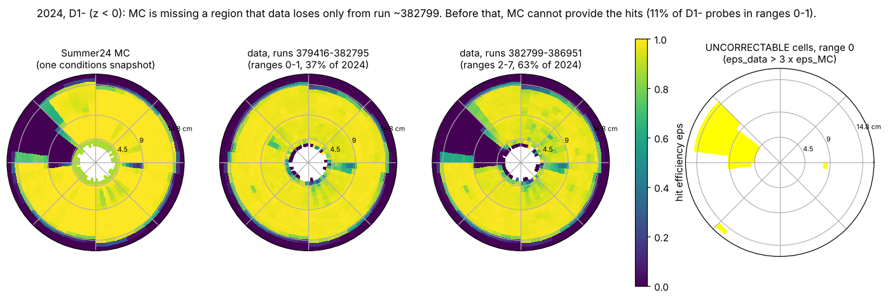

*D1− hit efficiency in (φ, r), 2024. From left: Summer24 MC; data in runs 379416–382795 (ranges 0–1, 37% of 2024); data in runs 382799–386951 (ranges 2–7); the cells flagged uncorrectable in range 0 (ε<sub>data</sub> > 3 ε<sub>MC</sub>). The MC has a dead sector in the upper left (φ ≈ 2.4–3.1 rad, r ≈ 5–14.8 cm) and a second, smaller one near φ ≈ −2.2. Data loses the same sector only from run ~382799. The MC conditions are a snapshot taken after that run.*

From `inspect_killmaps.py` on the 2024 maps (D1−):

| run range | runs | D1− probes in uncorrectable cells | efficiency left missing |
|---|---|---|---|
| 0 | 379416–381152 | 11.3% | −10.7% |
| 1 | 381164–382795 | 11.1% | −10.4% |
| 2–7 | 382799–386951 | 0.3–0.5% | −0.01 to −0.07% |

- The emulation can only remove hits (or reweight existing ones). In this sector MC has no hits to give, so in ranges 0–1 the MC muons crossing it keep "no D1 hit" while data has one 90% of the time. Over 2024 this is −4.2% of the D1− efficiency.
- **Size:** ~37k data probes out of ~6.7M selected 2024 muons, i.e. **~0.6% of the 2024 muons** get the wrong hit pattern on D1− (first disk D2 instead of D1), all with η < −1.5.
- **Options:**
  - (a) Accept it and quote it. These are forward muons with a small weight in the analysis.
  - (b) Give MC muons crossing the sector only the run ranges 2–7. This is a per-track range assignment: their context then matches data's later runs, at the price of a slightly wrong L1 mix for those muons.
  - (c) Use an MC with early-2024 conditions, if one exists.

  (a) is the default. The same thing happens nowhere else: 2025–2026 have the sector dead in data as well (uncorrectable < 0.6% of D1− probes).

### 10.6 One MC sample for 2024, 2025 and 2026

Three facts from the outputs:

1. The emulation reads **3,627,107 MC events in 2024, 2025 and 2026**. It is the same sample (Summer24).
2. The MC maps of **2025 and 2026 are bit-identical** (same probes, same weighted hits; md5 of the L1 map `20294a69` in both), although they use `pu_weight_2025` and `pu_weight_2026`. The no-L1 MC outputs (`hiterrors_mc_2025.json` / `_2026.json`, the PDFs) are byte-identical too. **So `pu_weight_2026` equals `pu_weight_2025` event by event.** 2024 differs only through its own PU weight (7.01M against 6.98M weighted L1 probes).
3. 2022 pre‑EE and 2022 post‑EE both use `pu_weight_2022`, but with different MC samples.

Consequences:

- The 2026 emulation uses the 2025 pile-up profile. The hit efficiency depends little on pile-up, but the context (p<sub>T</sub>, η of the muons) and the probe counts do a little. **Is a 2026 PU profile available?** If not, this is deliberate and fine for now.
- The Summer24 conditions are a 2024 snapshot. In 2025–2026 everything the data lost later is handled by the kill maps. What the MC lost *and data had* is uncorrectable, which only bites in early 2024 (10.5).

### 10.7 The context per epoch: what L1 and D1 alone cannot reproduce

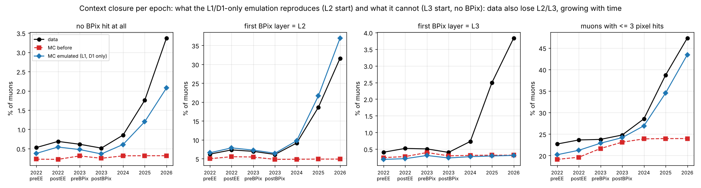

*Fraction of muons per epoch: with no BPix hit, starting at L2, starting at L3, and with ≤ 3 pixel hits. Data (black), MC before (red dashes), MC emulated with L1/D1 kill only (blue).*

- **L2 start** is reproduced, and even overshoots in 2025–26 (37.0% against 31.6% in 2026). Those are the muons that in data also lost L2 and start at L3.
- **L3 start**: data grows from 0.4% (2022–23) to 0.7% (2024), 2.5% (2025) and 3.8% (2026). The emulation stays at the MC's 0.3%.
- **No BPix hit**: data 0.5% → 3.4%, emulated 0.4% → 2.1%.
- **≤ 3 pixel hits**: data 23% → 47%, emulated 20% → 44%.

This is the missing L2/L3 (and D2) emulation of section 9.2, now seen in every epoch, growing with time. It is the reason for the Bmmm per-layer mask patch. Nothing in these results argues against the patch; 2024 and 2025 make it more necessary.

### 10.8 Run ranges: the cap of 8, and the scatter of single runs

| epoch | ranges | χ²/ndf of single runs around their range (L1) | extra run-to-run spread of ε<sub>L1</sub> inside a range (rms) |
|---|---|---|---|
| 2022 pre‑EE | 3 | 5.1 | 0.7–0.9% |
| 2022 post‑EE | 7 | 8.1 | 0.3–1.0% |
| 2023 pre‑BPix | 6 | 12.8 | 0.5–1.2% |
| 2023 post‑BPix | 4 | 18.5 | 0.3–1.0% |
| 2024 | **8 = cap** | 21.2 | 0.8–1.6% |
| 2025 | **8 = cap** | 29.6 | 0.5–2.3% |
| 2026 | 7 | 16.9 | 0.2–2.3% |

*"Extra" = rms of the per-run L1 hit efficiency inside a range after subtracting the statistical part (runs with ≥ 200 probes).*

- Single runs scatter well beyond statistics: up to 25 standard deviations (2025 run 394677: 0.807 against 0.863 for its range). Modules come and go from run to run. 2025 range 2 alone holds 142 runs and 34% of the year.
- **For single-layer quantities this is harmless.** The average over runs of the per-run efficiency is what the emulation reproduces, and it is linear.
- **It is not harmless for correlations between layers.** P(L1 and L2 both lost) averaged over runs is not the product of the averages when both vary together. With the masks every layer is killed independently in each range, so the ranges should be finer.
- **Action (done, 8 Oct):** the default `--max-ranges` is now 10. It costs nothing in time; the minimum of 40 probes per L1 cell still applies. With the larger production (×10 statistics) single-run ranges become possible for most of 2024–2025.

### 10.9 Statistics per range: D1 left short in the small epochs

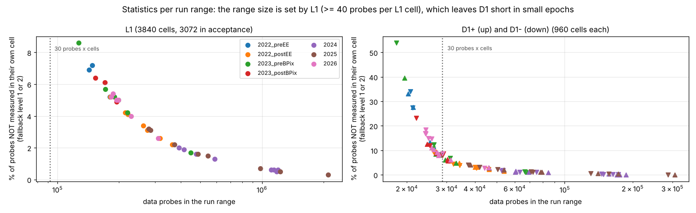

*Per run range: fraction of the data probes whose cell efficiency is not measured in the cell itself (fallback level 1, neighbouring ranges, or level 2), against the probes of the range. Left L1, right D1+ (▲) and D1− (▼). Dotted: 30 probes × number of cells.*

- The range size is chosen on **L1 only** (at least 40 probes per L1 cell). Each D1 side has a third of L1's cells (960 against 3072) but only 15–18% of its probes.
- In the large epochs this is fine (D1 fallback < 3%). In 2022 pre‑EE (27–33%), 2023 pre‑BPix range 2 (40–54%) and 2023 post‑BPix range 0 (23%), a large part of D1 borrows its value from neighbouring ranges.
- **Action (small):** also require a minimum per D1 cell when splitting, or use coarser D1 cells (e.g. 24 in φ) in the small epochs. With the masks this applies to every surface: the split rule should look at all surfaces.

### 10.10 The mixture test per epoch

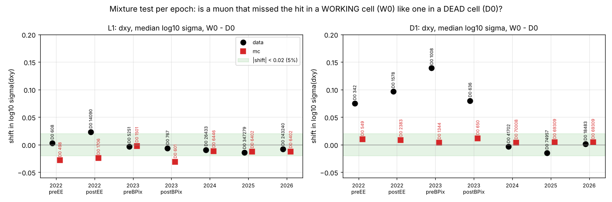

*Median log<sub>10</sub> σ(d<sub>xy</sub>) of muons without the hit in a working cell (W0, reweighted) minus that of muons in a dead cell (D0), per epoch. Black: data; red: MC. Labels: number of D0 tracks. Green band: |shift| < 0.02 (5% in σ).*

- **L1** passes in every epoch and in MC (|shift| ≤ 0.033 on every parameter, KS ≤ 0.08).
- **D1 in 2022–2023 data fails:** +0.075 to +0.139 (σ 19–38% wider for W0), KS 0.17–0.29.
  - There are few D0 tracks (342–1578), all in a handful of dead cells.
  - In 2024–2026 data (19k–75k D0 tracks) and in all MC it passes.
- **Not statistics (checked 8 Oct).** With 342–1578 tracks the median is known to ~0.01 in log<sub>10</sub>, and the shifts are 0.075–0.14. The "dead" D1 cells of 2022–2023 are not dead modules: **94–100% of their probes sit on the outer ring, r > 13.8 cm**. That is where the data and MC disks end at different radii (section 9.6). Tracks predicted to cross D1 there physically miss the disk, which is a different population from a muon that crossed a dead module. In 2024–2025 the D0 is diluted by real dead modules in the interior (14–36% of the probes on D1−), and the test passes.

  | | D1+ D0 probes on the outer ring | D1− D0 probes on the outer ring |
  |---|---|---|
  | 2022 pre‑EE, 2022 post‑EE, 2023 pre‑BPix, 2023 post‑BPix | 94–96% | 99–100% |
  | 2024 | 95% | 85% |
  | 2025 | 87% | 61% |

- **Fix (in the code since 8 Oct):** in data, a D0 cell must also work in MC (ε<sub>MC</sub> ≥ `--eps-working`). It is then a loss of data only, which is exactly what the emulation creates; geometric edges, dead in both, drop out. `--d0-any-mc` restores the old definition. Expect fewer D0 tracks for D1 in 2022–2023, and a meaningful test.

### 10.11 Routes per epoch

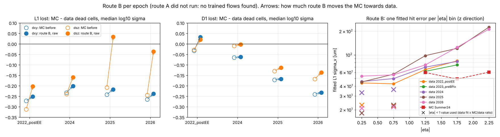

*Left and middle: for MC muons that lost L1 (D1), median log<sub>10</sub> σ minus that of data muons in dead cells, before (open) and after route B (full), for d<sub>xy</sub> (blue) and d<sub>sz</sub> (orange). Right: the L1 hit error σ<sub>v</sub> fitted per \|η\| bin on data (lines) and Summer24 MC (red), and the value actually used for \|η\| < 1 (crosses), which is a data fit scaled by an MC/data ratio taken from the higher bins.*

- **Without flows these numbers are not a closure test.** "MC before" is the raw MC covariance, which covflow has not corrected yet; −0.23 to −0.27 in log<sub>10</sub> is mostly the MC/data covariance difference that covflow exists to correct. Route A (primary) and "route B final" (B, then covflow) both need the flows (#1).
- **Route B moves d<sub>xy</sub> by only 0.02–0.03** (out of 0.2–0.27) in every epoch. It moves d<sub>sz</sub> a lot in 2025–26 (−0.21 → +0.03), even past zero.
- The **transferred σ<sub>v</sub> for \|η\| < 1 is 18–23 µm in 2022, 2025 and 2026**, smaller than σ<sub>u</sub> and than any fitted bin. The MC/data ratio (0.39–0.52) comes from bins where the data fit is pushed up by the pinned V. This is not physical.
- **D1 hit errors sit at the 500 µm bound** for \|η\| > 1.5 in 2024–26 (and in 2022–23 data). Removing a D1 hit with that error changes nothing: route B on D1 is effectively off.
- **"Inflated"** (tracks whose own V had to be enlarged to stay positive-definite) grows from 11% (2024) to 23% (2022 post‑EE) and 37–40% (2025–26).
- **2022 pre‑EE and 2023 post‑BPix:** no fit (2022 pre‑EE: 0–16 D0 tracks per \|η\| bin on L1, at most 162 on D1). `EXTRA_HITERR` could borrow 2022 post‑EE / 2023 pre‑BPix, but see the next point.
- All of this confirms section 9.8: one V per \|η\| bin cannot work. Route B needs the per-track V = k · H C Hᵀ before it is worth tuning further. Route A first.

### 10.12 What to do, in order (as of 7 Oct)

1. **Get the flows found** (#1): check the `RUNS` tag in `run_hitemu.csh` and that `covflow.json` exists for mu1 and mu2 in every epoch. Then rerun step 4 only. Example for one epoch, the rest as in the driver:
   ```
   python emulate_hit_loss.py --epoch 2024 --branch vx=pv_x --branch vy=pv_y --z0-from dz_pv \
       --killmaps hitemu/2024/killmaps/killmaps_2024 --route A B \
       --hit-errors hitemu/2024/noL1_mc/hiterrors_mc_2024.json hitemu/2024/noL1_data/hiterrors_data_2024.json \
       --flow-dir "$RUNS/@epoch@/@mu@/task_0" --min-weight 0 --out hitemu/2024/emu
   ```
   `--min-weight 0` re-finalises the stored maps without the floor (#11), so step 1 need not be redone.
2. **Copy the missing files and logs** (#10), so 2023 pre‑BPix can be checked as well.
3. **Confirm the MC per epoch** (#3, #12): is Summer24 meant for 2025 and 2026, and is a 2026 PU profile coming?
4. **2024 D1−** (#2): decide between accept-and-quote (default) and range assignment by sector (10.5).
5. **Bmmm per-layer masks** (#5): nothing here argues against them; 10.7 shows they are needed in 2024 and 2025 too. After the cmsenv test and the merge, the next production gives all ten surfaces.
6. **At the next full run** (after the masks):
   - `--max-ranges` 10, now the default (#6);
   - a split rule that looks at all surfaces (#7);
   - optionally the selection-loss weight of 10.4 (#4).
7. **Route B per-track V** (#9), only if route A turns out insufficient.

### 10.13 Route A on real data (rerun of 8 October, all seven epochs)

*Same kill maps and no-L1 outputs as on 7 October (identical files); the emulation rerun with the trained flows of `run3_epochs_05oct26_trgmatch_e1200`, all seven epochs (summary: `OK_AB` everywhere except 2022 pre‑EE and 2023 post‑BPix, `OK_A_noB`: no hit-error fit for route B there). The whole chain took 4 h 10 min, of which the 2024–2026 MC passes with the flows on CPU ~1 h.*

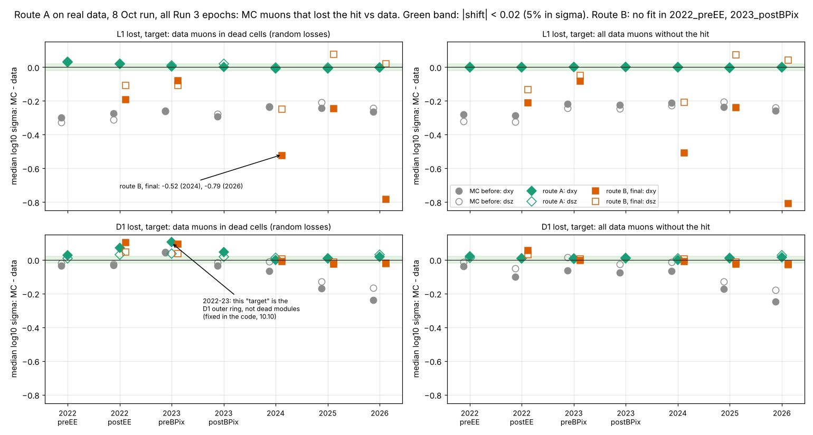

*Median log<sub>10</sub> σ of the MC muons that lost the hit minus that of the data target, MC reweighted to the target in (p<sub>T</sub>, \|η\|, pixel hits, z0·sign η). Full markers d<sub>xy</sub>, open markers d<sub>sz</sub>. Grey: MC before (no correction at all); green: route A; orange: route B followed by covflow ("final"). Left: data muons in dead cells (pure random losses). Right: all data muons without the hit. Green band: \|shift\| < 0.02, i.e. 5% in σ.*

**Route A closes.** Muons that lost L1:

| epoch | target: dead cells, d<sub>xy</sub> / d<sub>sz</sub> (KS d<sub>xy</sub>) | target: all without L1, d<sub>xy</sub> / d<sub>sz</sub> (KS d<sub>xy</sub>) | MC before (dead cells, d<sub>xy</sub>) |
|---|---|---|---|
| 2022 pre‑EE | +0.027 / +0.033 (0.065) | −0.003 / −0.001 (0.009) | −0.301 |
| 2022 post‑EE | +0.020 / +0.019 (0.054) | −0.001 / +0.000 (0.004) | −0.274 |
| 2023 pre‑BPix | +0.004 / +0.009 (0.009) | +0.001 / +0.001 (0.005) | −0.260 |
| 2023 post‑BPix | −0.001 / +0.019 (0.029) | +0.002 / +0.002 (0.007) | −0.294 |
| 2024 | **−0.008 / −0.004 (0.022)** | −0.002 / −0.001 (0.005) | −0.233 |
| 2025 | **−0.010 / −0.002 (0.027)** | −0.006 / −0.002 (0.018) | −0.242 |
| 2026 | **−0.003 / −0.001 (0.010)** | −0.002 / +0.001 (0.006) | −0.265 |

- From a 40–50% too small σ(d<sub>xy</sub>) to within 2% (6% at most in 2022, where the dead-cell target has only 600–14k tracks). **2026, the year with the most L1 loss (36% of the MC L1 hits removed), closes best: −0.003.**
- The right column is expected to close: covflow was trained on data muons without L1, so f<sub>data</sub> at that context reproduces them. **The left column is the real test.** Muons that lost L1 in a dead module are a population covflow never singled out, and route A reproduces them too. That is the mixture test (section 6) passing at the level of the full covariance.
- The beam-spot IP significance, with the parameters smeared by N(0, C′ − C), matches data over three orders of magnitude (2024):

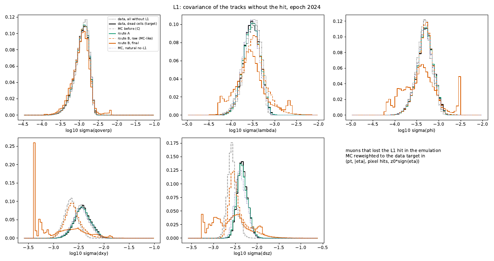

*Real page, 2024, muons that lost L1: σ of the five parameters. Black: data in dead cells (target); dotted: all data without L1; grey dashed: MC before; green: route A; orange: route B raw (dashed) and final (solid). Route A lies on the target in every parameter. Route B final has a spike at the lower edge of σ(d<sub>xy</sub>) (26% of the tracks) and a long tail: see below.*

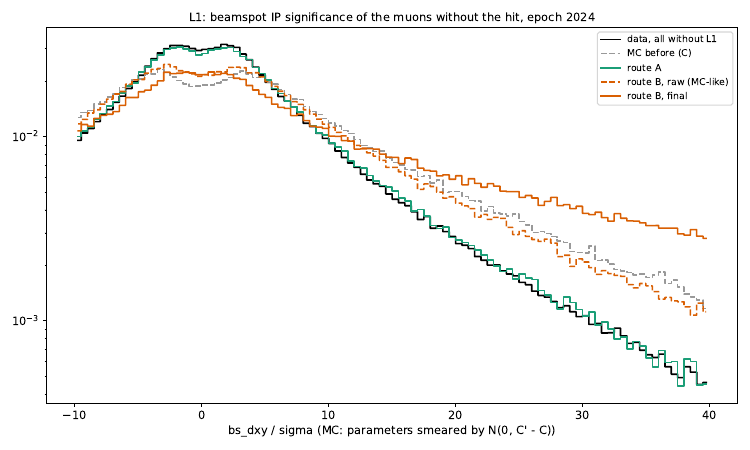

*Real page, 2024: beam-spot IP significance of the muons without L1. Route A (green) follows data (black) out to 40σ; MC before and both route B variants have tails 3–6× too high.*

**D1.** Against all data muons without D1, route A is within +0.03 everywhere (2025: +0.009; 2026: +0.014 d<sub>xy</sub>, +0.026 d<sub>sz</sub>). Against "dead cells" it is +0.03 to +0.10 in 2022–2023, +0.001 in 2024, +0.009 in 2025 and +0.018 / +0.029 in 2026. In 2025–2026 the MC before is −0.17 to −0.24, so route A removes ~90% of it; what is left in 2026 sits in the high-σ shoulder (muons that lost D1 and rely on few other hits), slightly too populated in route A (page below). The 2022–2023 dead-cell numbers are the outer-ring artefact: In 2022–2023 that target is the disk's outer ring, not dead modules (section 10.10): those tracks physically miss the disk. The page shows it: route A (green) lies on "all without D1" (dotted), the "dead-cell" histogram (black) is the odd one out.

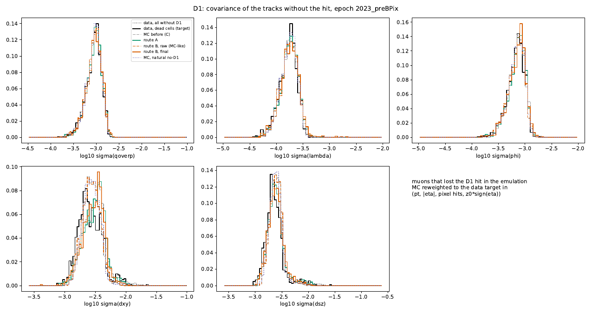

*Real page, 2023 pre‑BPix, muons that lost D1.*

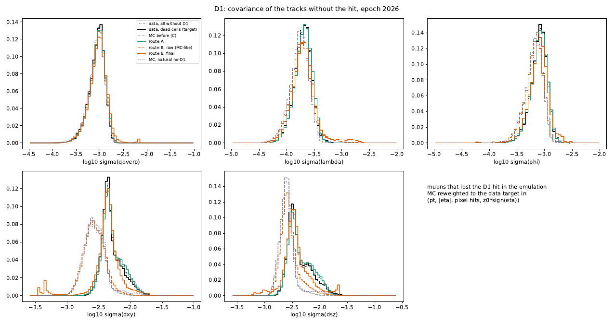

*Real page, 2026, muons that lost D1. Route A (green) follows the data target (black) from −0.24 MC-before; the shoulder at log<sub>10</sub> σ(d<sub>xy</sub>) ≈ −2.1 is a little too high.*

Since 8 October the dead-cell target in `emulate_hit_loss.py` uses the same rule as the no-L1 study: the cell must work in MC (`--dead-any-mc` for the old behaviour).

**Route B is dropped.**

- **B, raw** (hit removed with fitted errors) moves σ(d<sub>xy</sub>) by 0.02–0.03 out of 0.23–0.30. It does not even close on MC's own muons without L1 (−0.15 to −0.22).
- **B, final** (B, raw, then covflow) is worse than doing nothing in 2024 (−0.52 in d<sub>xy</sub>) and 2026 (−0.79). In 2024 only 35% of the tracks get a larger σ(d<sub>xy</sub>), and 26% end at the lower edge of the histogram; in 2026 there are spikes at both edges of σ(q/p), σ(d<sub>xy</sub>) and σ(d<sub>sz</sub>) (page below). The reason: B, raw produces covariances that the MC flow never saw at that context (off the MC distribution), and f<sub>MC</sub> maps them to extreme latent values.

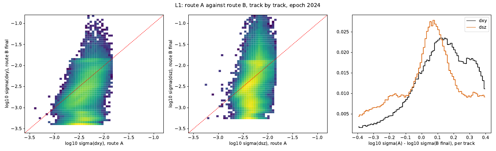

*Real page, 2024: route A against route B, final, track by track. No correlation: route B final is noise around route A.*

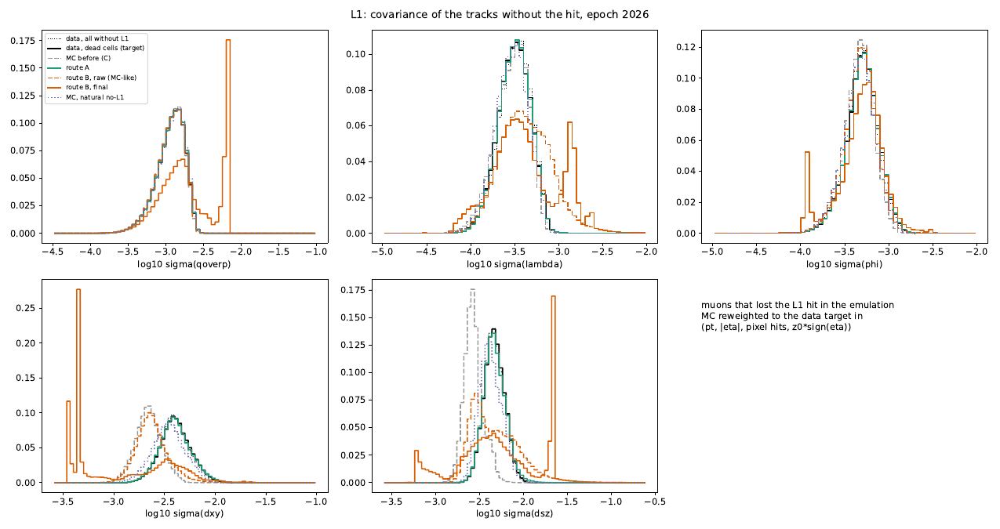

*Real page, 2026, muons that lost L1. Route A (green) on the target (black) in all five parameters; route B final (orange, solid) piles up at the histogram edges.*

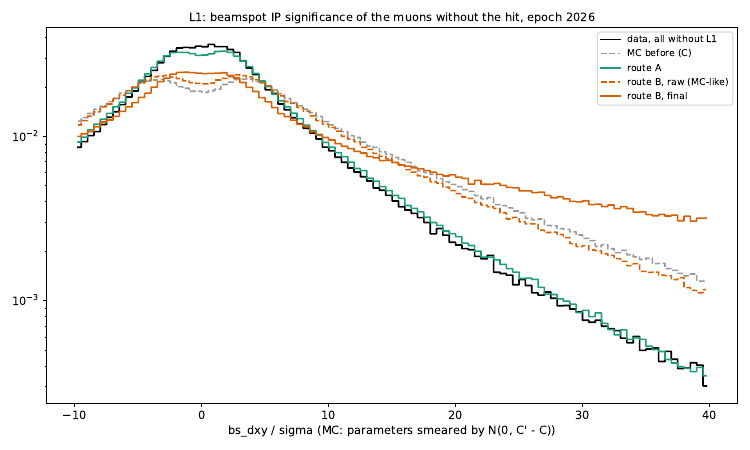

*Real page, 2026: beam-spot IP significance of the muons without L1. Route A follows data; the others have tails several times too high.*

This settles item 9 of section 10.0 differently than planned: there is no need to rescue route B. It stays in the code as a diagnostic.

**Route A, diagnostics.**

- "not PD": for 97% of the L1 tracks in every epoch, C′<sub>A</sub> − C has a small negative eigenvalue (median −0.6% of the largest). For D1 in 2022–2024, 85–94%, and the negative part is larger (median −5% to −37%); only 54–86% of the D1 tracks get a larger σ(d<sub>xy</sub>). In 2025–2026, where losing D1 changes more, it is better: 71–75% not PD with median −0.5% to −0.8%, and 98–99% of the D1 tracks get a larger σ(d<sub>xy</sub>).
- Why, two reasons:
  - **rank 2** (section 7.2.5): removing one pixel hit removes two measurements, so the true change has three eigenvalues exactly zero. Small flow noise on them makes a tiny negative eigenvalue the norm. This is the L1 picture: 97%, median −0.6%.
  - **the data term:** C′<sub>A</sub> contains the hit loss **and** the covflow MC→data correction itself. The second can shrink σ in some directions, and for D1 it is as large as the hit loss (removing a D1 hit changes little). This is the large D1 negatives in 2022–2024.
- This only matters for the smearing of the track parameters: δ ~ N(0, C′ − C) should come from the hit loss alone.

**Route A splits into two steps (in the code since 8 October, variant "A, MC part").**

&nbsp;&nbsp;&nbsp;&nbsp;C′<sub>MC</sub> = f<sub>MC</sub>⁻¹( f<sub>MC</sub>(C; c) ; c′ ) &nbsp;&nbsp;&nbsp;— the hit loss, inside MC<br>
&nbsp;&nbsp;&nbsp;&nbsp;C′<sub>A</sub> = f<sub>data</sub>⁻¹( f<sub>MC</sub>(C′<sub>MC</sub>; c′) ; c′ ) &nbsp;&nbsp;&nbsp;— the usual covflow correction, at the new context

The second line is identical to route A by construction: f<sub>MC</sub>(C′<sub>MC</sub>; c′) = f<sub>MC</sub>(C; c). The emulation now computes C′<sub>MC</sub>, checks that covflow on it reproduces route A (|Δ log<sub>10</sub> σ| ~ 10⁻⁷ on the synthetic sample), and reports its own closure against MC's natural no-L1 muons. What this buys for production:

1. **No retraining.** The emulated MC tree (`--write-tree`, now `--tree-route A` by default) carries C′<sub>MC</sub> and the emulated context. The existing covflow, applied as usual at the emulated context, gives route A.
2. **A smearing that is only the hit loss:** δ ~ N(0, C′<sub>MC</sub> − C), written as `{mu}_emu_delta_<param>` (section 7.2.5). The fraction "not PD" will stay high, because the true change has rank 2. What to look at in the next run is the **size** of the negative part: for C′<sub>MC</sub> − C it should be at the −0.6% level for L1 **and** for D1, since the data term is gone.
3. **For Bmmm:** the kill step and the MC-part morph (one flow, f<sub>MC</sub>) before the vertex fits, then covflow as already planned.

---

## 11. Approximations, open items, speed

1. **No per-layer hit mask** (section 9.2). After a kill, the next crossed layer is assumed valid, and L2–L4 / D2–D3 cannot be emulated. This is the dominant residual in 2026. **Fix written** (Bmmm branch `pix-layer-masks`, October 2026), as new muon branches from `bestTrack()`:
   - `{mu}_pix_valid_mask`: layers with a valid hit;
   - `{mu}_pix_miss_mask`: layers crossed on an active module without a hit;
   - `{mu}_pix_inact_mask`: layers crossed on an inactive or bad module;
   - `{mu}_pix_hit_count`: valid hits per layer, 2 bits per layer.

   Bits 0–3 are BPix L1–L4, bits 4–6 FPix D1–D3. They need a new ntuple production (dimuon at least); the kill maps and the emulation are then extended to all seven surfaces.
2. **Two hits on one layer** (module overlaps) are common: 22–24% of the muons in the first Bmmm test with the masks (Summer24 MC, 8 Oct 2026). Without the masks a kill removed only one of them, leaving n<sub>pix</sub> 1 too high. **Solved with the masks:** `{mu}_pix_hit_count` gives the hits per layer, and a kill removes all of them (`layer_count` in `hitemu.py`). Same test: Σ of the per-layer counts equals `n_pix_hit` for 99.94% (mu1) and 100% (mu2) of the muons; 4.6% have a crossed layer without a hit, 9–10% cross an inactive module.
3. **Tracks left with ≤ 2 pixel hits are kept.** Checked on full 2026 (section 9.7): data has even more of them (10.8% against 9.6%; no pixel hit 0.54% against 0.11%), so keeping them is right.
4. **MC share per run range** = share of selected data events, which includes trigger and selection efficiency. `--lumi-csv` takes the brilcalc recorded luminosity instead.
5. **Uncorrectable cells** (MC dead where data works) cannot be emulated by removing hits. In 2026 they are mostly the D1+ outer edge, where data's disk extends ~1.5 mm further than MC's (section 9.6). With cap 1.5 they leave 0.9% of the D1+ efficiency missing; with the new default cap 3, 0.4%, at the price of weights up to 3 on those few tracks. Inside the nominal acceptance it is below 0.2% on every surface.
6. **Fallback cells** (level 2) take MC's pattern scaled to the data total: data-only dead modules in a sparse cell are spread over the surface. They hold few probes by definition, and with the full sample most of them become level 1 (same cell, neighbouring months).
7. **Route B hit errors** are one (σ<sub>u</sub>, σ<sub>v</sub>) per \|η\| bin. On 2026 data and MC this does not close beyond \|η\| ≈ 0.5 (section 9.8): V is pinned by the positive-definiteness of the widest tracks. To be replaced by a per-track relative error V = k · H C Hᵀ.
8. **Route A** uses the flows as trained on non-emulated MC: f<sub>MC</sub> forward at the original context, where MC is plentiful, and f<sub>MC</sub> inverse at the emulated context c′, which MC must populate with its natural no-hit muons (section 7.2.6).
9. **Offline only.** The smearing δ is applied here only to the beam-spot IP-significance check. Production needs, in Bmmm before the vertex fits: the kill step, the MC part of route A (C′<sub>MC</sub>, one flow: f<sub>MC</sub>) and the smearing δ ~ N(0, C′<sub>MC</sub> − C); covflow then runs as usual at the emulated context (section 10.13). The kill functions in `hitemu.py` are plain numpy; the morph needs torch.
10. **Early epochs** (2022–2023) have few dead cells, so the hit-error fits may be empty (it happened for 2022 pre‑EE and 2023 post‑BPix, section 10.11). `EXTRA_HITERR` in `run_hitemu.csh` can point to a neighbouring epoch's fits.
11. **Speed:** solved (section 9.7). The full year takes 5.5 min without routes, dominated by reading. `--closure-only` is still there for even faster iterations.
12. **Selection loss in dead cells** (section 10.4). A muon that loses its L1 hit is 2–9% less likely to be selected in data. The emulation kills hits after the selection, so it cannot reproduce this. It shows up as an L1 closure residual of up to −0.3% (2026). Possible fix: kill with the per-crossing efficiency and weight killed muons by the measured ratio r.
13. **MC conditions are one snapshot per MC sample** (section 10.5). What the MC lost before data did is uncorrectable: 2024 D1−, runs before ~382799, ~0.6% of the 2024 muons.
14. **Run ranges** (sections 10.8–10.9): the cap of 8 is binding in 2024–2025, and the split rule looks only at L1. Raise `--max-ranges`, and split on all surfaces once the masks are in.
15. **Route A pairs tracks through the flow's latent space** (section 7.2.3). In 9 dimensions "the same percentile" is a modelling choice; only the population is tested (dead-cell closure, section 10.13).
16. **Smearing of D1 losses.** C′<sub>A</sub> − C has large negative eigenvalues for D1 in 2022–2024 (median −5% to −37%). The MC-only C′<sub>MC</sub> − C should not: check in the next run (section 10.13, item 2), and make sure that the D1 kills of those epochs are not smeared with a matrix that is mostly clipped.

---

## 12. Reference

### Files (repository root)

| file | step | what it does |
|---|---|---|
| `hitemu.py` | – | library: helix crossings, run ranges, `KillMaps`, `emulate`, route B (`jacobian`, `remove_hit`, `HitErrors`), route A (`CovFlow`), smearing, reweighting histograms |
| `build_kill_maps.py` | 1 | per-run table → run ranges → data maps per range, MC map, P<sub>kill</sub>, weights → `killmaps_<epoch>.npz/.json/.pdf` |
| `inspect_killmaps.py` | 1 | where the data probes sit (fallback level, uncorrectable) and what stays missing, for any cap |
| `noL1_data_study.py` | 4 (+5) | W1/W0/D0, mixture test, fit of route B hit errors → `noL1_<sample>_<epoch>.pdf`, `hiterrors_<sample>_<epoch>.json` |
| `emulate_hit_loss.py` | 2, 3, 5 | hit killing in MC, per-cell and context closure, routes A/B and their checks, optional emulated MC tree → `emu_<epoch>.pdf/.json` |
| `run_hitemu.csh` | all | all steps for every epoch, for screen |
| `pixel_eff_maps.py` | – | geometry and helpers (needs the version with `set_thetalim`) |

### Main options

| script | option | default | meaning |
|---|---|---|---|
| `build_kill_maps` | `--max-ranges` | 10 | maximum number of run ranges (8 until 8 Oct 2026) |
| | `--min-cell-probes` | 40 | minimum mean probes per L1 cell in a range (× 3072 = minimum per range) |
| | `--min-gain` | 25 | minimum −2 ln L gain to split |
| | `--min-cell` | 30 | probes for a cell's own value (else fallback) |
| | `--max-weight` | 3 | ratio of hit efficiencies ε<sub>data</sub>/ε<sub>MC</sub> above which a cell is uncorrectable (1.5 until Oct 2026) |
| | `--min-weight` | 0 | floor of w<sub>nohit</sub> (was 0.2 until Oct 2026: a floor biases the emulated hit efficiency low by ~0.1–0.2% where data and MC are both ~0.99; section 9.9) |
| | `--surfaces` | auto | `auto` = all ten surfaces with the per-layer masks, L1 D1+ D1− without; `all`, or a list |
| | `--nbins-phi`, `--nbins-r` | 48, 20 | cell granularity (L1 z is fixed to the ROC pitch) |
| | `--lumi-csv` | – | brilcalc csv for the MC shares |
| | `--fallback` | mcshape | level-2 data efficiency: `mcshape` (ε<sub>MC</sub> of the cell × factor) or `average` (old) |
| `emulate_hit_loss` | `--route` | none | `A`, `B` or both |
| | `--flow-dir` | – | trained flows, with `@epoch@` / `@mu@` placeholders |
| | `--hit-errors` | – | one or more `hiterrors_*.json` (first with a fit wins, per surface) |
| | `--eps-dead` | 0.4 | data hit efficiency ε<sub>data</sub> below which a cell counts as dead (D0 target) |
| `noL1_data_study` | `--d0-any-mc` | off | data D0 also from cells dead in MC (the D1 outer ring); default: the cell must work in MC |
| | `--write-tree` | off | write the emulated MC tree (context, covariance, smearing δ) |
| | `--tree-route` | A if route A runs | `A`: the MC part of route A, C′<sub>MC</sub> (apply covflow at the emulated context, no retraining); `B`: route B,raw |
| | `--dead-any-mc` | off | dead-cell target also includes cells dead in MC (geometric edges); default: data-only losses |
| | `--closure-only` | off | only hit killing and closure; no covariance / beam-spot branches, no routes (fast) |
| | `--fallback` | as stored | re-finalise the kill maps with another level-2 fallback (maps from before Oct 2026: `mcshape`) |
| | `--max-weight` | as stored | re-finalise the kill maps with another cap (no need to rebuild them) |
| | `--min-weight` | as stored | re-finalise the kill maps with another floor on w<sub>nohit</sub> (0 = none) |
| all | `--max-events` | all | read only the first N events (= first runs) |

### Outputs per epoch (`run_hitemu.csh`)

```
hitemu/<epoch>/killmaps/killmaps_<epoch>.{npz,json,pdf}
hitemu/<epoch>/noL1_data/{noL1_data_<epoch>.pdf, hiterrors_data_<epoch>.json}
hitemu/<epoch>/noL1_mc/{noL1_mc_<epoch>.pdf, hiterrors_mc_<epoch>.json}
hitemu/<epoch>/emu/{emu_<epoch>.pdf, emu_<epoch>.json [, emu_<epoch>_routeB.root/.json]}
hitemu/logs/<epoch>_<step>.log, summary_<timestamp>.txt
```
